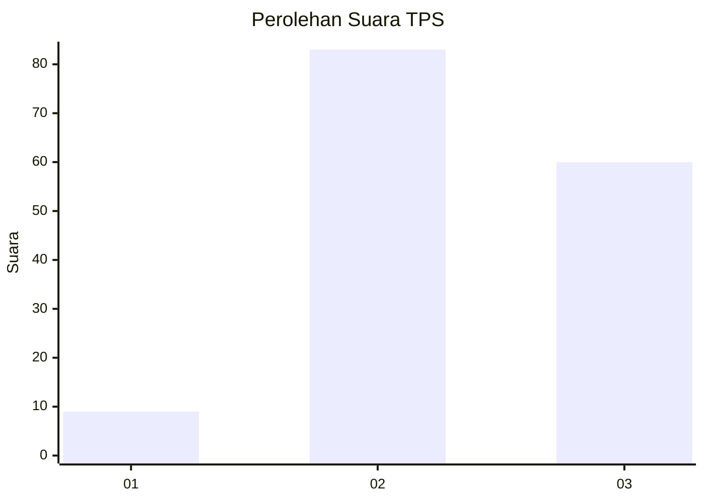
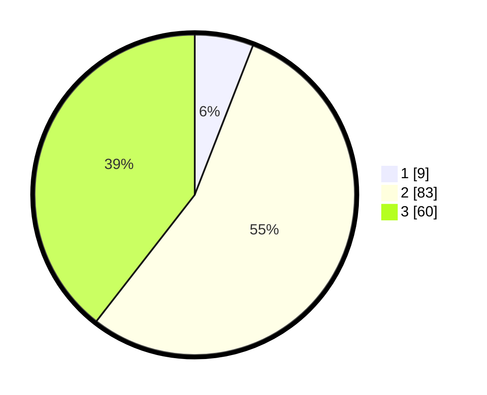

# Hasil

## Grafik

## Tabel

| No. | Nama Paslon    | Suara | Suara (raw) | Persentase |
|:--- |:-------------- | -----:| -----------:| ----------:|
| 1   | ANIES MUHAIMIN | 9     | [9][p-1]    | 5,92       |
| 2   | PRABOWO GIBRAN | 83    | [83][p-2]   | 54,61      |
| 3   | GANJAR MAHFUD  | 60    | [60][p-3]   | 39,47      |

[p-1]: https://github.com/gigit-pemilu/pemilu-2024-33-jawa-tengah/blob/main/pilpres/hitung-suara/sub/33-jawa-tengah/sub/04-banjarnegara/sub/20-pagedongan/sub/2005-kebutuhjurang/sub/010-tps/sub/paslon-1.txt
[p-2]: https://github.com/gigit-pemilu/pemilu-2024-33-jawa-tengah/blob/main/pilpres/hitung-suara/sub/33-jawa-tengah/sub/04-banjarnegara/sub/20-pagedongan/sub/2005-kebutuhjurang/sub/010-tps/sub/paslon-2.txt
[p-3]: https://github.com/gigit-pemilu/pemilu-2024-33-jawa-tengah/blob/main/pilpres/hitung-suara/sub/33-jawa-tengah/sub/04-banjarnegara/sub/20-pagedongan/sub/2005-kebutuhjurang/sub/010-tps/sub/paslon-3.txt

## Foto C Plano

https://sirekap-obj-formc.kpu.go.id/b225/pemilu/ppwp/33/04/20/20/05/3304202005010-20240214-201202--c917862d-bd74-4375-ad4e-284a57a4194b.jpg

https://sirekap-obj-formc.kpu.go.id/b225/pemilu/ppwp/33/04/20/20/05/3304202005010-20240215-041554--ecff38ce-4c92-4663-9885-3f1f61ff58f3.jpg

https://sirekap-obj-formc.kpu.go.id/b225/pemilu/ppwp/33/04/20/20/05/3304202005010-20240214-202215--4a231cb7-b219-44b7-ac97-5ee9531b841c.jpg

## Metadata

| Key        | Value               |
| ---------- | ------------------- |
| Time Stamp | 2024-02-15 16:00:26 |

