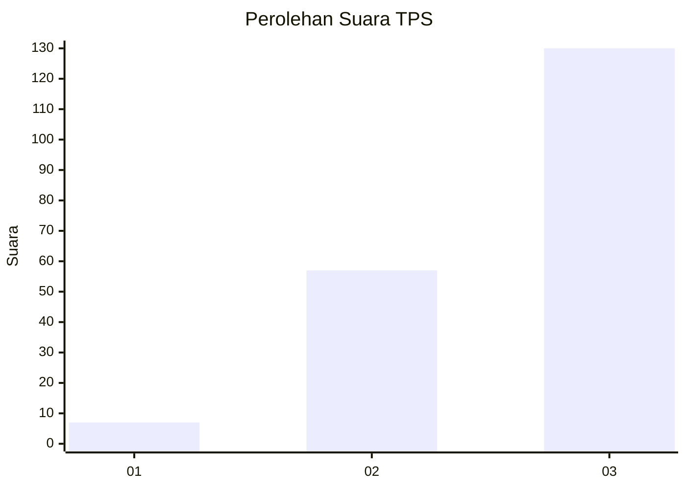
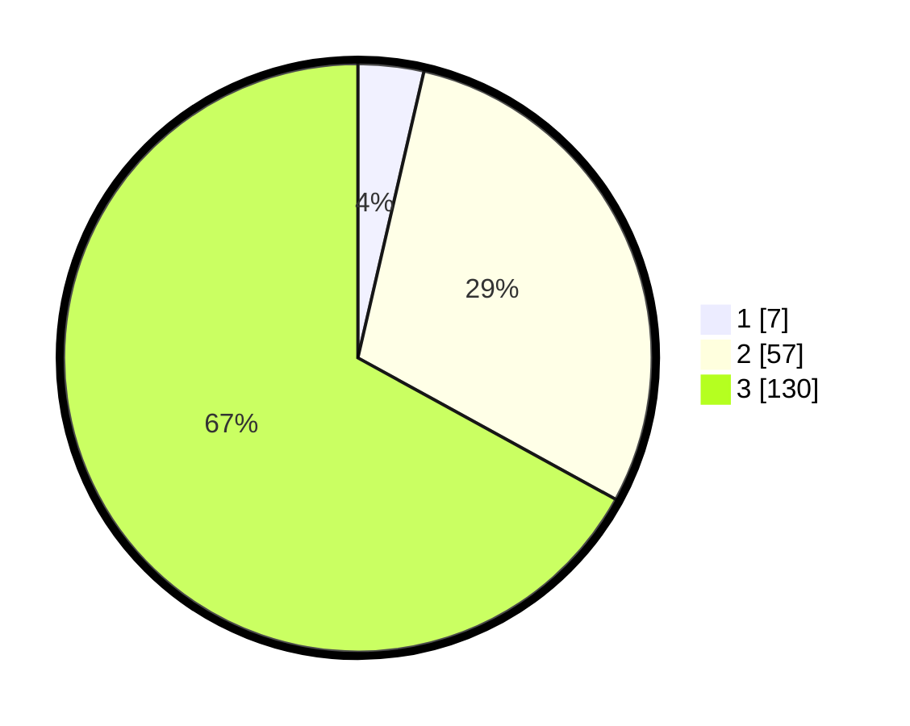

# Hasil

## Grafik

## Tabel

| No. | Nama Paslon    | Suara | Suara (raw) | Persentase |
|:--- |:-------------- | -----:| -----------:| ----------:|
| 1   | ANIES MUHAIMIN | 7     | [7][p-1]    | 3,61       |
| 2   | PRABOWO GIBRAN | 57    | [57][p-2]   | 29,38      |
| 3   | GANJAR MAHFUD  | 130   | [130][p-3]  | 67,01      |

[p-1]: https://github.com/gigit-pemilu/pemilu-2024-33-jawa-tengah/blob/main/pilpres/hitung-suara/sub/33-jawa-tengah/sub/04-banjarnegara/sub/20-pagedongan/sub/2006-pesangkalan/sub/005-tps/sub/paslon-1.txt
[p-2]: https://github.com/gigit-pemilu/pemilu-2024-33-jawa-tengah/blob/main/pilpres/hitung-suara/sub/33-jawa-tengah/sub/04-banjarnegara/sub/20-pagedongan/sub/2006-pesangkalan/sub/005-tps/sub/paslon-2.txt
[p-3]: https://github.com/gigit-pemilu/pemilu-2024-33-jawa-tengah/blob/main/pilpres/hitung-suara/sub/33-jawa-tengah/sub/04-banjarnegara/sub/20-pagedongan/sub/2006-pesangkalan/sub/005-tps/sub/paslon-3.txt

## Foto C Plano

https://sirekap-obj-formc.kpu.go.id/2de0/pemilu/ppwp/33/04/20/20/06/3304202006005-20240214-211944--7d2e5349-1962-40d8-b028-dca68d3d8916.jpg

https://sirekap-obj-formc.kpu.go.id/2de0/pemilu/ppwp/33/04/20/20/06/3304202006005-20240214-211526--bd0e4d17-e993-453f-a821-d74691be27d8.jpg

https://sirekap-obj-formc.kpu.go.id/2de0/pemilu/ppwp/33/04/20/20/06/3304202006005-20240214-223001--dad81c65-26f0-40e4-8e5a-4b07a683f05b.jpg

## Metadata

| Key        | Value               |
| ---------- | ------------------- |
| Time Stamp | 2024-02-15 21:01:18 |

