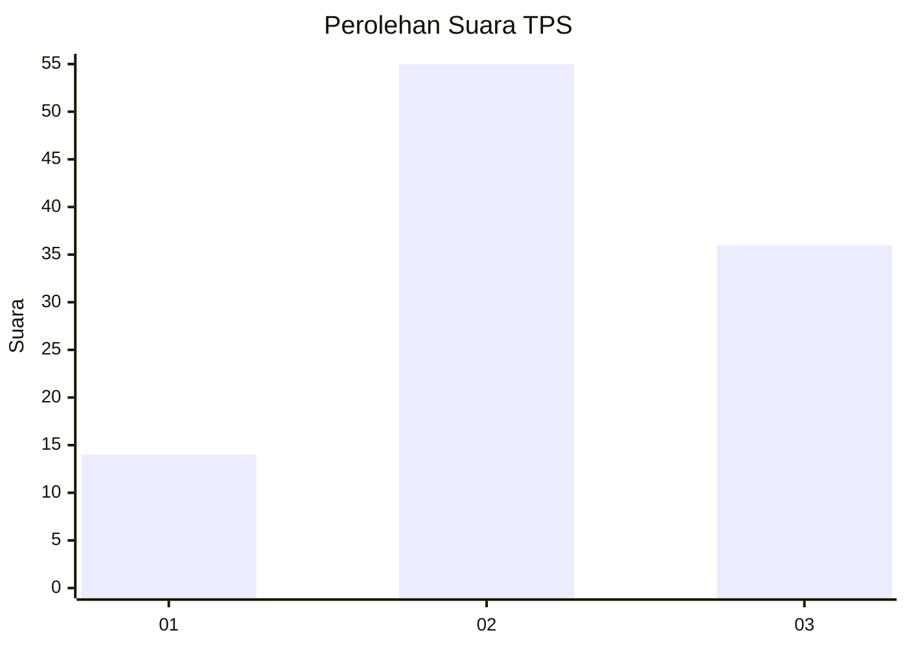
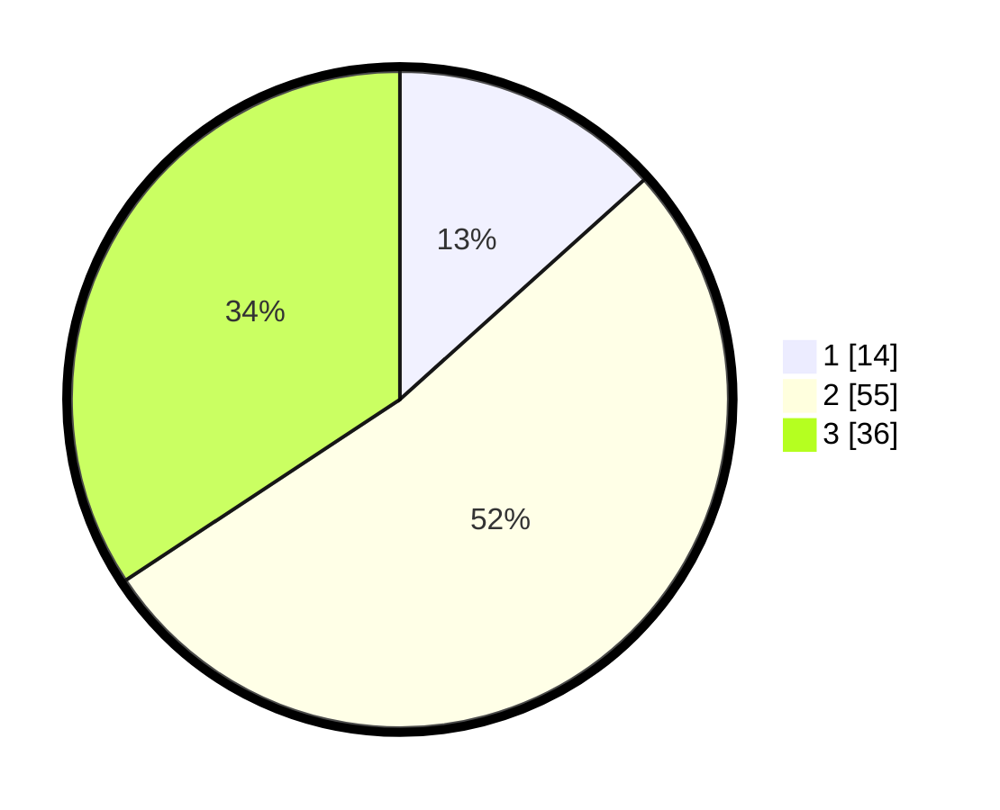

# Hasil

## Grafik

## Tabel

| No. | Nama Paslon    | Suara | Suara (raw) | Persentase |
|:--- |:-------------- | -----:| -----------:| ----------:|
| 1   | ANIES MUHAIMIN | 14    | [14][p-1]   | 13,33      |
| 2   | PRABOWO GIBRAN | 55    | [55][p-2]   | 52,38      |
| 3   | GANJAR MAHFUD  | 36    | [36][p-3]   | 34,29      |

[p-1]: https://github.com/gigit-pemilu/pemilu-2024/blob/main/pilpres/hitung-suara/sub/33-jawa-tengah/sub/05-kebumen/sub/01-ayah/sub/2001-argopeni/sub/001-tps/sub/paslon-1.txt
[p-2]: https://github.com/gigit-pemilu/pemilu-2024/blob/main/pilpres/hitung-suara/sub/33-jawa-tengah/sub/05-kebumen/sub/01-ayah/sub/2001-argopeni/sub/001-tps/sub/paslon-2.txt
[p-3]: https://github.com/gigit-pemilu/pemilu-2024/blob/main/pilpres/hitung-suara/sub/33-jawa-tengah/sub/05-kebumen/sub/01-ayah/sub/2001-argopeni/sub/001-tps/sub/paslon-3.txt

## Foto C Plano

https://sirekap-obj-formc.kpu.go.id/40ca/pemilu/ppwp/33/05/01/20/01/3305012001001-20240214-141354--c65f8fec-d4d2-4811-9885-7c2ed86ee44f.jpg

https://sirekap-obj-formc.kpu.go.id/40ca/pemilu/ppwp/33/05/01/20/01/3305012001001-20240214-141502--6f398ab8-d605-4290-ba41-3d0544879fcf.jpg

https://sirekap-obj-formc.kpu.go.id/40ca/pemilu/ppwp/33/05/01/20/01/3305012001001-20240214-185713--ebfdc402-159d-492c-a859-3cc49027c94c.jpg

## Metadata

| Key        | Value               |
| ---------- | ------------------- |
| Time Stamp | 2024-02-14 21:46:01 |

## DATA PEMILIH TETAP

Jumlah pemilih dalam DPT: **135**.
 * L: **72**.
 * P: **63**.

## DATA PENGGUNA HAK PILIH

Jumlah pengguna hak pilih dalam DPT: **103**.
 * L: **52**.
 * P: **51**.

Jumlah pengguna hak pilih dalam DPTb: **2**.
 * L: **1**.
 * P: **1**.

Jumlah pengguna hak pilih dalam DPK: **0**.
 * L: **0**.
 * P: **0**.

Jumlah pengguna hak pilih: **105**.
 * L: **53**.
 * P: **52**.

## JUMLAH SUARA SAH DAN TIDAK SAH

JUMLAH SELURUH SUARA SAH: **105**.

JUMLAH SUARA TIDAK SAH: **0**.

JUMLAH SELURUH SUARA SAH DAN SUARA TIDAK SAH: **105**.

