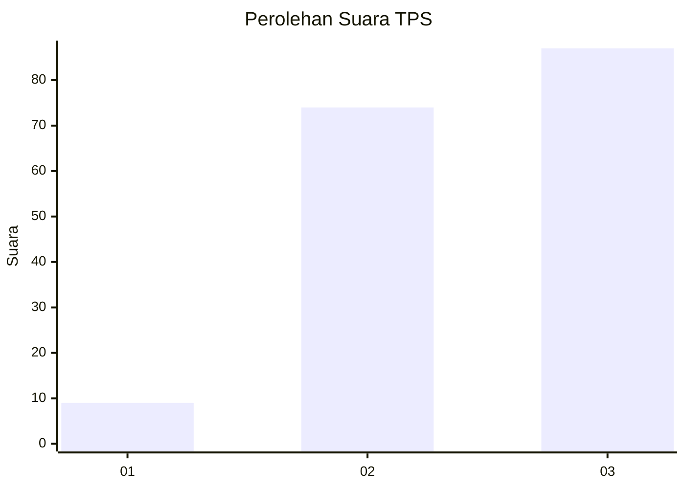
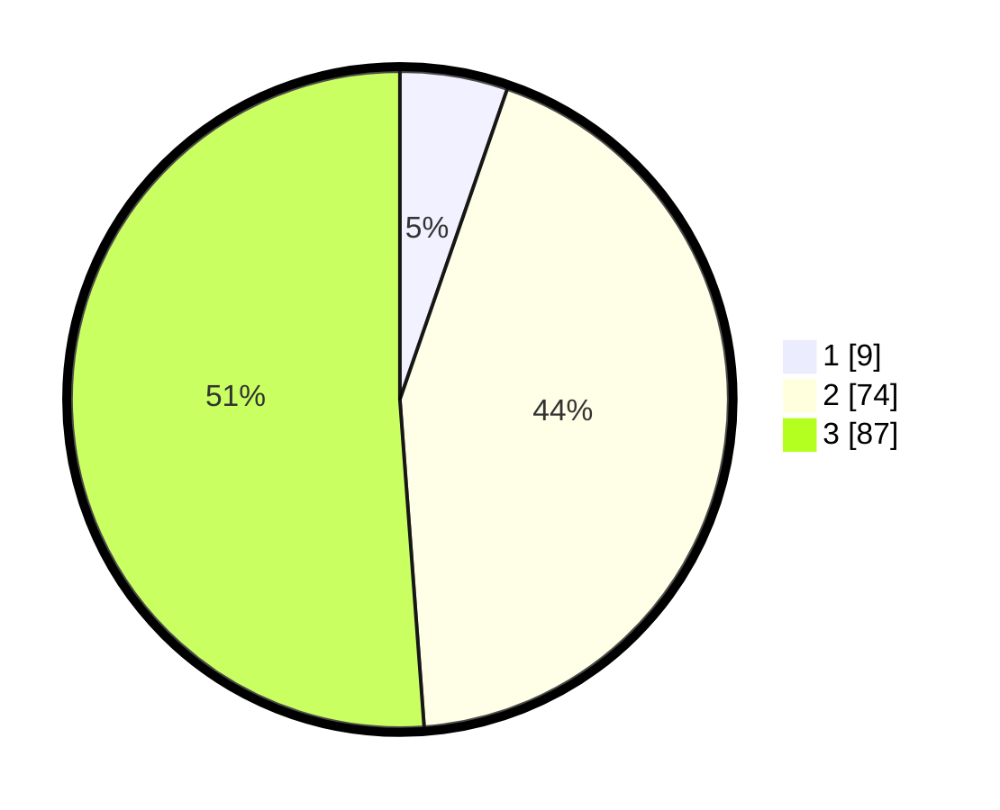

# Hasil

## Grafik

## Tabel

| No. | Nama Paslon    | Suara | Suara (raw) | Persentase |
|:--- |:-------------- | -----:| -----------:| ----------:|
| 1   | ANIES MUHAIMIN | 9     | [9][p-1]    | 5,29       |
| 2   | PRABOWO GIBRAN | 74    | [74][p-2]   | 43,53      |
| 3   | GANJAR MAHFUD  | 87    | [87][p-3]   | 51,18      |

[p-1]: https://github.com/gigit-pemilu/pemilu-2024/blob/main/pilpres/hitung-suara/sub/33-jawa-tengah/sub/05-kebumen/sub/01-ayah/sub/2001-argopeni/sub/004-tps/sub/paslon-1.txt
[p-2]: https://github.com/gigit-pemilu/pemilu-2024/blob/main/pilpres/hitung-suara/sub/33-jawa-tengah/sub/05-kebumen/sub/01-ayah/sub/2001-argopeni/sub/004-tps/sub/paslon-2.txt
[p-3]: https://github.com/gigit-pemilu/pemilu-2024/blob/main/pilpres/hitung-suara/sub/33-jawa-tengah/sub/05-kebumen/sub/01-ayah/sub/2001-argopeni/sub/004-tps/sub/paslon-3.txt

## Foto C Plano

https://sirekap-obj-formc.kpu.go.id/b856/pemilu/ppwp/33/05/01/20/01/3305012001004-20240215-124921--21bfe612-c3ee-42f2-89c0-c4fce5ddba1e.jpg

https://sirekap-obj-formc.kpu.go.id/b856/pemilu/ppwp/33/05/01/20/01/3305012001004-20240215-012545--c2302790-c3c8-4564-8b7c-0ab1a5ebaf8d.jpg

https://sirekap-obj-formc.kpu.go.id/b856/pemilu/ppwp/33/05/01/20/01/3305012001004-20240215-012959--e946241b-be53-4ea5-85a7-cbc524be8b35.jpg

## Metadata

| Key        | Value               |
| ---------- | ------------------- |
| Time Stamp | 2024-02-15 15:00:29 |

