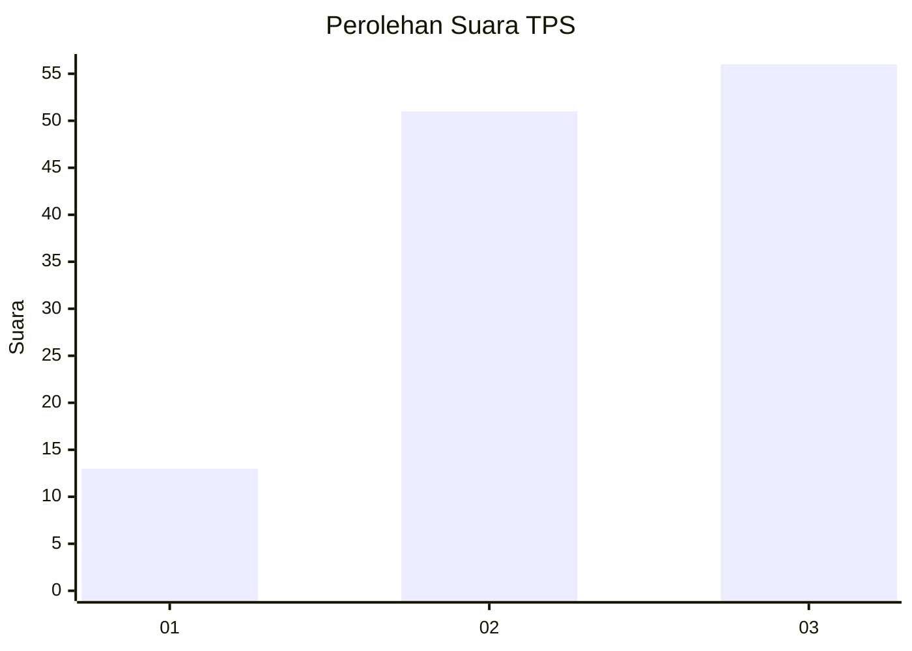
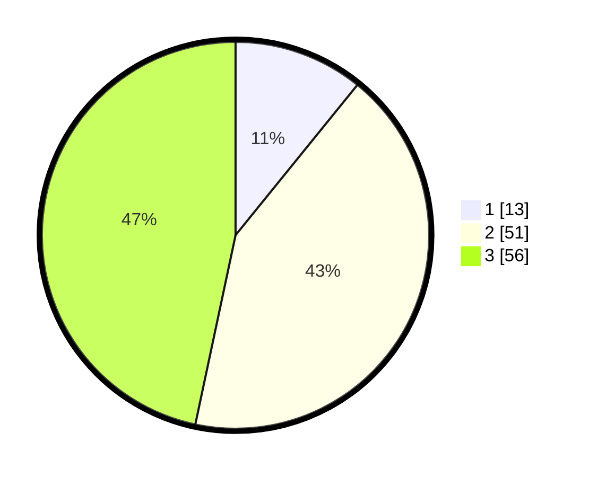

# Hasil

## Grafik

## Tabel

| No. | Nama Paslon    | Suara | Suara (raw) | Persentase |
|:--- |:-------------- | -----:| -----------:| ----------:|
| 1   | ANIES MUHAIMIN | 13    | [13][p-1]   | 10,83      |
| 2   | PRABOWO GIBRAN | 51    | [51][p-2]   | 42,50      |
| 3   | GANJAR MAHFUD  | 56    | [56][p-3]   | 46,67      |

[p-1]: https://github.com/gigit-pemilu/pemilu-2024/blob/main/pilpres/hitung-suara/sub/33-jawa-tengah/sub/05-kebumen/sub/01-ayah/sub/2001-argopeni/sub/005-tps/sub/paslon-1.txt
[p-2]: https://github.com/gigit-pemilu/pemilu-2024/blob/main/pilpres/hitung-suara/sub/33-jawa-tengah/sub/05-kebumen/sub/01-ayah/sub/2001-argopeni/sub/005-tps/sub/paslon-2.txt
[p-3]: https://github.com/gigit-pemilu/pemilu-2024/blob/main/pilpres/hitung-suara/sub/33-jawa-tengah/sub/05-kebumen/sub/01-ayah/sub/2001-argopeni/sub/005-tps/sub/paslon-3.txt

## Foto C Plano

https://sirekap-obj-formc.kpu.go.id/ed36/pemilu/ppwp/33/05/01/20/01/3305012001005-20240214-192441--69a3346f-b2a7-406c-b3d2-5a91cf1af783.jpg

https://sirekap-obj-formc.kpu.go.id/ed36/pemilu/ppwp/33/05/01/20/01/3305012001005-20240216-053152--057ecef5-a4e3-416d-bd4c-15dfd94f50f1.jpg

https://sirekap-obj-formc.kpu.go.id/ed36/pemilu/ppwp/33/05/01/20/01/3305012001005-20240214-191645--b027906b-325a-48a7-b0d2-81f8ca95725c.jpg

## Metadata

| Key        | Value               |
| ---------- | ------------------- |
| Time Stamp | 2024-02-16 10:00:28 |

## DATA PEMILIH TETAP

Jumlah pemilih dalam DPT: **142**.
 * L: **72**.
 * P: **70**.

## DATA PENGGUNA HAK PILIH

Jumlah pengguna hak pilih dalam DPT: **121**.
 * L: **63**.
 * P: **58**.

Jumlah pengguna hak pilih dalam DPTb: **0**.
 * L: **0**.
 * P: **0**.

Jumlah pengguna hak pilih dalam DPK: **0**.
 * L: **0**.
 * P: **0**.

Jumlah pengguna hak pilih: **121**.
 * L: **63**.
 * P: **58**.

## JUMLAH SUARA SAH DAN TIDAK SAH

JUMLAH SELURUH SUARA SAH: **120**.

JUMLAH SUARA TIDAK SAH: **1**.

JUMLAH SELURUH SUARA SAH DAN SUARA TIDAK SAH: **121**.

