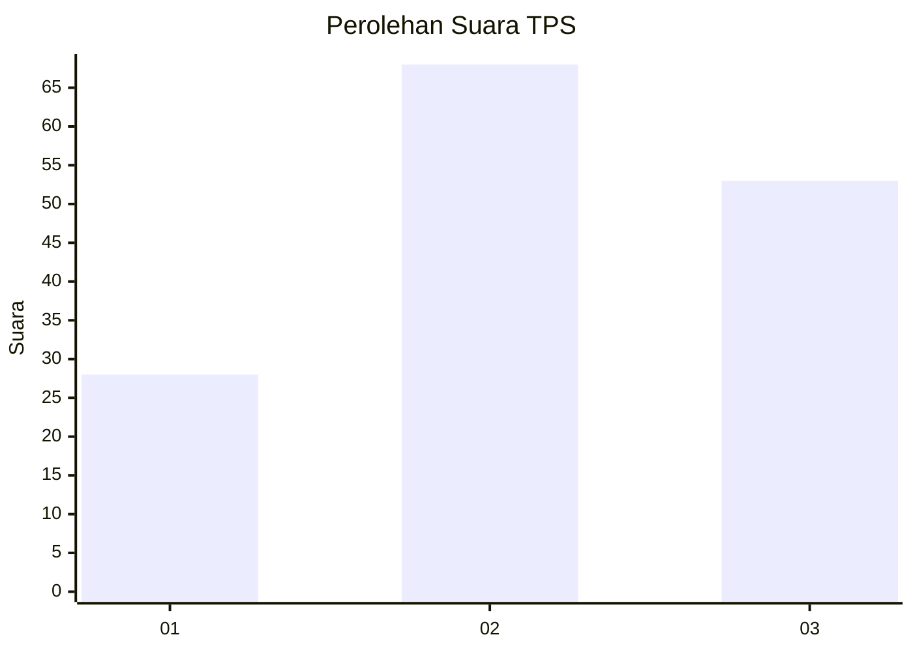
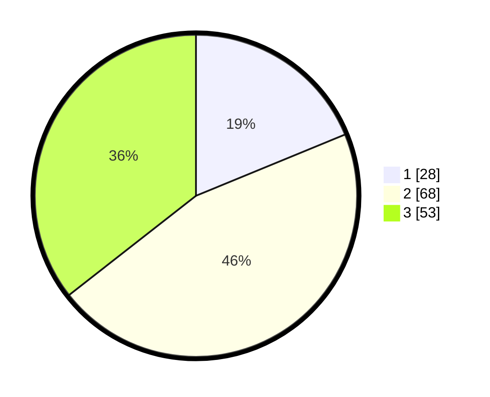

# Hasil

## Grafik

## Tabel

| No. | Nama Paslon    | Suara | Suara (raw) | Persentase |
|:--- |:-------------- | -----:| -----------:| ----------:|
| 1   | ANIES MUHAIMIN | 28    | [28][p-1]   | 18,79      |
| 2   | PRABOWO GIBRAN | 68    | [68][p-2]   | 45,64      |
| 3   | GANJAR MAHFUD  | 53    | [53][p-3]   | 35,57      |

[p-1]: https://github.com/gigit-pemilu/pemilu-2024/blob/main/pilpres/hitung-suara/sub/33-jawa-tengah/sub/05-kebumen/sub/01-ayah/sub/2003-srati/sub/001-tps/sub/paslon-1.txt
[p-2]: https://github.com/gigit-pemilu/pemilu-2024/blob/main/pilpres/hitung-suara/sub/33-jawa-tengah/sub/05-kebumen/sub/01-ayah/sub/2003-srati/sub/001-tps/sub/paslon-2.txt
[p-3]: https://github.com/gigit-pemilu/pemilu-2024/blob/main/pilpres/hitung-suara/sub/33-jawa-tengah/sub/05-kebumen/sub/01-ayah/sub/2003-srati/sub/001-tps/sub/paslon-3.txt

## Foto C Plano

https://sirekap-obj-formc.kpu.go.id/21ab/pemilu/ppwp/33/05/01/20/03/3305012003001-20240214-235310--e55b9f20-2ce5-4e76-83f7-bd49b739f41a.jpg

https://sirekap-obj-formc.kpu.go.id/21ab/pemilu/ppwp/33/05/01/20/03/3305012003001-20240214-235711--abe6c11b-c31a-4bd8-a04e-3e5e2ecb92c0.jpg

https://sirekap-obj-formc.kpu.go.id/21ab/pemilu/ppwp/33/05/01/20/03/3305012003001-20240215-000142--a08f0c0d-88b5-4774-8470-ff2cee099c70.jpg

## Metadata

| Key        | Value               |
| ---------- | ------------------- |
| Time Stamp | 2024-02-25 00:00:00 |

