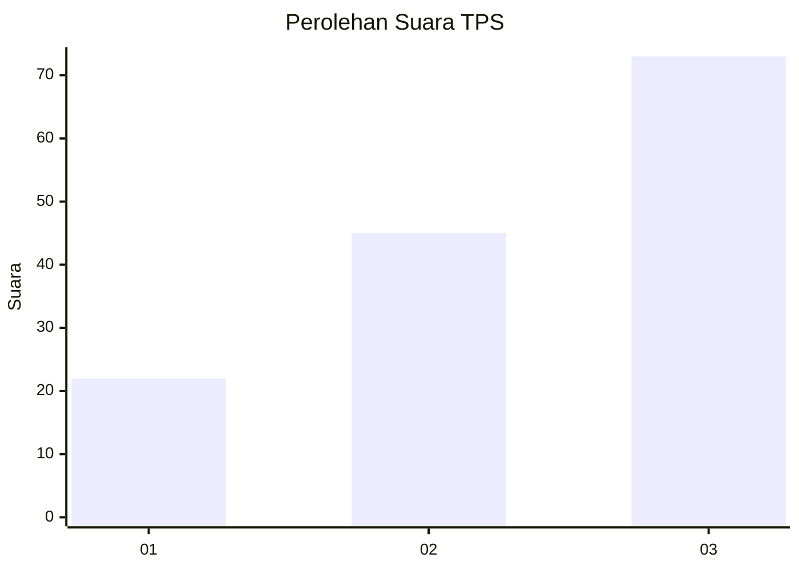
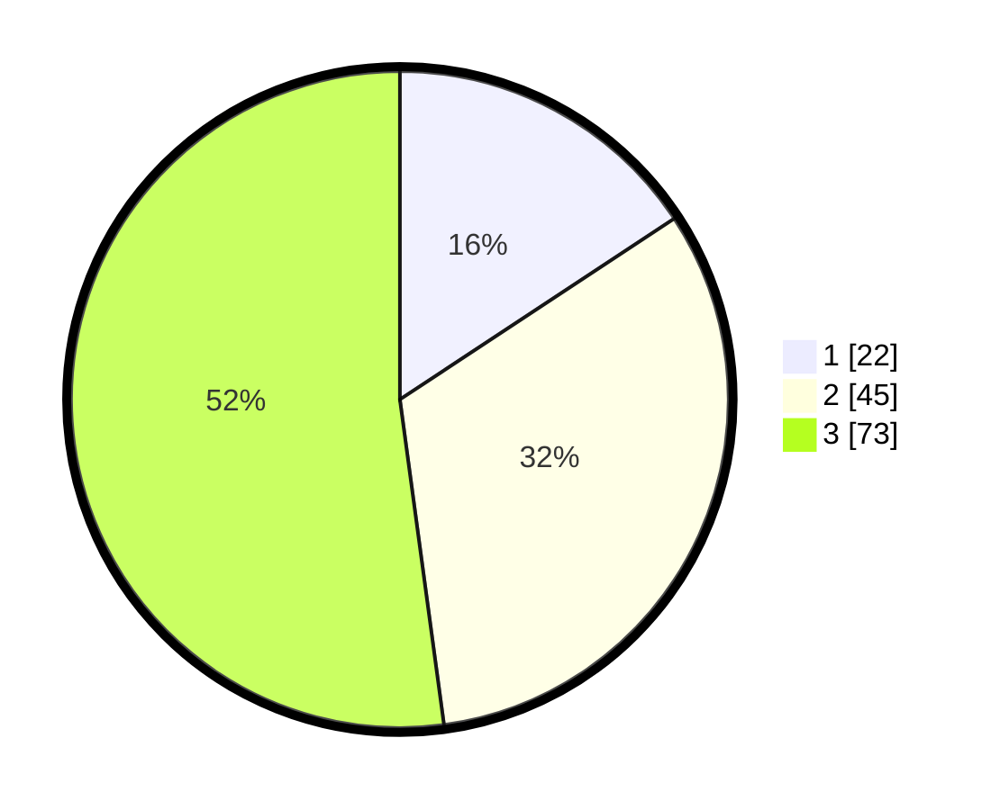

# Hasil

## Grafik

## Tabel

| No. | Nama Paslon    | Suara | Suara (raw) | Persentase |
|:--- |:-------------- | -----:| -----------:| ----------:|
| 1   | ANIES MUHAIMIN | 22    | [22][p-1]   | 15,71      |
| 2   | PRABOWO GIBRAN | 45    | [45][p-2]   | 32,14      |
| 3   | GANJAR MAHFUD  | 73    | [73][p-3]   | 52,14      |

[p-1]: https://github.com/gigit-pemilu/pemilu-2024/blob/main/pilpres/hitung-suara/sub/33-jawa-tengah/sub/05-kebumen/sub/01-ayah/sub/2003-srati/sub/010-tps/sub/paslon-1.txt
[p-2]: https://github.com/gigit-pemilu/pemilu-2024/blob/main/pilpres/hitung-suara/sub/33-jawa-tengah/sub/05-kebumen/sub/01-ayah/sub/2003-srati/sub/010-tps/sub/paslon-2.txt
[p-3]: https://github.com/gigit-pemilu/pemilu-2024/blob/main/pilpres/hitung-suara/sub/33-jawa-tengah/sub/05-kebumen/sub/01-ayah/sub/2003-srati/sub/010-tps/sub/paslon-3.txt

## Foto C Plano

https://sirekap-obj-formc.kpu.go.id/f3b2/pemilu/ppwp/33/05/01/20/03/3305012003010-20240216-185805--c9ba0ba5-2b68-487d-93e2-6d87fe3b9034.jpg

https://sirekap-obj-formc.kpu.go.id/f3b2/pemilu/ppwp/33/05/01/20/03/3305012003010-20240216-081241--ac684060-13ef-4924-bd0a-8b8d1a805f74.jpg

https://sirekap-obj-formc.kpu.go.id/f3b2/pemilu/ppwp/33/05/01/20/03/3305012003010-20240216-081402--4b8d33ec-c673-460a-bfe5-e17f447d1c08.jpg

## Metadata

| Key        | Value               |
| ---------- | ------------------- |
| Time Stamp | 2024-02-19 13:00:00 |

