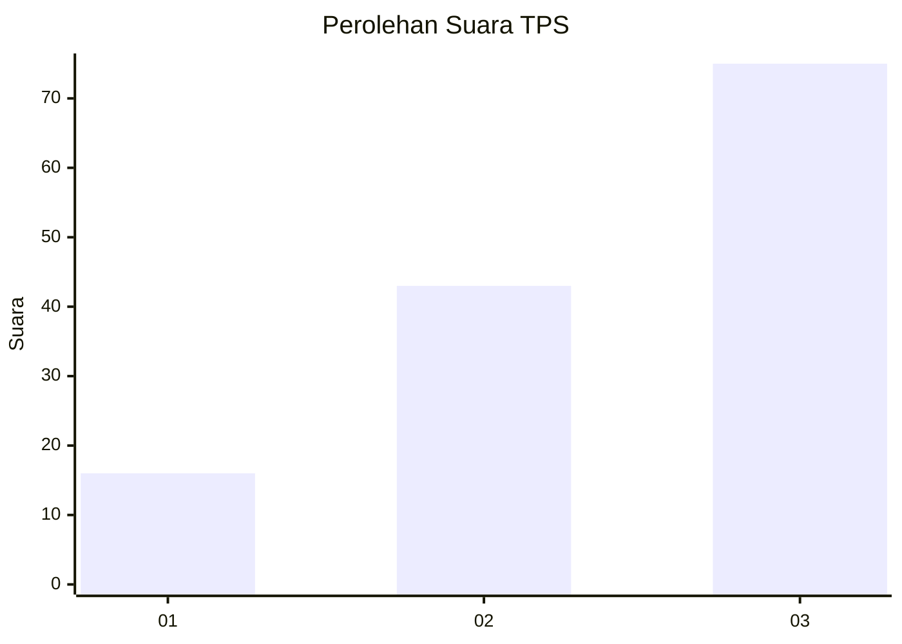
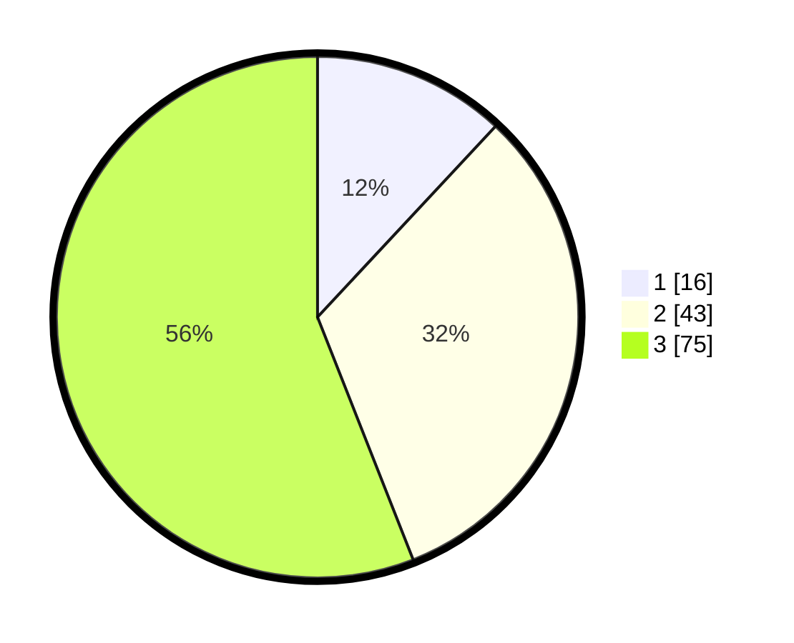

# Hasil

## Grafik

## Tabel

| No. | Nama Paslon    | Suara | Suara (raw) | Persentase |
|:--- |:-------------- | -----:| -----------:| ----------:|
| 1   | ANIES MUHAIMIN | 16    | [16][p-1]   | 11,94      |
| 2   | PRABOWO GIBRAN | 43    | [43][p-2]   | 32,09      |
| 3   | GANJAR MAHFUD  | 75    | [75][p-3]   | 55,97      |

[p-1]: https://github.com/gigit-pemilu/pemilu-2024-33-jawa-tengah/blob/main/pilpres/hitung-suara/sub/33-jawa-tengah/sub/05-kebumen/sub/01-ayah/sub/2003-srati/sub/016-tps/sub/paslon-1.txt
[p-2]: https://github.com/gigit-pemilu/pemilu-2024-33-jawa-tengah/blob/main/pilpres/hitung-suara/sub/33-jawa-tengah/sub/05-kebumen/sub/01-ayah/sub/2003-srati/sub/016-tps/sub/paslon-2.txt
[p-3]: https://github.com/gigit-pemilu/pemilu-2024-33-jawa-tengah/blob/main/pilpres/hitung-suara/sub/33-jawa-tengah/sub/05-kebumen/sub/01-ayah/sub/2003-srati/sub/016-tps/sub/paslon-3.txt

## Foto C Plano

https://sirekap-obj-formc.kpu.go.id/20de/pemilu/ppwp/33/05/01/20/03/3305012003016-20240215-054256--a9f57c08-f5e9-46b7-8280-0af0fe7167f2.jpg

https://sirekap-obj-formc.kpu.go.id/20de/pemilu/ppwp/33/05/01/20/03/3305012003016-20240214-222901--d0fef561-815f-491a-a36f-0d023df171ce.jpg

https://sirekap-obj-formc.kpu.go.id/20de/pemilu/ppwp/33/05/01/20/03/3305012003016-20240214-222956--a977322f-fd58-4c5d-bf8b-37ef34fe06d8.jpg

## Metadata

| Key        | Value               |
| ---------- | ------------------- |
| Time Stamp | 2024-02-19 13:00:00 |

