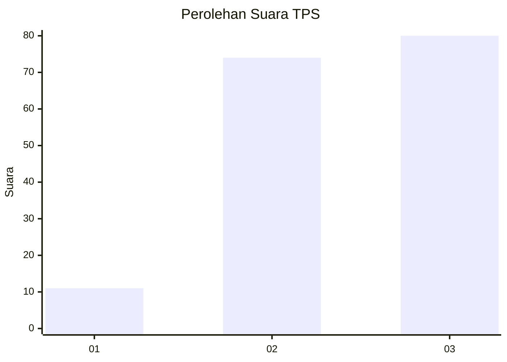
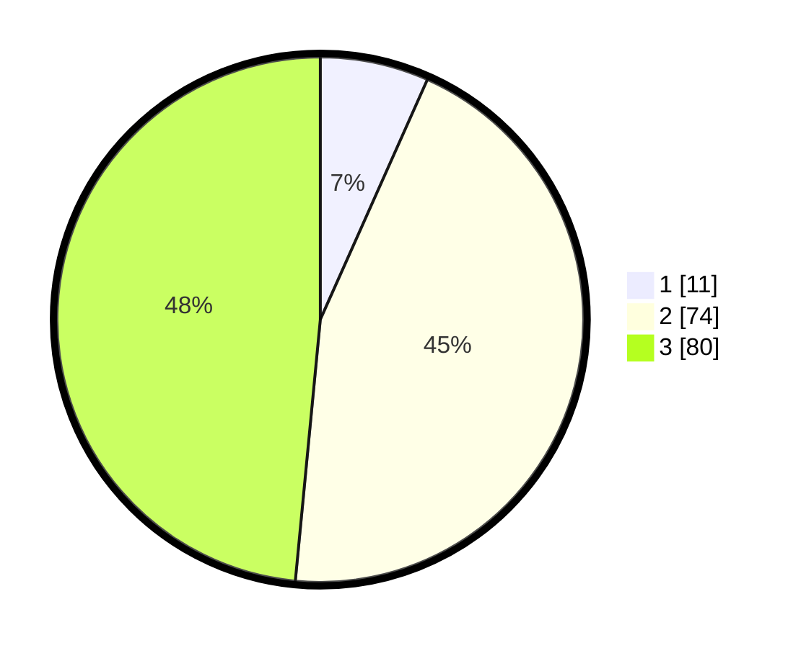

# Hasil

## Grafik

## Tabel

| No. | Nama Paslon    | Suara | Suara (raw) | Persentase |
|:--- |:-------------- | -----:| -----------:| ----------:|
| 1   | ANIES MUHAIMIN | 11    | [11][p-1]   | 6,67       |
| 2   | PRABOWO GIBRAN | 74    | [74][p-2]   | 44,85      |
| 3   | GANJAR MAHFUD  | 80    | [80][p-3]   | 48,48      |

[p-1]: https://github.com/gigit-pemilu/pemilu-2024/blob/main/pilpres/hitung-suara/sub/33-jawa-tengah/sub/05-kebumen/sub/01-ayah/sub/2006-banjararjo/sub/002-tps/sub/paslon-1.txt
[p-2]: https://github.com/gigit-pemilu/pemilu-2024/blob/main/pilpres/hitung-suara/sub/33-jawa-tengah/sub/05-kebumen/sub/01-ayah/sub/2006-banjararjo/sub/002-tps/sub/paslon-2.txt
[p-3]: https://github.com/gigit-pemilu/pemilu-2024/blob/main/pilpres/hitung-suara/sub/33-jawa-tengah/sub/05-kebumen/sub/01-ayah/sub/2006-banjararjo/sub/002-tps/sub/paslon-3.txt

## Foto C Plano

https://sirekap-obj-formc.kpu.go.id/7b3f/pemilu/ppwp/33/05/01/20/06/3305012006002-20240214-193246--978a2a06-c4dc-49fb-b300-de55b0c43f14.jpg

https://sirekap-obj-formc.kpu.go.id/7b3f/pemilu/ppwp/33/05/01/20/06/3305012006002-20240214-193447--facf9ff2-7742-4195-870e-02f02c366049.jpg

https://sirekap-obj-formc.kpu.go.id/7b3f/pemilu/ppwp/33/05/01/20/06/3305012006002-20240214-221709--e3ac51d0-4e6e-4829-8d9d-540a97cfa428.jpg

## Metadata

| Key        | Value               |
| ---------- | ------------------- |
| Time Stamp | 2024-02-15 04:00:24 |

