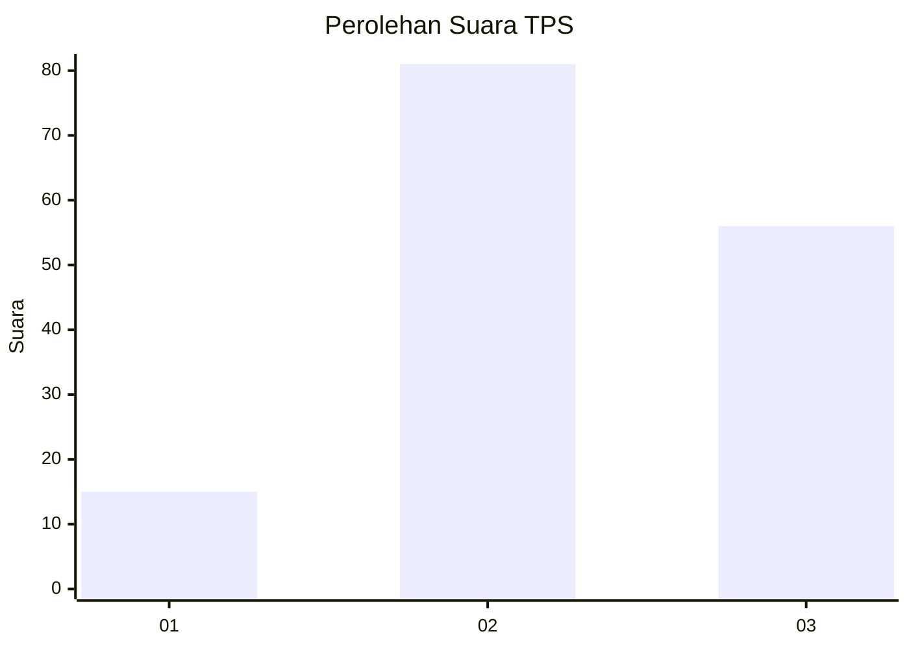
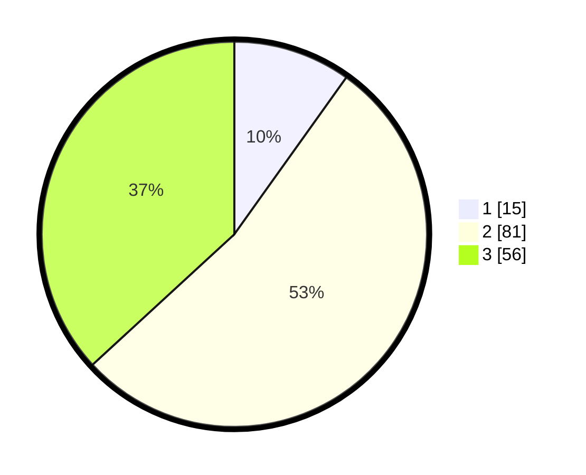

# Hasil

## Grafik

## Tabel

| No. | Nama Paslon    | Suara | Suara (raw) | Persentase |
|:--- |:-------------- | -----:| -----------:| ----------:|
| 1   | ANIES MUHAIMIN | 15    | [15][p-1]   | 9,87       |
| 2   | PRABOWO GIBRAN | 81    | [81][p-2]   | 53,29      |
| 3   | GANJAR MAHFUD  | 56    | [56][p-3]   | 36,84      |

[p-1]: https://github.com/gigit-pemilu/pemilu-2024/blob/main/pilpres/hitung-suara/sub/33-jawa-tengah/sub/05-kebumen/sub/01-ayah/sub/2008-watukelir/sub/001-tps/sub/paslon-1.txt
[p-2]: https://github.com/gigit-pemilu/pemilu-2024/blob/main/pilpres/hitung-suara/sub/33-jawa-tengah/sub/05-kebumen/sub/01-ayah/sub/2008-watukelir/sub/001-tps/sub/paslon-2.txt
[p-3]: https://github.com/gigit-pemilu/pemilu-2024/blob/main/pilpres/hitung-suara/sub/33-jawa-tengah/sub/05-kebumen/sub/01-ayah/sub/2008-watukelir/sub/001-tps/sub/paslon-3.txt

## Foto C Plano

https://sirekap-obj-formc.kpu.go.id/c318/pemilu/ppwp/33/05/01/20/08/3305012008001-20240215-072837--31571074-f3b2-4ec4-b12a-225e8aff13d2.jpg

https://sirekap-obj-formc.kpu.go.id/c318/pemilu/ppwp/33/05/01/20/08/3305012008001-20240215-072931--06f1c052-3d7e-48b2-812e-2edee817a02f.jpg

https://sirekap-obj-formc.kpu.go.id/c318/pemilu/ppwp/33/05/01/20/08/3305012008001-20240215-073012--3d4c6d94-9d9e-4b2c-b937-2d51fd849062.jpg

## Metadata

| Key        | Value               |
| ---------- | ------------------- |
| Time Stamp | 2024-02-17 16:00:02 |

