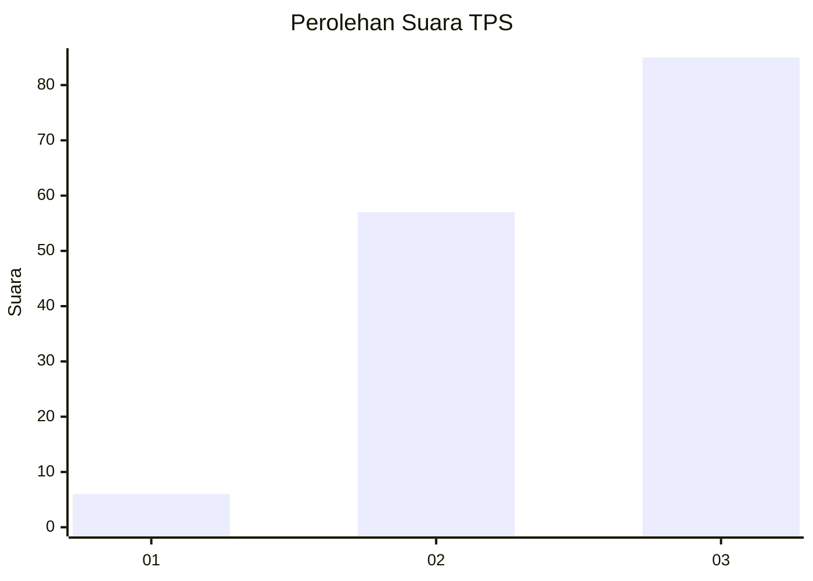
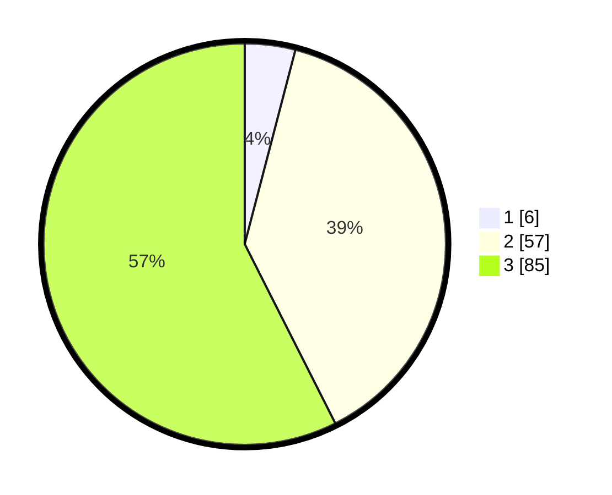

# Hasil

## Grafik

## Tabel

| No. | Nama Paslon    | Suara | Suara (raw) | Persentase |
|:--- |:-------------- | -----:| -----------:| ----------:|
| 1   | ANIES MUHAIMIN | 6     | [6][p-1]    | 4,05       |
| 2   | PRABOWO GIBRAN | 57    | [57][p-2]   | 38,51      |
| 3   | GANJAR MAHFUD  | 85    | [85][p-3]   | 57,43      |

[p-1]: https://github.com/gigit-pemilu/pemilu-2024/blob/main/pilpres/hitung-suara/sub/33-jawa-tengah/sub/05-kebumen/sub/01-ayah/sub/2008-watukelir/sub/009-tps/sub/paslon-1.txt
[p-2]: https://github.com/gigit-pemilu/pemilu-2024/blob/main/pilpres/hitung-suara/sub/33-jawa-tengah/sub/05-kebumen/sub/01-ayah/sub/2008-watukelir/sub/009-tps/sub/paslon-2.txt
[p-3]: https://github.com/gigit-pemilu/pemilu-2024/blob/main/pilpres/hitung-suara/sub/33-jawa-tengah/sub/05-kebumen/sub/01-ayah/sub/2008-watukelir/sub/009-tps/sub/paslon-3.txt

## Foto C Plano

https://sirekap-obj-formc.kpu.go.id/f69e/pemilu/ppwp/33/05/01/20/08/3305012008009-20240215-042721--f3eee1b4-8df5-48b1-89af-3c0711290c8a.jpg

https://sirekap-obj-formc.kpu.go.id/f69e/pemilu/ppwp/33/05/01/20/08/3305012008009-20240215-043114--0a4511e4-e4e3-4bd0-9e6f-e87c1a131973.jpg

https://sirekap-obj-formc.kpu.go.id/f69e/pemilu/ppwp/33/05/01/20/08/3305012008009-20240215-043140--4c084c3c-f93d-4829-9e42-68a2c5b4e9f4.jpg

## Metadata

| Key        | Value               |
| ---------- | ------------------- |
| Time Stamp | 2024-02-17 16:00:02 |

