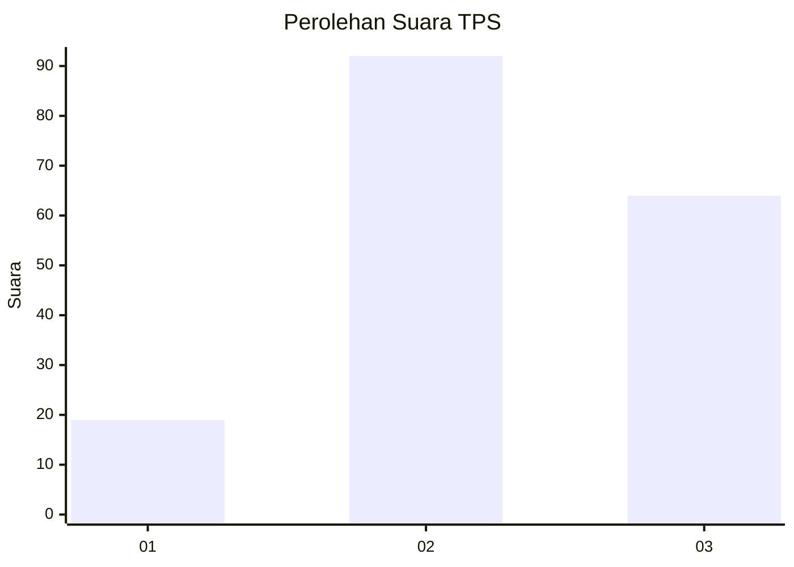
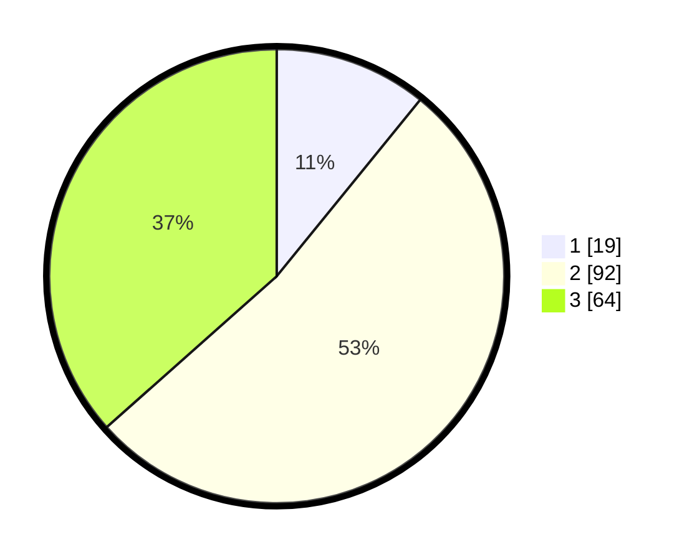

# Hasil

## Grafik

## Tabel

| No. | Nama Paslon    | Suara | Suara (raw) | Persentase |
|:--- |:-------------- | -----:| -----------:| ----------:|
| 1   | ANIES MUHAIMIN | 19    | [19][p-1]   | 10,86      |
| 2   | PRABOWO GIBRAN | 92    | [92][p-2]   | 52,57      |
| 3   | GANJAR MAHFUD  | 64    | [64][p-3]   | 36,57      |

[p-1]: https://github.com/gigit-pemilu/pemilu-2024/blob/main/pilpres/hitung-suara/sub/33-jawa-tengah/sub/05-kebumen/sub/01-ayah/sub/2009-kalibangkang/sub/003-tps/sub/paslon-1.txt
[p-2]: https://github.com/gigit-pemilu/pemilu-2024/blob/main/pilpres/hitung-suara/sub/33-jawa-tengah/sub/05-kebumen/sub/01-ayah/sub/2009-kalibangkang/sub/003-tps/sub/paslon-2.txt
[p-3]: https://github.com/gigit-pemilu/pemilu-2024/blob/main/pilpres/hitung-suara/sub/33-jawa-tengah/sub/05-kebumen/sub/01-ayah/sub/2009-kalibangkang/sub/003-tps/sub/paslon-3.txt

## Foto C Plano

https://sirekap-obj-formc.kpu.go.id/01eb/pemilu/ppwp/33/05/01/20/09/3305012009003-20240214-191416--1b7d8ab8-0301-4f2b-a329-468a738924f5.jpg

https://sirekap-obj-formc.kpu.go.id/01eb/pemilu/ppwp/33/05/01/20/09/3305012009003-20240214-200922--b6ee7bcc-de4c-40c7-bce9-0c7a98852f73.jpg

https://sirekap-obj-formc.kpu.go.id/01eb/pemilu/ppwp/33/05/01/20/09/3305012009003-20240215-071039--c9faba05-de28-44d6-b7d6-d88509b90738.jpg

## Metadata

| Key        | Value               |
| ---------- | ------------------- |
| Time Stamp | 2024-02-15 15:00:29 |

