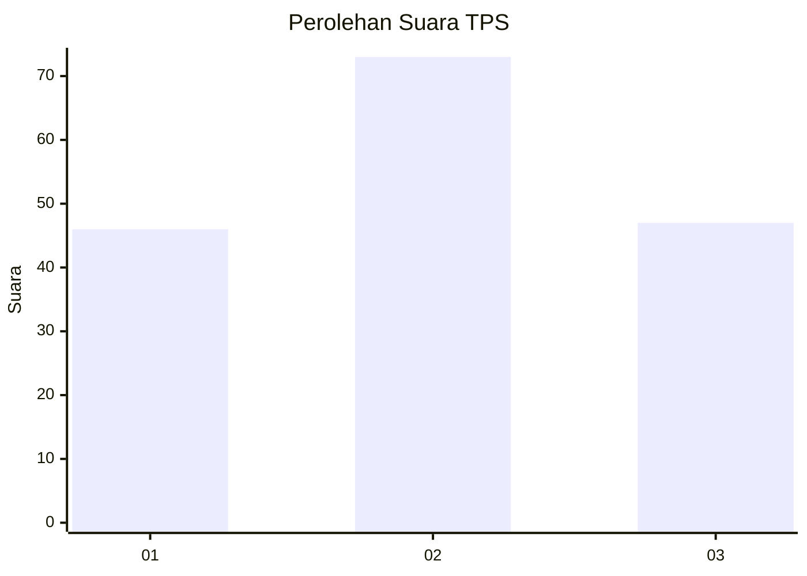
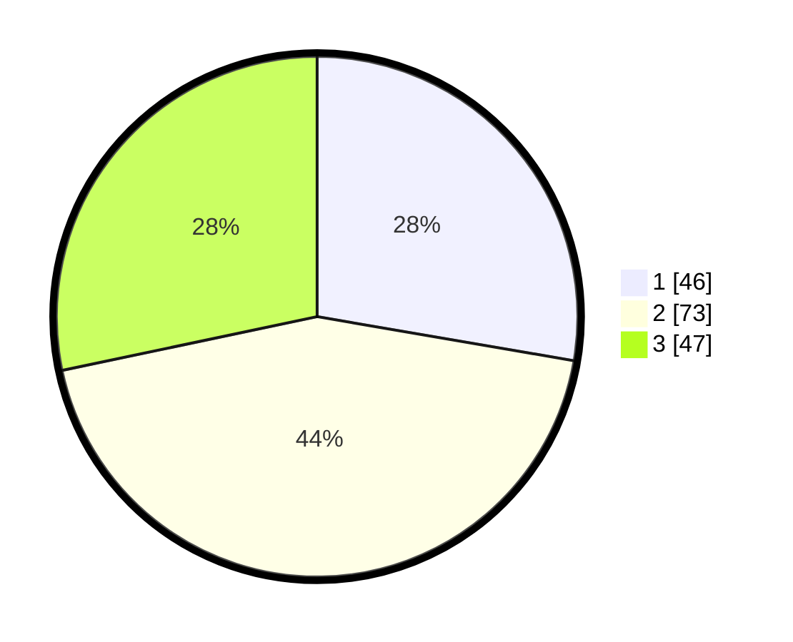

# Hasil

## Grafik

## Tabel

| No. | Nama Paslon    | Suara | Suara (raw) | Persentase |
|:--- |:-------------- | -----:| -----------:| ----------:|
| 1   | ANIES MUHAIMIN | 46    | [46][p-1]   | 27,71      |
| 2   | PRABOWO GIBRAN | 73    | [73][p-2]   | 43,98      |
| 3   | GANJAR MAHFUD  | 47    | [47][p-3]   | 28,31      |

[p-1]: https://github.com/gigit-pemilu/pemilu-2024-33-jawa-tengah/blob/main/pilpres/hitung-suara/sub/33-jawa-tengah/sub/05-kebumen/sub/01-ayah/sub/2009-kalibangkang/sub/008-tps/sub/paslon-1.txt
[p-2]: https://github.com/gigit-pemilu/pemilu-2024-33-jawa-tengah/blob/main/pilpres/hitung-suara/sub/33-jawa-tengah/sub/05-kebumen/sub/01-ayah/sub/2009-kalibangkang/sub/008-tps/sub/paslon-2.txt
[p-3]: https://github.com/gigit-pemilu/pemilu-2024-33-jawa-tengah/blob/main/pilpres/hitung-suara/sub/33-jawa-tengah/sub/05-kebumen/sub/01-ayah/sub/2009-kalibangkang/sub/008-tps/sub/paslon-3.txt

## Foto C Plano

https://sirekap-obj-formc.kpu.go.id/bbd8/pemilu/ppwp/33/05/01/20/09/3305012009008-20240214-221455--602fc6f3-c18c-41f4-a905-2aeda30df3ff.jpg

https://sirekap-obj-formc.kpu.go.id/bbd8/pemilu/ppwp/33/05/01/20/09/3305012009008-20240214-221647--09ace77c-c1bb-4ecd-ad0c-a5a0c25344d7.jpg

https://sirekap-obj-formc.kpu.go.id/bbd8/pemilu/ppwp/33/05/01/20/09/3305012009008-20240214-222047--6b8ae11a-38bd-4303-bf74-725f209ce155.jpg

## Metadata

| Key        | Value               |
| ---------- | ------------------- |
| Time Stamp | 2024-02-15 16:00:26 |

