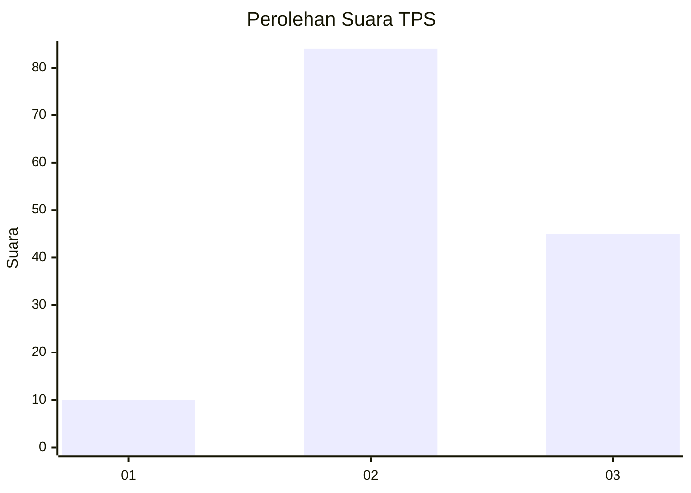
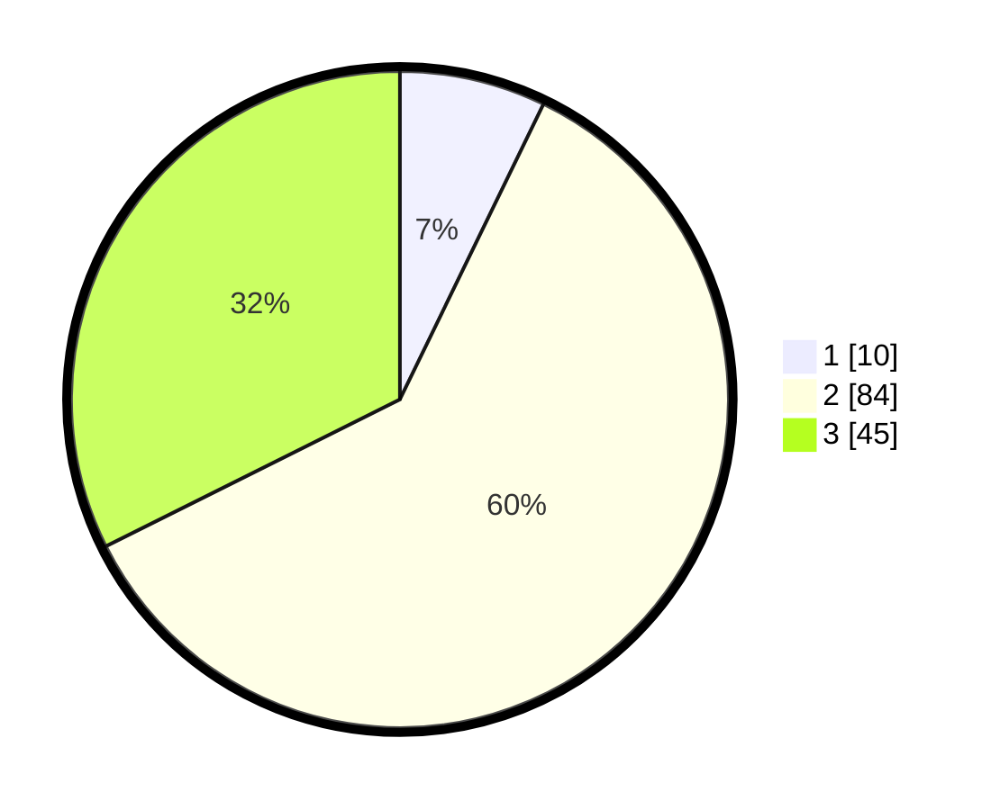

# Hasil

## Grafik

## Tabel

| No. | Nama Paslon    | Suara | Suara (raw) | Persentase |
|:--- |:-------------- | -----:| -----------:| ----------:|
| 1   | ANIES MUHAIMIN | 10    | [10][p-1]   | 7,19       |
| 2   | PRABOWO GIBRAN | 84    | [84][p-2]   | 60,43      |
| 3   | GANJAR MAHFUD  | 45    | [45][p-3]   | 32,37      |

[p-1]: https://github.com/gigit-pemilu/pemilu-2024-33-jawa-tengah/blob/main/pilpres/hitung-suara/sub/33-jawa-tengah/sub/05-kebumen/sub/01-ayah/sub/2009-kalibangkang/sub/013-tps/sub/paslon-1.txt
[p-2]: https://github.com/gigit-pemilu/pemilu-2024-33-jawa-tengah/blob/main/pilpres/hitung-suara/sub/33-jawa-tengah/sub/05-kebumen/sub/01-ayah/sub/2009-kalibangkang/sub/013-tps/sub/paslon-2.txt
[p-3]: https://github.com/gigit-pemilu/pemilu-2024-33-jawa-tengah/blob/main/pilpres/hitung-suara/sub/33-jawa-tengah/sub/05-kebumen/sub/01-ayah/sub/2009-kalibangkang/sub/013-tps/sub/paslon-3.txt

## Foto C Plano

https://sirekap-obj-formc.kpu.go.id/77f2/pemilu/ppwp/33/05/01/20/09/3305012009013-20240215-015729--affc1152-84ae-47fd-9e8c-821109a6fa5f.jpg

https://sirekap-obj-formc.kpu.go.id/77f2/pemilu/ppwp/33/05/01/20/09/3305012009013-20240215-015909--f2edfcc0-bd15-45b6-836c-d86550f583b6.jpg

https://sirekap-obj-formc.kpu.go.id/77f2/pemilu/ppwp/33/05/01/20/09/3305012009013-20240215-020039--44812aa0-82cd-4277-bf5e-ddb4c843aad3.jpg

## Metadata

| Key        | Value               |
| ---------- | ------------------- |
| Time Stamp | 2024-02-15 05:00:24 |

