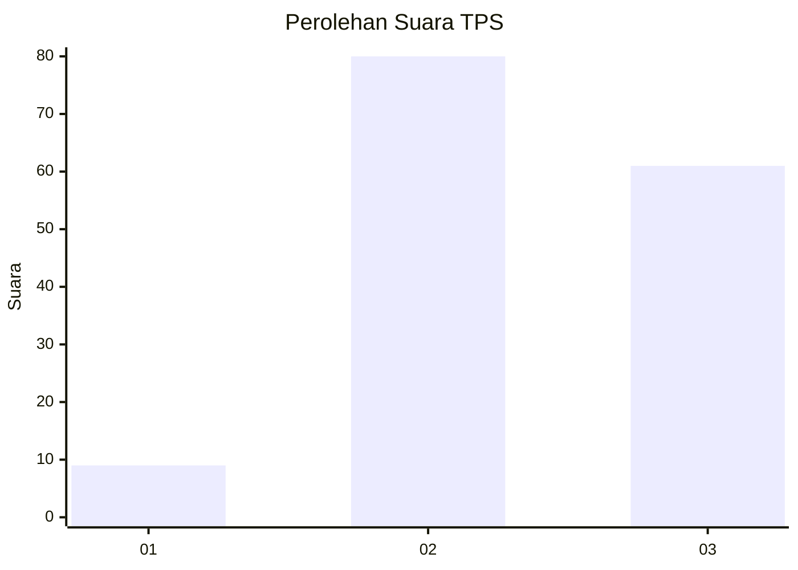
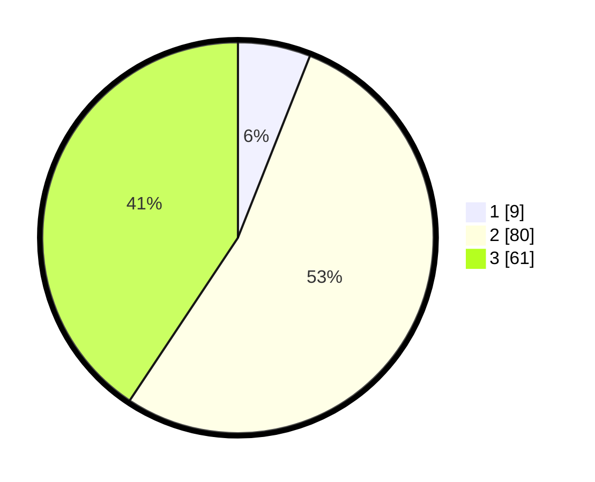

# Hasil

## Grafik

## Tabel

| No. | Nama Paslon    | Suara | Suara (raw) | Persentase |
|:--- |:-------------- | -----:| -----------:| ----------:|
| 1   | ANIES MUHAIMIN | 9     | [9][p-1]    | 6,00       |
| 2   | PRABOWO GIBRAN | 80    | [80][p-2]   | 53,33      |
| 3   | GANJAR MAHFUD  | 61    | [61][p-3]   | 40,67      |

[p-1]: https://github.com/gigit-pemilu/pemilu-2024/blob/main/pilpres/hitung-suara/sub/33-jawa-tengah/sub/05-kebumen/sub/01-ayah/sub/2010-tlogosari/sub/004-tps/sub/paslon-1.txt
[p-2]: https://github.com/gigit-pemilu/pemilu-2024/blob/main/pilpres/hitung-suara/sub/33-jawa-tengah/sub/05-kebumen/sub/01-ayah/sub/2010-tlogosari/sub/004-tps/sub/paslon-2.txt
[p-3]: https://github.com/gigit-pemilu/pemilu-2024/blob/main/pilpres/hitung-suara/sub/33-jawa-tengah/sub/05-kebumen/sub/01-ayah/sub/2010-tlogosari/sub/004-tps/sub/paslon-3.txt

## Foto C Plano

https://sirekap-obj-formc.kpu.go.id/89d6/pemilu/ppwp/33/05/01/20/10/3305012010004-20240214-141245--1a31c054-f551-49ab-85d9-796b4a49894a.jpg

https://sirekap-obj-formc.kpu.go.id/89d6/pemilu/ppwp/33/05/01/20/10/3305012010004-20240214-141330--34384e35-98d9-4d29-8bf7-acb14af9261d.jpg

https://sirekap-obj-formc.kpu.go.id/89d6/pemilu/ppwp/33/05/01/20/10/3305012010004-20240214-141209--4b0f1f52-afed-4533-9784-8ba04b0e3c8f.jpg

## Metadata

| Key        | Value               |
| ---------- | ------------------- |
| Time Stamp | 2024-02-17 16:00:02 |

