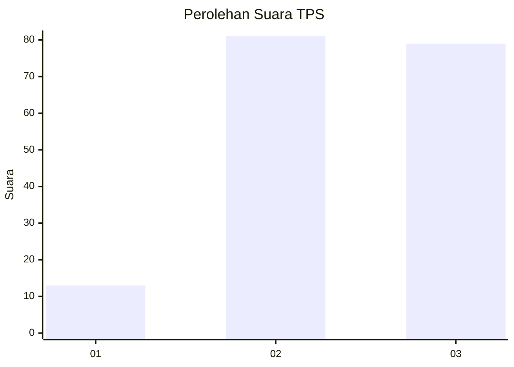
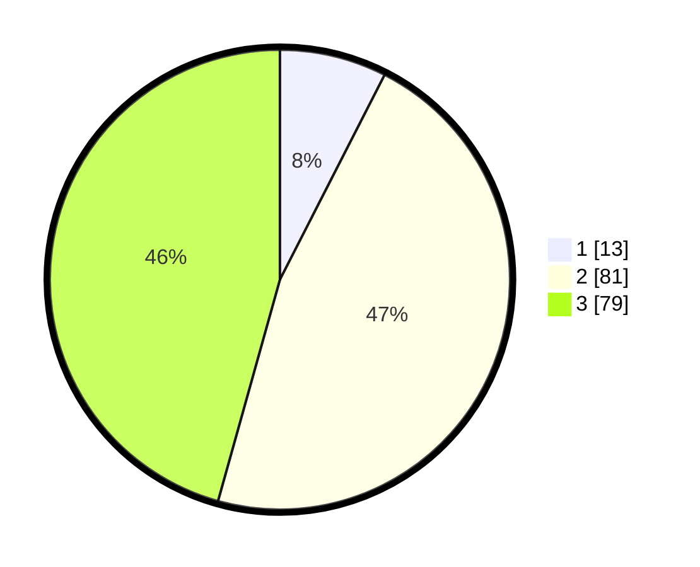

# Hasil

## Grafik

## Tabel

| No. | Nama Paslon    | Suara | Suara (raw) | Persentase |
|:--- |:-------------- | -----:| -----------:| ----------:|
| 1   | ANIES MUHAIMIN | 13    | [13][p-1]   | 7,51       |
| 2   | PRABOWO GIBRAN | 81    | [81][p-2]   | 46,82      |
| 3   | GANJAR MAHFUD  | 79    | [79][p-3]   | 45,66      |

[p-1]: https://github.com/gigit-pemilu/pemilu-2024-33-jawa-tengah/blob/main/pilpres/hitung-suara/sub/33-jawa-tengah/sub/05-kebumen/sub/01-ayah/sub/2011-kalipoh/sub/001-tps/sub/paslon-1.txt
[p-2]: https://github.com/gigit-pemilu/pemilu-2024-33-jawa-tengah/blob/main/pilpres/hitung-suara/sub/33-jawa-tengah/sub/05-kebumen/sub/01-ayah/sub/2011-kalipoh/sub/001-tps/sub/paslon-2.txt
[p-3]: https://github.com/gigit-pemilu/pemilu-2024-33-jawa-tengah/blob/main/pilpres/hitung-suara/sub/33-jawa-tengah/sub/05-kebumen/sub/01-ayah/sub/2011-kalipoh/sub/001-tps/sub/paslon-3.txt

## Foto C Plano

https://sirekap-obj-formc.kpu.go.id/ab04/pemilu/ppwp/33/05/01/20/11/3305012011001-20240215-023839--dee080fb-7b4a-4ab9-9990-c00c48e40658.jpg

https://sirekap-obj-formc.kpu.go.id/ab04/pemilu/ppwp/33/05/01/20/11/3305012011001-20240215-014608--1ad341c0-0177-41fe-9d30-7ee81575b3d1.jpg

https://sirekap-obj-formc.kpu.go.id/ab04/pemilu/ppwp/33/05/01/20/11/3305012011001-20240215-042801--69cc52bf-b0e2-48f9-a9b9-933db48df95e.jpg

## Metadata

| Key        | Value               |
| ---------- | ------------------- |
| Time Stamp | 2024-02-17 16:00:02 |

