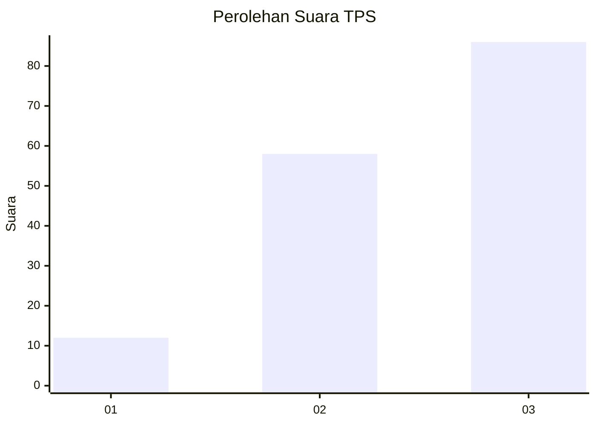
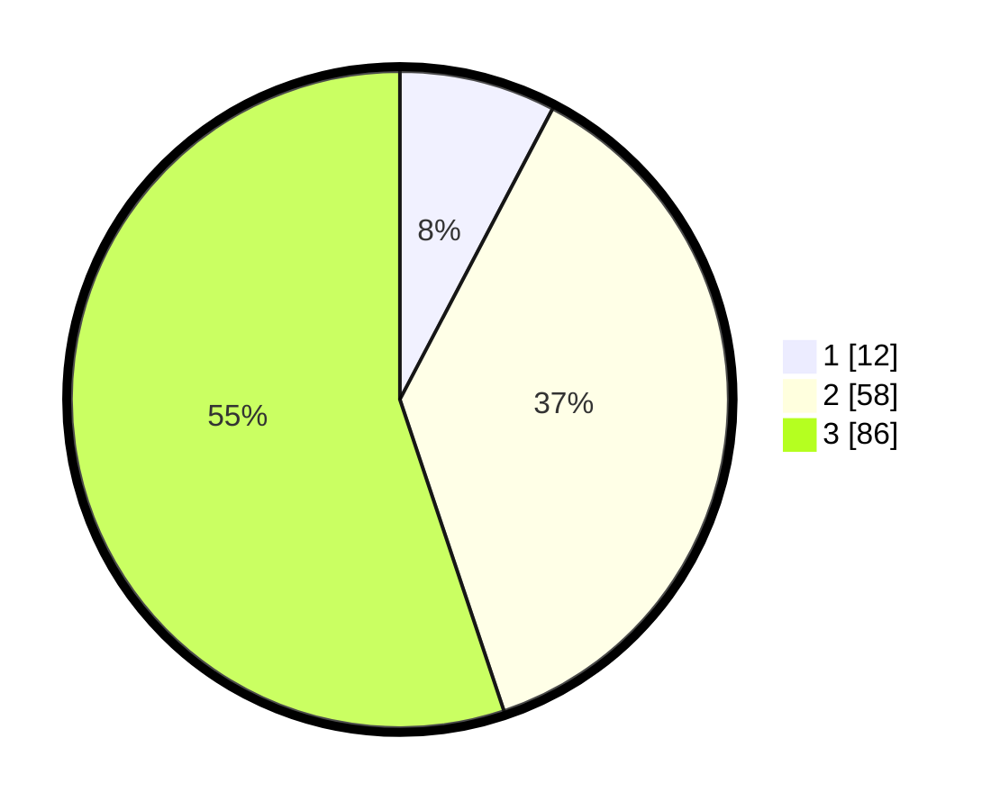

# Hasil

## Grafik

## Tabel

| No. | Nama Paslon    | Suara | Suara (raw) | Persentase |
|:--- |:-------------- | -----:| -----------:| ----------:|
| 1   | ANIES MUHAIMIN | 12    | [12][p-1]   | 7,69       |
| 2   | PRABOWO GIBRAN | 58    | [58][p-2]   | 37,18      |
| 3   | GANJAR MAHFUD  | 86    | [86][p-3]   | 55,13      |

[p-1]: https://github.com/gigit-pemilu/pemilu-2024-33-jawa-tengah/blob/main/pilpres/hitung-suara/sub/33-jawa-tengah/sub/05-kebumen/sub/01-ayah/sub/2011-kalipoh/sub/005-tps/sub/paslon-1.txt
[p-2]: https://github.com/gigit-pemilu/pemilu-2024-33-jawa-tengah/blob/main/pilpres/hitung-suara/sub/33-jawa-tengah/sub/05-kebumen/sub/01-ayah/sub/2011-kalipoh/sub/005-tps/sub/paslon-2.txt
[p-3]: https://github.com/gigit-pemilu/pemilu-2024-33-jawa-tengah/blob/main/pilpres/hitung-suara/sub/33-jawa-tengah/sub/05-kebumen/sub/01-ayah/sub/2011-kalipoh/sub/005-tps/sub/paslon-3.txt

## Foto C Plano

https://sirekap-obj-formc.kpu.go.id/57b5/pemilu/ppwp/33/05/01/20/11/3305012011005-20240215-000348--59fc2783-6623-4cb0-a8d6-f030eade976e.jpg

https://sirekap-obj-formc.kpu.go.id/57b5/pemilu/ppwp/33/05/01/20/11/3305012011005-20240215-000852--91c9249b-e898-42d4-b82e-1a514025836c.jpg

https://sirekap-obj-formc.kpu.go.id/57b5/pemilu/ppwp/33/05/01/20/11/3305012011005-20240215-000959--2e5472f6-6620-4de0-a67c-82e92fa10f48.jpg

## Metadata

| Key        | Value               |
| ---------- | ------------------- |
| Time Stamp | 2024-02-15 19:00:26 |

