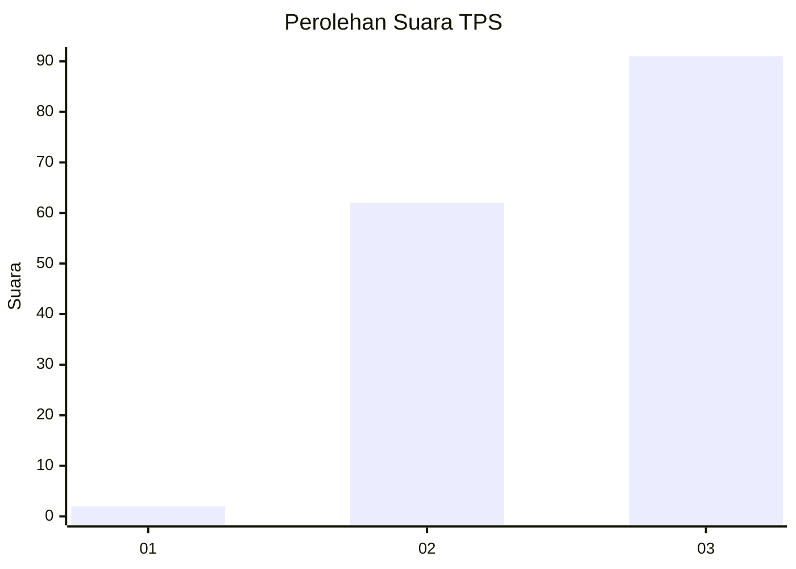
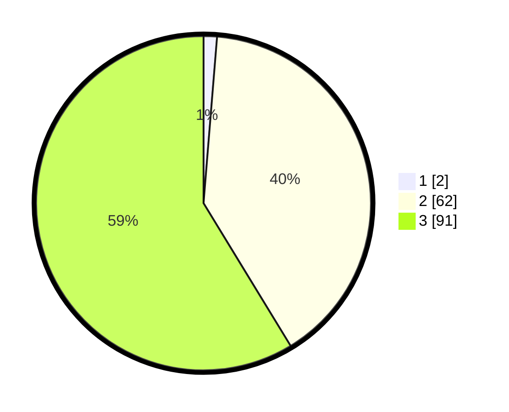

# Hasil

## Grafik

## Tabel

| No. | Nama Paslon    | Suara | Suara (raw) | Persentase |
|:--- |:-------------- | -----:| -----------:| ----------:|
| 1   | ANIES MUHAIMIN | 2     | [2][p-1]    | 1,29       |
| 2   | PRABOWO GIBRAN | 62    | [62][p-2]   | 40,00      |
| 3   | GANJAR MAHFUD  | 91    | [91][p-3]   | 58,71      |

[p-1]: https://github.com/gigit-pemilu/pemilu-2024-33-jawa-tengah/blob/main/pilpres/hitung-suara/sub/33-jawa-tengah/sub/05-kebumen/sub/01-ayah/sub/2011-kalipoh/sub/007-tps/sub/paslon-1.txt
[p-2]: https://github.com/gigit-pemilu/pemilu-2024-33-jawa-tengah/blob/main/pilpres/hitung-suara/sub/33-jawa-tengah/sub/05-kebumen/sub/01-ayah/sub/2011-kalipoh/sub/007-tps/sub/paslon-2.txt
[p-3]: https://github.com/gigit-pemilu/pemilu-2024-33-jawa-tengah/blob/main/pilpres/hitung-suara/sub/33-jawa-tengah/sub/05-kebumen/sub/01-ayah/sub/2011-kalipoh/sub/007-tps/sub/paslon-3.txt

## Foto C Plano

https://sirekap-obj-formc.kpu.go.id/b68f/pemilu/ppwp/33/05/01/20/11/3305012011007-20240214-210049--71d9ca98-c5c1-456a-ae7d-05bcf395ad61.jpg

https://sirekap-obj-formc.kpu.go.id/b68f/pemilu/ppwp/33/05/01/20/11/3305012011007-20240214-210617--3268eb41-f48b-48d3-a6f8-4ca7e744829b.jpg

https://sirekap-obj-formc.kpu.go.id/b68f/pemilu/ppwp/33/05/01/20/11/3305012011007-20240214-231514--80fd40ad-032d-4732-8854-cb1bc43dac79.jpg

## Metadata

| Key        | Value               |
| ---------- | ------------------- |
| Time Stamp | 2024-02-15 00:41:44 |

