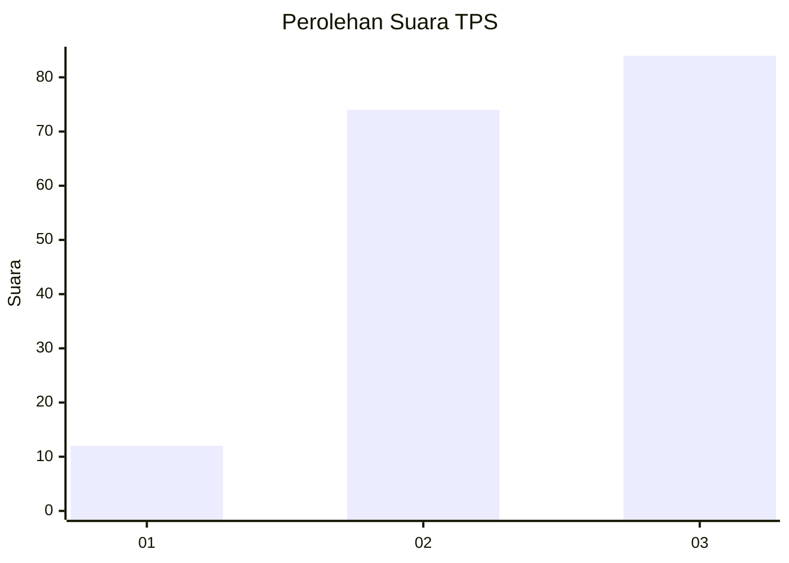
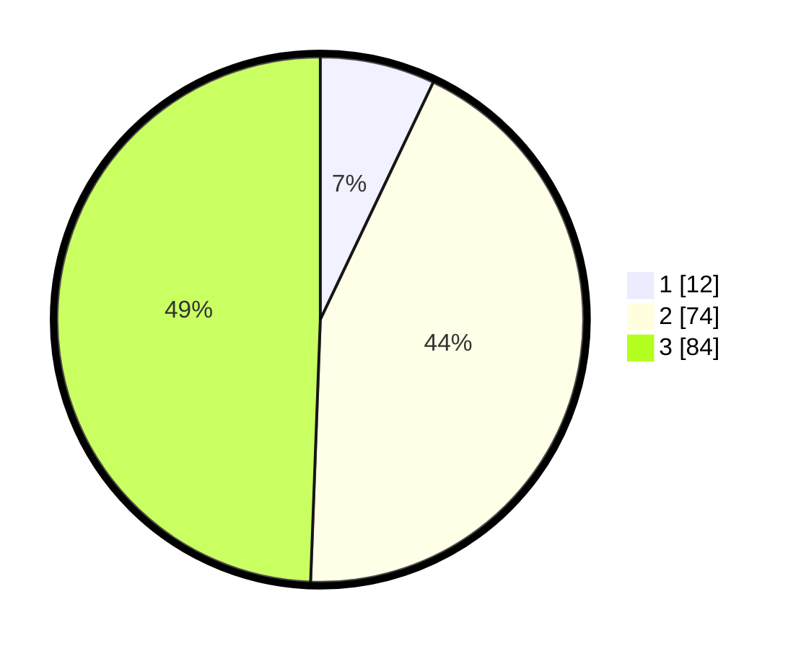

# Hasil

## Grafik

## Tabel

| No. | Nama Paslon    | Suara | Suara (raw) | Persentase |
|:--- |:-------------- | -----:| -----------:| ----------:|
| 1   | ANIES MUHAIMIN | 12    | [12][p-1]   | 7,06       |
| 2   | PRABOWO GIBRAN | 74    | [74][p-2]   | 43,53      |
| 3   | GANJAR MAHFUD  | 84    | [84][p-3]   | 49,41      |

[p-1]: https://github.com/gigit-pemilu/pemilu-2024/blob/main/pilpres/hitung-suara/sub/33-jawa-tengah/sub/05-kebumen/sub/01-ayah/sub/2014-mangunweni/sub/003-tps/sub/paslon-1.txt
[p-2]: https://github.com/gigit-pemilu/pemilu-2024/blob/main/pilpres/hitung-suara/sub/33-jawa-tengah/sub/05-kebumen/sub/01-ayah/sub/2014-mangunweni/sub/003-tps/sub/paslon-2.txt
[p-3]: https://github.com/gigit-pemilu/pemilu-2024/blob/main/pilpres/hitung-suara/sub/33-jawa-tengah/sub/05-kebumen/sub/01-ayah/sub/2014-mangunweni/sub/003-tps/sub/paslon-3.txt

## Foto C Plano

https://sirekap-obj-formc.kpu.go.id/dae4/pemilu/ppwp/33/05/01/20/14/3305012014003-20240214-141154--085e5381-4729-400a-892a-01e5267813f8.jpg

https://sirekap-obj-formc.kpu.go.id/dae4/pemilu/ppwp/33/05/01/20/14/3305012014003-20240214-141606--a3fab029-4831-4dd7-9ed4-b6f3a1490538.jpg

https://sirekap-obj-formc.kpu.go.id/dae4/pemilu/ppwp/33/05/01/20/14/3305012014003-20240215-024923--d68eb464-d164-4387-b231-80103d357999.jpg

## Metadata

| Key        | Value               |
| ---------- | ------------------- |
| Time Stamp | 2024-02-15 12:00:28 |

