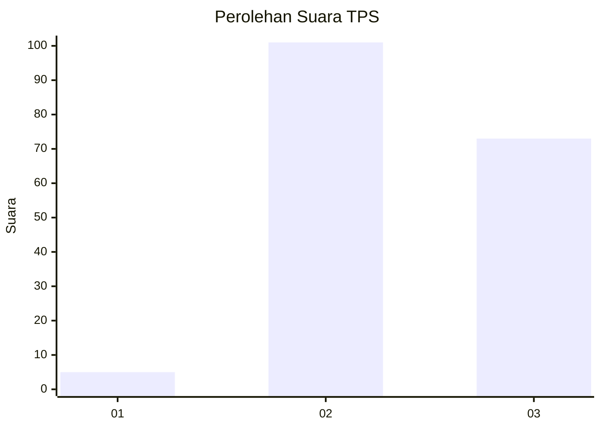
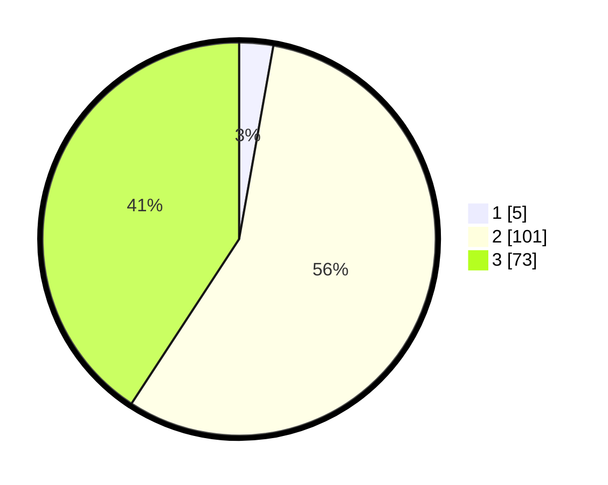

# Hasil

## Grafik

## Tabel

| No. | Nama Paslon    | Suara | Suara (raw) | Persentase |
|:--- |:-------------- | -----:| -----------:| ----------:|
| 1   | ANIES MUHAIMIN | 5     | [5][p-1]    | 2,79       |
| 2   | PRABOWO GIBRAN | 101   | [101][p-2]  | 56,42      |
| 3   | GANJAR MAHFUD  | 73    | [73][p-3]   | 40,78      |

[p-1]: https://github.com/gigit-pemilu/pemilu-2024/blob/main/pilpres/hitung-suara/sub/33-jawa-tengah/sub/05-kebumen/sub/02-buayan/sub/2008-pakuran/sub/004-tps/sub/paslon-1.txt
[p-2]: https://github.com/gigit-pemilu/pemilu-2024/blob/main/pilpres/hitung-suara/sub/33-jawa-tengah/sub/05-kebumen/sub/02-buayan/sub/2008-pakuran/sub/004-tps/sub/paslon-2.txt
[p-3]: https://github.com/gigit-pemilu/pemilu-2024/blob/main/pilpres/hitung-suara/sub/33-jawa-tengah/sub/05-kebumen/sub/02-buayan/sub/2008-pakuran/sub/004-tps/sub/paslon-3.txt

## Foto C Plano

https://sirekap-obj-formc.kpu.go.id/cdb6/pemilu/ppwp/33/05/02/20/08/3305022008004-20240214-235751--9a9a9db1-7ac8-4b0b-ac5c-02cf7f586dd6.jpg

https://sirekap-obj-formc.kpu.go.id/cdb6/pemilu/ppwp/33/05/02/20/08/3305022008004-20240215-000134--6c91eb32-2e44-416f-b9a0-e26ca3dcc6c8.jpg

https://sirekap-obj-formc.kpu.go.id/cdb6/pemilu/ppwp/33/05/02/20/08/3305022008004-20240215-000535--a73d52b0-7425-4094-b55e-b05eb471f677.jpg

## Metadata

| Key        | Value               |
| ---------- | ------------------- |
| Time Stamp | 2024-02-15 03:06:03 |

