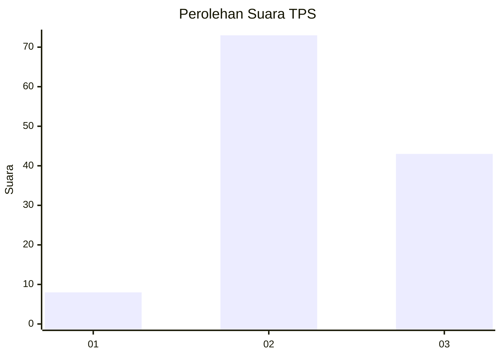
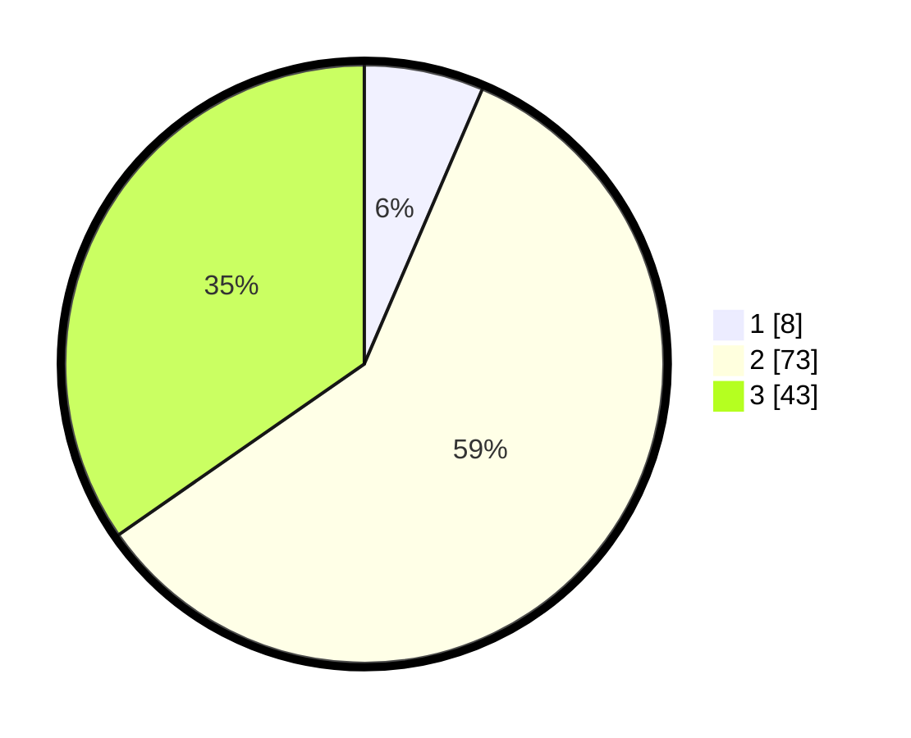

# Hasil

## Grafik

## Tabel

| No. | Nama Paslon    | Suara | Suara (raw) | Persentase |
|:--- |:-------------- | -----:| -----------:| ----------:|
| 1   | ANIES MUHAIMIN | 8     | [8][p-1]    | 6,45       |
| 2   | PRABOWO GIBRAN | 73    | [73][p-2]   | 58,87      |
| 3   | GANJAR MAHFUD  | 43    | [43][p-3]   | 34,68      |

[p-1]: https://github.com/gigit-pemilu/pemilu-2024/blob/main/pilpres/hitung-suara/sub/33-jawa-tengah/sub/05-kebumen/sub/02-buayan/sub/2009-buayan/sub/004-tps/sub/paslon-1.txt
[p-2]: https://github.com/gigit-pemilu/pemilu-2024/blob/main/pilpres/hitung-suara/sub/33-jawa-tengah/sub/05-kebumen/sub/02-buayan/sub/2009-buayan/sub/004-tps/sub/paslon-2.txt
[p-3]: https://github.com/gigit-pemilu/pemilu-2024/blob/main/pilpres/hitung-suara/sub/33-jawa-tengah/sub/05-kebumen/sub/02-buayan/sub/2009-buayan/sub/004-tps/sub/paslon-3.txt

## Foto C Plano

https://sirekap-obj-formc.kpu.go.id/fe72/pemilu/ppwp/33/05/02/20/09/3305022009004-20240215-000349--39e8e6e5-3b5b-4f9a-97e3-70c04e2c0cc9.jpg

https://sirekap-obj-formc.kpu.go.id/fe72/pemilu/ppwp/33/05/02/20/09/3305022009004-20240215-025707--5e05cacf-22e3-4c82-be0e-46119cc3f897.jpg

https://sirekap-obj-formc.kpu.go.id/fe72/pemilu/ppwp/33/05/02/20/09/3305022009004-20240215-000621--58b192b0-0591-46db-89bb-513c7df75a5a.jpg

## Metadata

| Key        | Value               |
| ---------- | ------------------- |
| Time Stamp | 2024-02-15 15:00:29 |

