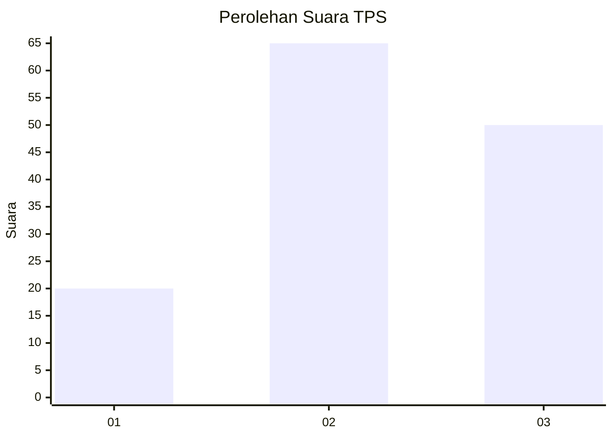
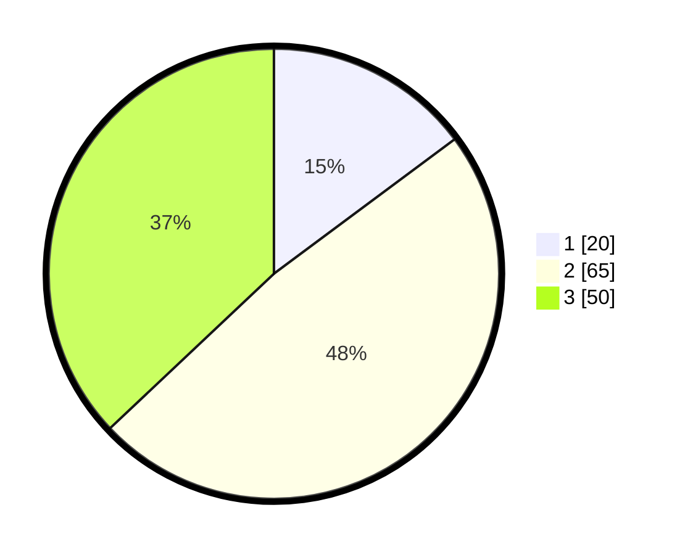

# Hasil

## Grafik

## Tabel

| No. | Nama Paslon    | Suara | Suara (raw) | Persentase |
|:--- |:-------------- | -----:| -----------:| ----------:|
| 1   | ANIES MUHAIMIN | 20    | [20][p-1]   | 14,81      |
| 2   | PRABOWO GIBRAN | 65    | [65][p-2]   | 48,15      |
| 3   | GANJAR MAHFUD  | 50    | [50][p-3]   | 37,04      |

[p-1]: https://github.com/gigit-pemilu/pemilu-2024/blob/main/pilpres/hitung-suara/sub/33-jawa-tengah/sub/05-kebumen/sub/02-buayan/sub/2013-banyumudal/sub/015-tps/sub/paslon-1.txt
[p-2]: https://github.com/gigit-pemilu/pemilu-2024/blob/main/pilpres/hitung-suara/sub/33-jawa-tengah/sub/05-kebumen/sub/02-buayan/sub/2013-banyumudal/sub/015-tps/sub/paslon-2.txt
[p-3]: https://github.com/gigit-pemilu/pemilu-2024/blob/main/pilpres/hitung-suara/sub/33-jawa-tengah/sub/05-kebumen/sub/02-buayan/sub/2013-banyumudal/sub/015-tps/sub/paslon-3.txt

## Foto C Plano

https://sirekap-obj-formc.kpu.go.id/e091/pemilu/ppwp/33/05/02/20/13/3305022013015-20240215-031840--dac96319-2bda-4c33-bec1-ba068acab386.jpg

https://sirekap-obj-formc.kpu.go.id/e091/pemilu/ppwp/33/05/02/20/13/3305022013015-20240215-032446--6dfee39c-1d97-4a65-8666-665e1c6964e9.jpg

https://sirekap-obj-formc.kpu.go.id/e091/pemilu/ppwp/33/05/02/20/13/3305022013015-20240214-213203--f15ce9dc-c952-47ca-accd-39ce98274b38.jpg

## Metadata

| Key        | Value               |
| ---------- | ------------------- |
| Time Stamp | 2024-02-15 19:00:26 |

