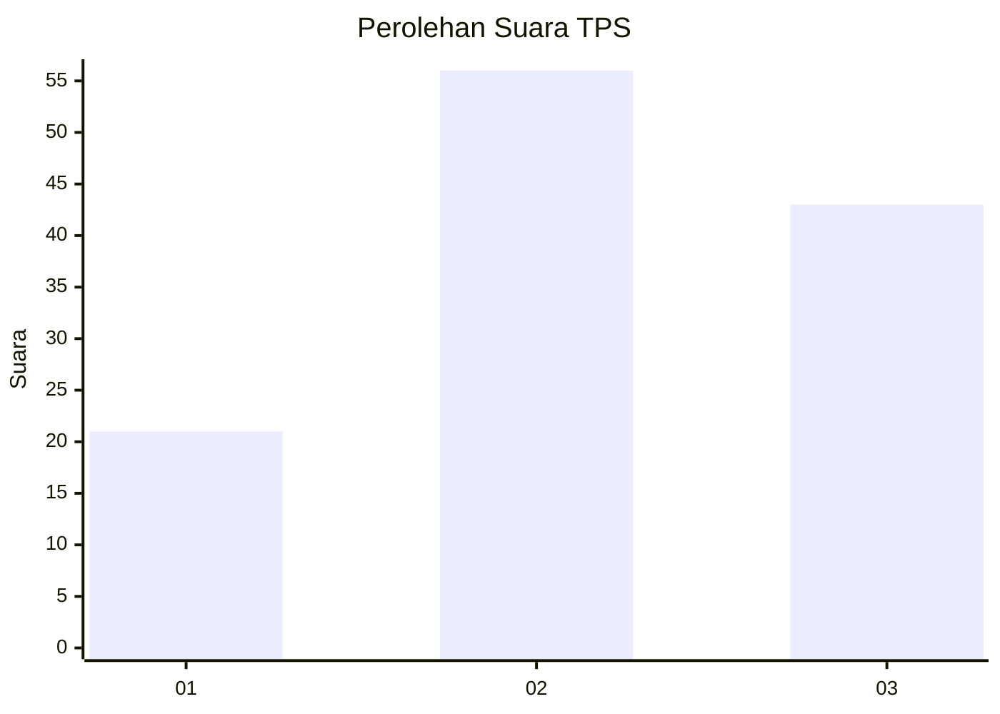
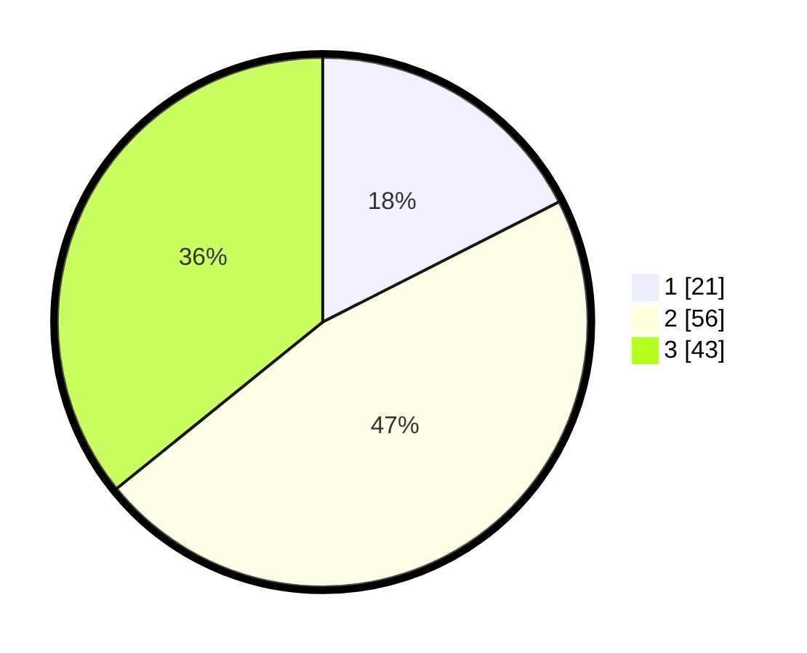

# Hasil

## Grafik

## Tabel

| No. | Nama Paslon    | Suara | Suara (raw) | Persentase |
|:--- |:-------------- | -----:| -----------:| ----------:|
| 1   | ANIES MUHAIMIN | 21    | [21][p-1]   | 17,50      |
| 2   | PRABOWO GIBRAN | 56    | [56][p-2]   | 46,67      |
| 3   | GANJAR MAHFUD  | 43    | [43][p-3]   | 35,83      |

[p-1]: https://github.com/gigit-pemilu/pemilu-2024/blob/main/pilpres/hitung-suara/sub/33-jawa-tengah/sub/05-kebumen/sub/02-buayan/sub/2015-nogoraji/sub/008-tps/sub/paslon-1.txt
[p-2]: https://github.com/gigit-pemilu/pemilu-2024/blob/main/pilpres/hitung-suara/sub/33-jawa-tengah/sub/05-kebumen/sub/02-buayan/sub/2015-nogoraji/sub/008-tps/sub/paslon-2.txt
[p-3]: https://github.com/gigit-pemilu/pemilu-2024/blob/main/pilpres/hitung-suara/sub/33-jawa-tengah/sub/05-kebumen/sub/02-buayan/sub/2015-nogoraji/sub/008-tps/sub/paslon-3.txt

## Foto C Plano

https://sirekap-obj-formc.kpu.go.id/7a80/pemilu/ppwp/33/05/02/20/15/3305022015008-20240217-172027--d538010c-bdde-473b-902b-d3f9245d25ec.jpg

https://sirekap-obj-formc.kpu.go.id/7a80/pemilu/ppwp/33/05/02/20/15/3305022015008-20240217-164058--c8756485-2e9f-4481-93fe-396c8cb5b352.jpg

https://sirekap-obj-formc.kpu.go.id/7a80/pemilu/ppwp/33/05/02/20/15/3305022015008-20240217-164953--8cd517ca-0c55-4341-afac-2dac1fc9abd9.jpg

## Metadata

| Key        | Value               |
| ---------- | ------------------- |
| Time Stamp | 2024-02-17 17:30:00 |

