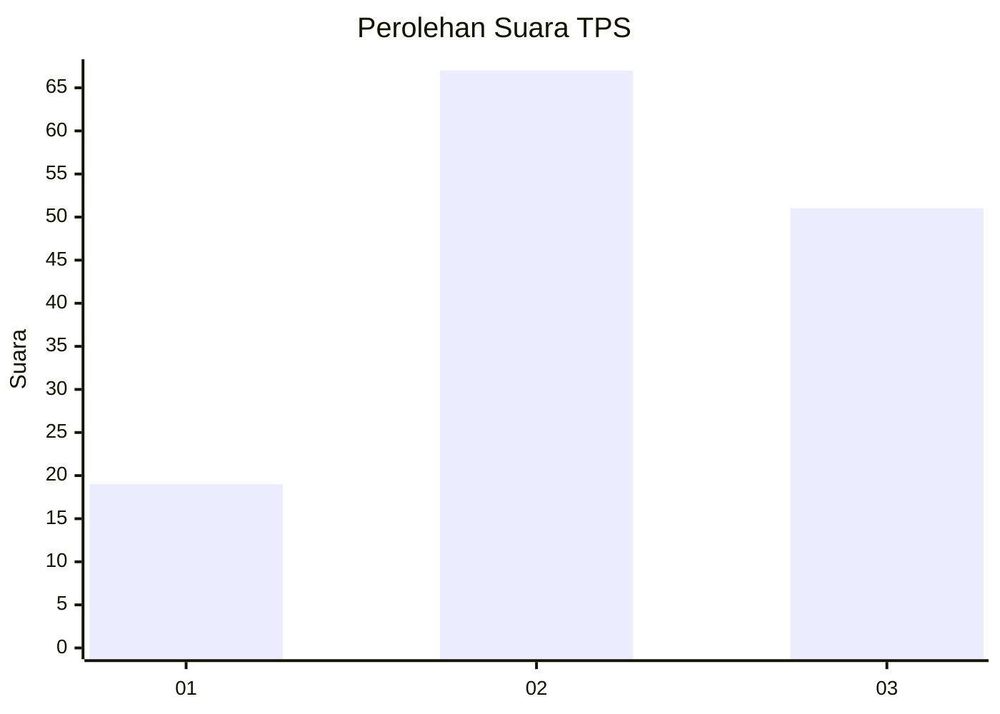
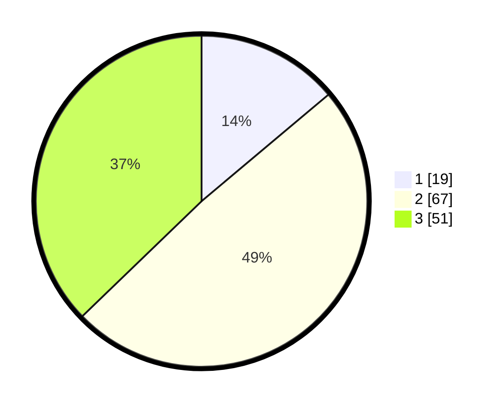

# Hasil

## Grafik

## Tabel

| No. | Nama Paslon    | Suara | Suara (raw) | Persentase |
|:--- |:-------------- | -----:| -----------:| ----------:|
| 1   | ANIES MUHAIMIN | 19    | [19][p-1]   | 13,87      |
| 2   | PRABOWO GIBRAN | 67    | [67][p-2]   | 48,91      |
| 3   | GANJAR MAHFUD  | 51    | [51][p-3]   | 37,23      |

[p-1]: https://github.com/gigit-pemilu/pemilu-2024/blob/main/pilpres/hitung-suara/sub/33-jawa-tengah/sub/05-kebumen/sub/02-buayan/sub/2015-nogoraji/sub/009-tps/sub/paslon-1.txt
[p-2]: https://github.com/gigit-pemilu/pemilu-2024/blob/main/pilpres/hitung-suara/sub/33-jawa-tengah/sub/05-kebumen/sub/02-buayan/sub/2015-nogoraji/sub/009-tps/sub/paslon-2.txt
[p-3]: https://github.com/gigit-pemilu/pemilu-2024/blob/main/pilpres/hitung-suara/sub/33-jawa-tengah/sub/05-kebumen/sub/02-buayan/sub/2015-nogoraji/sub/009-tps/sub/paslon-3.txt

## Foto C Plano

https://sirekap-obj-formc.kpu.go.id/8b26/pemilu/ppwp/33/05/02/20/15/3305022015009-20240218-140029--3115611d-0e07-4f1c-a752-d02aeb72ce18.jpg

https://sirekap-obj-formc.kpu.go.id/8b26/pemilu/ppwp/33/05/02/20/15/3305022015009-20240218-142521--1f118329-b489-42bf-b643-209f1bffa217.jpg

https://sirekap-obj-formc.kpu.go.id/8b26/pemilu/ppwp/33/05/02/20/15/3305022015009-20240215-164039--522d199a-4969-444f-90ad-223b7ea3d998.jpg

## Metadata

| Key        | Value               |
| ---------- | ------------------- |
| Time Stamp | 2024-02-19 06:16:00 |

