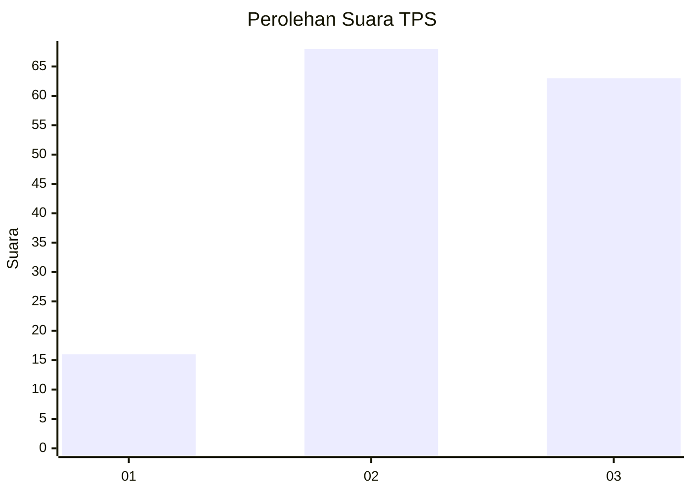
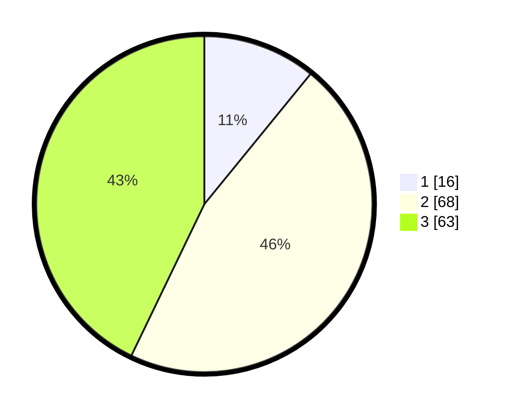

# Hasil

## Grafik

## Tabel

| No. | Nama Paslon    | Suara | Suara (raw) | Persentase |
|:--- |:-------------- | -----:| -----------:| ----------:|
| 1   | ANIES MUHAIMIN | 16    | [16][p-1]   | 10,88      |
| 2   | PRABOWO GIBRAN | 68    | [68][p-2]   | 46,26      |
| 3   | GANJAR MAHFUD  | 63    | [63][p-3]   | 42,86      |

[p-1]: https://github.com/gigit-pemilu/pemilu-2024-33-jawa-tengah/blob/main/pilpres/hitung-suara/sub/33-jawa-tengah/sub/05-kebumen/sub/02-buayan/sub/2018-jogomulyo/sub/011-tps/sub/paslon-1.txt
[p-2]: https://github.com/gigit-pemilu/pemilu-2024-33-jawa-tengah/blob/main/pilpres/hitung-suara/sub/33-jawa-tengah/sub/05-kebumen/sub/02-buayan/sub/2018-jogomulyo/sub/011-tps/sub/paslon-2.txt
[p-3]: https://github.com/gigit-pemilu/pemilu-2024-33-jawa-tengah/blob/main/pilpres/hitung-suara/sub/33-jawa-tengah/sub/05-kebumen/sub/02-buayan/sub/2018-jogomulyo/sub/011-tps/sub/paslon-3.txt

## Foto C Plano

https://sirekap-obj-formc.kpu.go.id/e0ae/pemilu/ppwp/33/05/02/20/18/3305022018011-20240214-192134--af560e1f-97bf-4084-8468-c56bfa19663b.jpg

https://sirekap-obj-formc.kpu.go.id/e0ae/pemilu/ppwp/33/05/02/20/18/3305022018011-20240219-222106--d31fd1d0-7281-489f-a420-a6383ca45607.jpg

https://sirekap-obj-formc.kpu.go.id/e0ae/pemilu/ppwp/33/05/02/20/18/3305022018011-20240219-222105--7d71497e-0b7c-4c89-9ce8-e3fe6dd1d79e.jpg

## Metadata

| Key        | Value               |
| ---------- | ------------------- |
| Time Stamp | 2024-02-20 09:00:00 |

