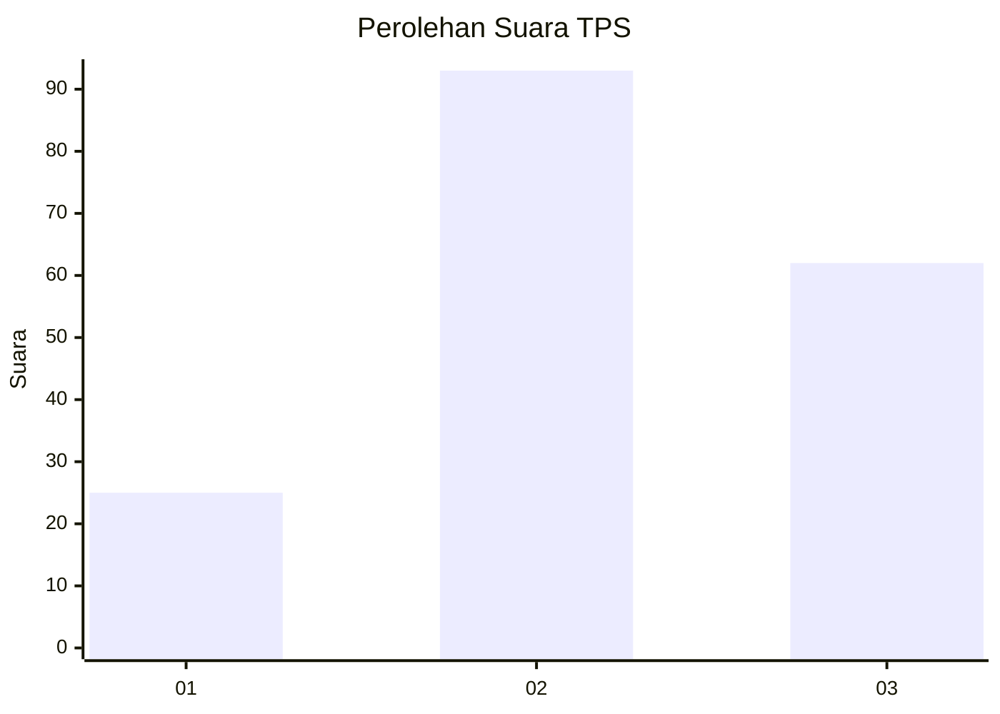
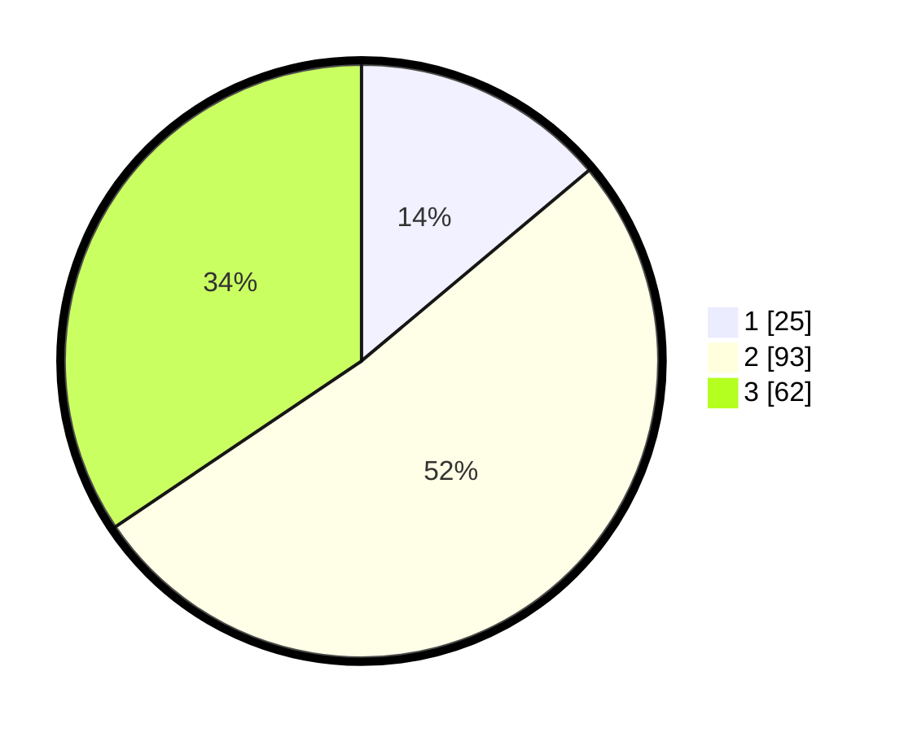

# Hasil

## Grafik

## Tabel

| No. | Nama Paslon    | Suara | Suara (raw) | Persentase |
|:--- |:-------------- | -----:| -----------:| ----------:|
| 1   | ANIES MUHAIMIN | 25    | [25][p-1]   | 13,89      |
| 2   | PRABOWO GIBRAN | 93    | [93][p-2]   | 51,67      |
| 3   | GANJAR MAHFUD  | 62    | [62][p-3]   | 34,44      |

[p-1]: https://github.com/gigit-pemilu/pemilu-2024-33-jawa-tengah/blob/main/pilpres/hitung-suara/sub/33-jawa-tengah/sub/05-kebumen/sub/03-puring/sub/2001-tambakmulyo/sub/004-tps/sub/paslon-1.txt
[p-2]: https://github.com/gigit-pemilu/pemilu-2024-33-jawa-tengah/blob/main/pilpres/hitung-suara/sub/33-jawa-tengah/sub/05-kebumen/sub/03-puring/sub/2001-tambakmulyo/sub/004-tps/sub/paslon-2.txt
[p-3]: https://github.com/gigit-pemilu/pemilu-2024-33-jawa-tengah/blob/main/pilpres/hitung-suara/sub/33-jawa-tengah/sub/05-kebumen/sub/03-puring/sub/2001-tambakmulyo/sub/004-tps/sub/paslon-3.txt

## Foto C Plano

https://sirekap-obj-formc.kpu.go.id/1a30/pemilu/ppwp/33/05/03/20/01/3305032001004-20240214-232306--9800ddd6-5c67-4d48-a0ae-88fc25810efd.jpg

https://sirekap-obj-formc.kpu.go.id/1a30/pemilu/ppwp/33/05/03/20/01/3305032001004-20240214-232515--edc398d1-016f-4136-9f1d-f01f55bd4770.jpg

https://sirekap-obj-formc.kpu.go.id/1a30/pemilu/ppwp/33/05/03/20/01/3305032001004-20240214-232637--6942d5d1-1924-48ef-8c5b-d6792ce0c413.jpg

## Metadata

| Key        | Value               |
| ---------- | ------------------- |
| Time Stamp | 2024-02-15 22:00:27 |

