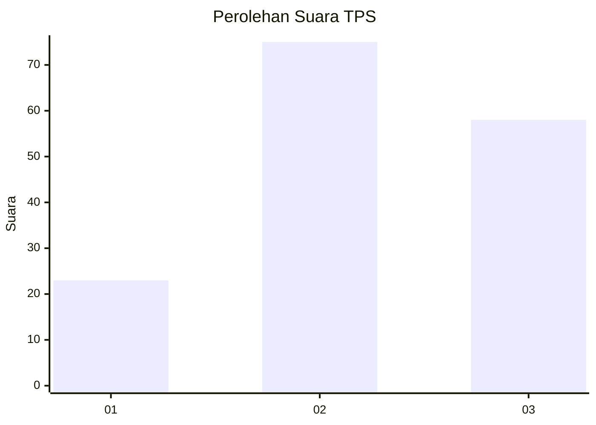
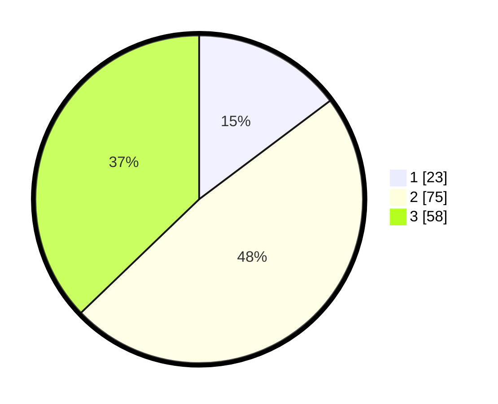

# Hasil

## Grafik

## Tabel

| No. | Nama Paslon    | Suara | Suara (raw) | Persentase |
|:--- |:-------------- | -----:| -----------:| ----------:|
| 1   | ANIES MUHAIMIN | 23    | [23][p-1]   | 14,74      |
| 2   | PRABOWO GIBRAN | 75    | [75][p-2]   | 48,08      |
| 3   | GANJAR MAHFUD  | 58    | [58][p-3]   | 37,18      |

[p-1]: https://github.com/gigit-pemilu/pemilu-2024/blob/main/pilpres/hitung-suara/sub/33-jawa-tengah/sub/05-kebumen/sub/03-puring/sub/2001-tambakmulyo/sub/015-tps/sub/paslon-1.txt
[p-2]: https://github.com/gigit-pemilu/pemilu-2024/blob/main/pilpres/hitung-suara/sub/33-jawa-tengah/sub/05-kebumen/sub/03-puring/sub/2001-tambakmulyo/sub/015-tps/sub/paslon-2.txt
[p-3]: https://github.com/gigit-pemilu/pemilu-2024/blob/main/pilpres/hitung-suara/sub/33-jawa-tengah/sub/05-kebumen/sub/03-puring/sub/2001-tambakmulyo/sub/015-tps/sub/paslon-3.txt

## Foto C Plano

https://sirekap-obj-formc.kpu.go.id/6260/pemilu/ppwp/33/05/03/20/01/3305032001015-20240215-132526--343f3b0e-2185-4a76-834d-19c0a7c5e094.jpg

https://sirekap-obj-formc.kpu.go.id/6260/pemilu/ppwp/33/05/03/20/01/3305032001015-20240214-221705--489b6b2f-0078-4e94-8d0a-60fd5cdb14c4.jpg

https://sirekap-obj-formc.kpu.go.id/6260/pemilu/ppwp/33/05/03/20/01/3305032001015-20240215-132317--ff4d05ec-feac-493b-bfc3-a355e97aff0a.jpg

## Metadata

| Key        | Value               |
| ---------- | ------------------- |
| Time Stamp | 2024-02-15 22:30:27 |

