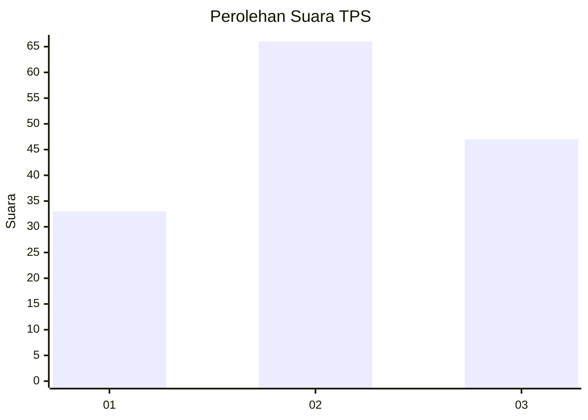
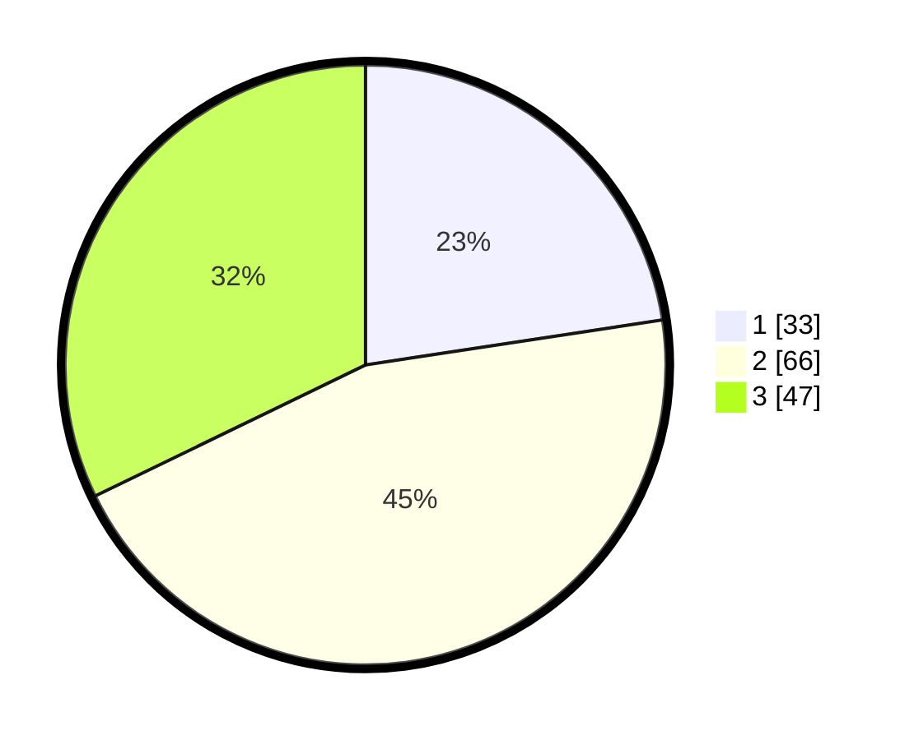

# Hasil

## Grafik

## Tabel

| No. | Nama Paslon    | Suara | Suara (raw) | Persentase |
|:--- |:-------------- | -----:| -----------:| ----------:|
| 1   | ANIES MUHAIMIN | 33    | [33][p-1]   | 22,60      |
| 2   | PRABOWO GIBRAN | 66    | [66][p-2]   | 45,21      |
| 3   | GANJAR MAHFUD  | 47    | [47][p-3]   | 32,19      |

[p-1]: https://github.com/gigit-pemilu/pemilu-2024/blob/main/pilpres/hitung-suara/sub/33-jawa-tengah/sub/05-kebumen/sub/03-puring/sub/2012-banjarejo/sub/005-tps/sub/paslon-1.txt
[p-2]: https://github.com/gigit-pemilu/pemilu-2024/blob/main/pilpres/hitung-suara/sub/33-jawa-tengah/sub/05-kebumen/sub/03-puring/sub/2012-banjarejo/sub/005-tps/sub/paslon-2.txt
[p-3]: https://github.com/gigit-pemilu/pemilu-2024/blob/main/pilpres/hitung-suara/sub/33-jawa-tengah/sub/05-kebumen/sub/03-puring/sub/2012-banjarejo/sub/005-tps/sub/paslon-3.txt

## Foto C Plano

https://sirekap-obj-formc.kpu.go.id/d2c9/pemilu/ppwp/33/05/03/20/12/3305032012005-20240214-204024--95334daf-3f20-4ad5-a1ea-6bcdb64f8b0a.jpg

https://sirekap-obj-formc.kpu.go.id/d2c9/pemilu/ppwp/33/05/03/20/12/3305032012005-20240215-033521--ce067fb4-44b1-4540-8bad-f7aebd371969.jpg

https://sirekap-obj-formc.kpu.go.id/d2c9/pemilu/ppwp/33/05/03/20/12/3305032012005-20240215-033625--09458e2f-aca6-4a74-86fe-b00f3ecc6b83.jpg

## Metadata

| Key        | Value               |
| ---------- | ------------------- |
| Time Stamp | 2024-02-19 06:16:00 |

