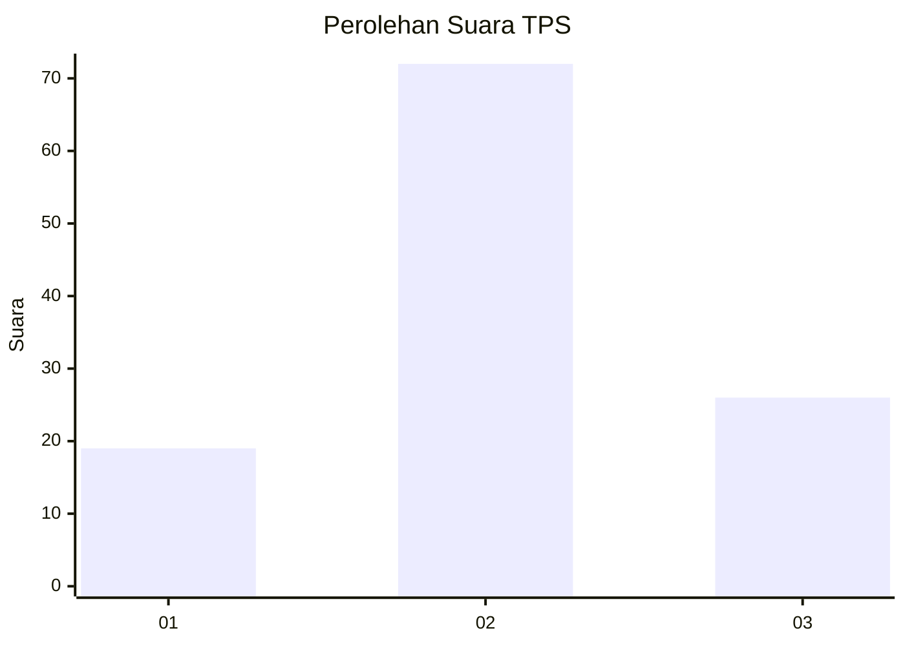
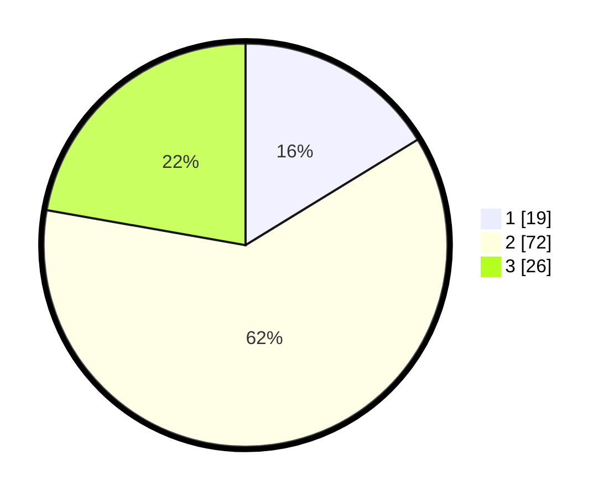

# Hasil

## Grafik

## Tabel

| No. | Nama Paslon    | Suara | Suara (raw) | Persentase |
|:--- |:-------------- | -----:| -----------:| ----------:|
| 1   | ANIES MUHAIMIN | 19    | [19][p-1]   | 16,24      |
| 2   | PRABOWO GIBRAN | 72    | [72][p-2]   | 61,54      |
| 3   | GANJAR MAHFUD  | 26    | [26][p-3]   | 22,22      |

[p-1]: https://github.com/gigit-pemilu/pemilu-2024/blob/main/pilpres/hitung-suara/sub/33-jawa-tengah/sub/05-kebumen/sub/03-puring/sub/2012-banjarejo/sub/006-tps/sub/paslon-1.txt
[p-2]: https://github.com/gigit-pemilu/pemilu-2024/blob/main/pilpres/hitung-suara/sub/33-jawa-tengah/sub/05-kebumen/sub/03-puring/sub/2012-banjarejo/sub/006-tps/sub/paslon-2.txt
[p-3]: https://github.com/gigit-pemilu/pemilu-2024/blob/main/pilpres/hitung-suara/sub/33-jawa-tengah/sub/05-kebumen/sub/03-puring/sub/2012-banjarejo/sub/006-tps/sub/paslon-3.txt

## Foto C Plano

https://sirekap-obj-formc.kpu.go.id/ce13/pemilu/ppwp/33/05/03/20/12/3305032012006-20240215-000247--c1b0321b-c06d-4254-bf7f-8a738f71e35b.jpg

https://sirekap-obj-formc.kpu.go.id/ce13/pemilu/ppwp/33/05/03/20/12/3305032012006-20240215-000400--92db7bff-1fba-49ea-aba6-93ca5da1fecc.jpg

https://sirekap-obj-formc.kpu.go.id/ce13/pemilu/ppwp/33/05/03/20/12/3305032012006-20240215-000505--d9c397ea-6a94-4efe-8534-48d5a38caacd.jpg

## Metadata

| Key        | Value               |
| ---------- | ------------------- |
| Time Stamp | 2024-02-19 06:16:00 |

