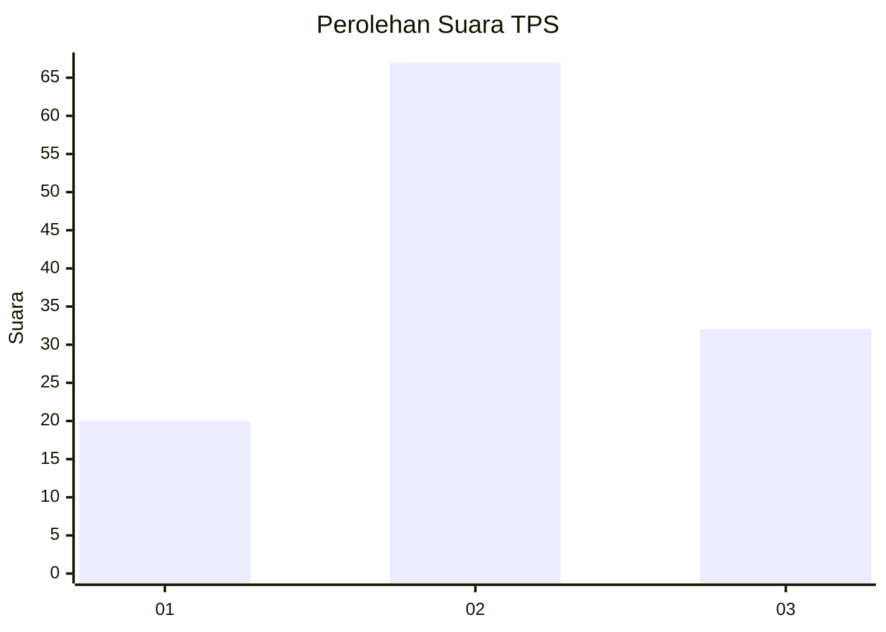
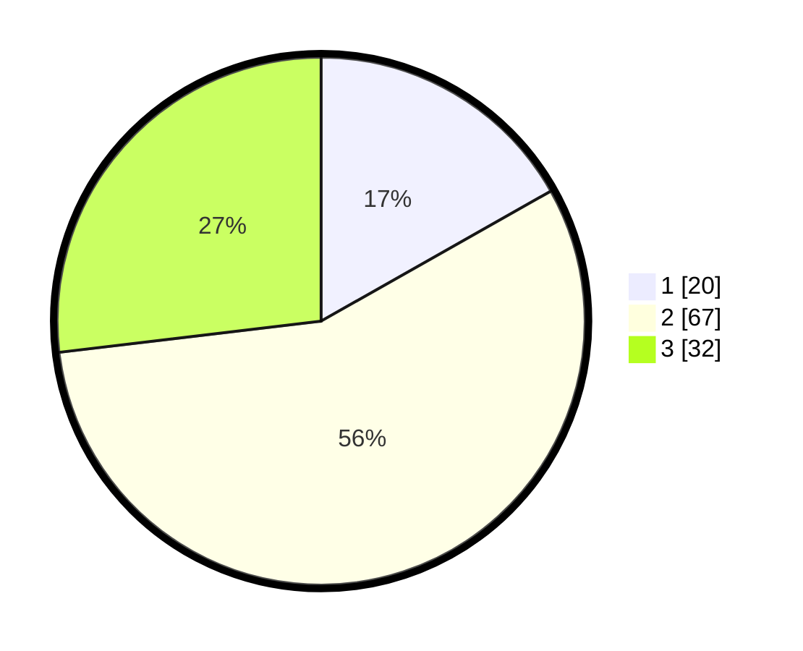

# Hasil

## Grafik

## Tabel

| No. | Nama Paslon    | Suara | Suara (raw) | Persentase |
|:--- |:-------------- | -----:| -----------:| ----------:|
| 1   | ANIES MUHAIMIN | 20    | [20][p-1]   | 16,81      |
| 2   | PRABOWO GIBRAN | 67    | [67][p-2]   | 56,30      |
| 3   | GANJAR MAHFUD  | 32    | [32][p-3]   | 26,89      |

[p-1]: https://github.com/gigit-pemilu/pemilu-2024-33-jawa-tengah/blob/main/pilpres/hitung-suara/sub/33-jawa-tengah/sub/05-kebumen/sub/03-puring/sub/2012-banjarejo/sub/007-tps/sub/paslon-1.txt
[p-2]: https://github.com/gigit-pemilu/pemilu-2024-33-jawa-tengah/blob/main/pilpres/hitung-suara/sub/33-jawa-tengah/sub/05-kebumen/sub/03-puring/sub/2012-banjarejo/sub/007-tps/sub/paslon-2.txt
[p-3]: https://github.com/gigit-pemilu/pemilu-2024-33-jawa-tengah/blob/main/pilpres/hitung-suara/sub/33-jawa-tengah/sub/05-kebumen/sub/03-puring/sub/2012-banjarejo/sub/007-tps/sub/paslon-3.txt

## Foto C Plano

https://sirekap-obj-formc.kpu.go.id/8f4c/pemilu/ppwp/33/05/03/20/12/3305032012007-20240215-050113--0781d2e6-6c20-4947-bc91-b250b41e8384.jpg

https://sirekap-obj-formc.kpu.go.id/8f4c/pemilu/ppwp/33/05/03/20/12/3305032012007-20240215-050247--86d3ca9b-847b-446e-8096-7e14337930ce.jpg

https://sirekap-obj-formc.kpu.go.id/8f4c/pemilu/ppwp/33/05/03/20/12/3305032012007-20240215-050352--d79f76cd-f634-4088-af5a-f66ce4dd4656.jpg

## Metadata

| Key        | Value               |
| ---------- | ------------------- |
| Time Stamp | 2024-02-19 06:16:00 |

