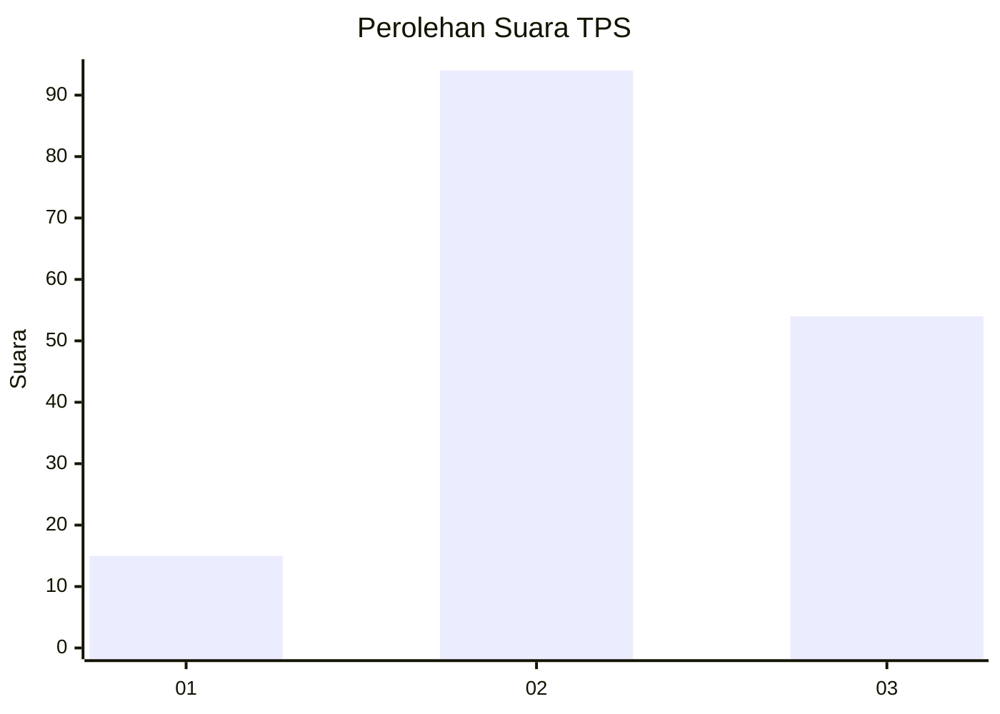
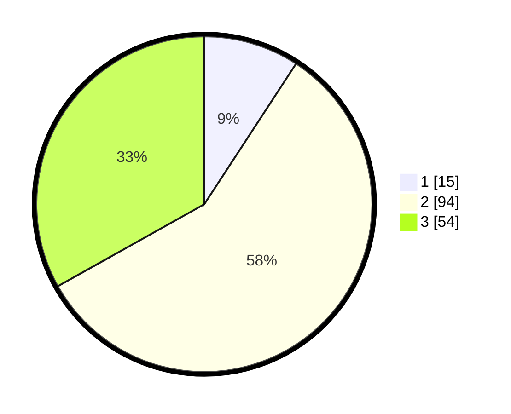

# Hasil

## Grafik

## Tabel

| No. | Nama Paslon    | Suara | Suara (raw) | Persentase |
|:--- |:-------------- | -----:| -----------:| ----------:|
| 1   | ANIES MUHAIMIN | 15    | [15][p-1]   | 9,20       |
| 2   | PRABOWO GIBRAN | 94    | [94][p-2]   | 57,67      |
| 3   | GANJAR MAHFUD  | 54    | [54][p-3]   | 33,13      |

[p-1]: https://github.com/gigit-pemilu/pemilu-2024/blob/main/pilpres/hitung-suara/sub/33-jawa-tengah/sub/05-kebumen/sub/03-puring/sub/2012-banjarejo/sub/013-tps/sub/paslon-1.txt
[p-2]: https://github.com/gigit-pemilu/pemilu-2024/blob/main/pilpres/hitung-suara/sub/33-jawa-tengah/sub/05-kebumen/sub/03-puring/sub/2012-banjarejo/sub/013-tps/sub/paslon-2.txt
[p-3]: https://github.com/gigit-pemilu/pemilu-2024/blob/main/pilpres/hitung-suara/sub/33-jawa-tengah/sub/05-kebumen/sub/03-puring/sub/2012-banjarejo/sub/013-tps/sub/paslon-3.txt

## Foto C Plano

https://sirekap-obj-formc.kpu.go.id/bb22/pemilu/ppwp/33/05/03/20/12/3305032012013-20240217-104257--541f0c96-6b36-49c6-b8b7-4ee8ceda6b35.jpg

https://sirekap-obj-formc.kpu.go.id/bb22/pemilu/ppwp/33/05/03/20/12/3305032012013-20240217-104348--cbeaa81d-b3d6-4b34-b39d-4597fd088453.jpg

https://sirekap-obj-formc.kpu.go.id/bb22/pemilu/ppwp/33/05/03/20/12/3305032012013-20240217-104557--0cc2b222-b0eb-4700-add7-d91e76fc4293.jpg

## Metadata

| Key        | Value               |
| ---------- | ------------------- |
| Time Stamp | 2024-02-17 14:56:33 |

