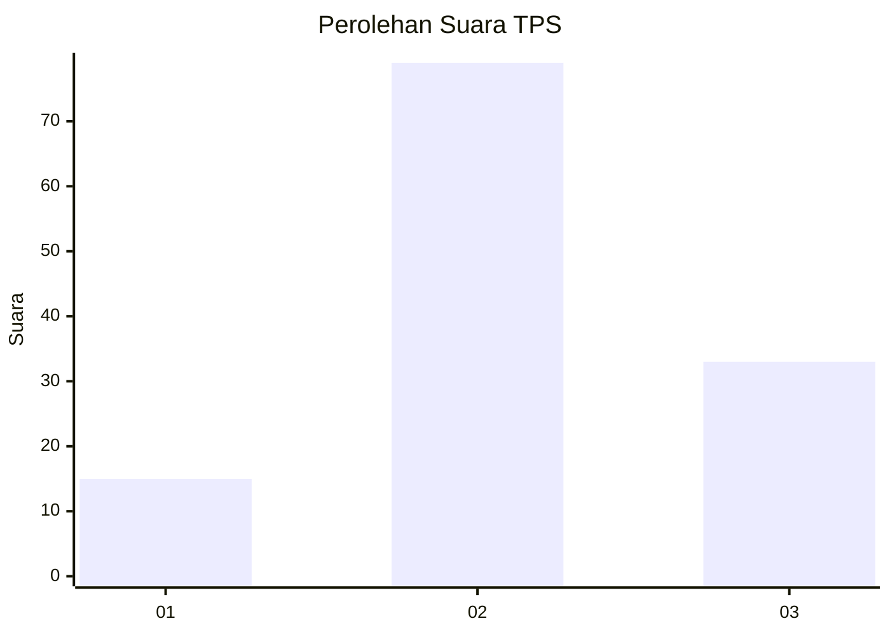
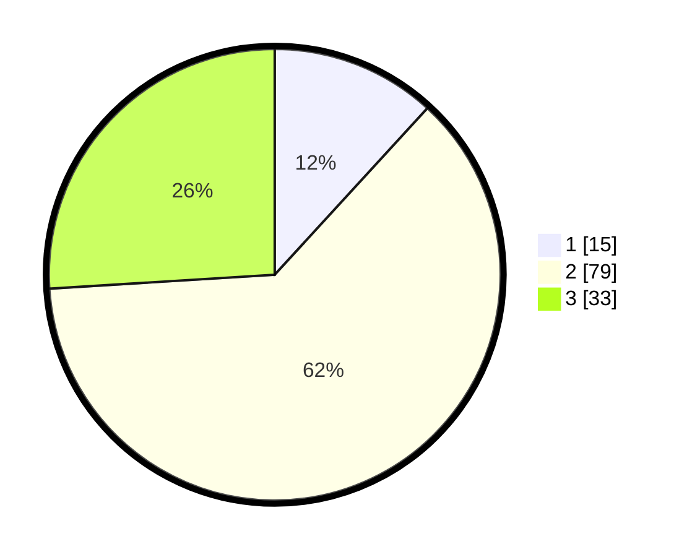

# Hasil

## Grafik

## Tabel

| No. | Nama Paslon    | Suara | Suara (raw) | Persentase |
|:--- |:-------------- | -----:| -----------:| ----------:|
| 1   | ANIES MUHAIMIN | 15    | [15][p-1]   | 11,81      |
| 2   | PRABOWO GIBRAN | 79    | [79][p-2]   | 62,20      |
| 3   | GANJAR MAHFUD  | 33    | [33][p-3]   | 25,98      |

[p-1]: https://github.com/gigit-pemilu/pemilu-2024-33-jawa-tengah/blob/main/pilpres/hitung-suara/sub/33-jawa-tengah/sub/05-kebumen/sub/03-puring/sub/2014-pesuruhan/sub/002-tps/sub/paslon-1.txt
[p-2]: https://github.com/gigit-pemilu/pemilu-2024-33-jawa-tengah/blob/main/pilpres/hitung-suara/sub/33-jawa-tengah/sub/05-kebumen/sub/03-puring/sub/2014-pesuruhan/sub/002-tps/sub/paslon-2.txt
[p-3]: https://github.com/gigit-pemilu/pemilu-2024-33-jawa-tengah/blob/main/pilpres/hitung-suara/sub/33-jawa-tengah/sub/05-kebumen/sub/03-puring/sub/2014-pesuruhan/sub/002-tps/sub/paslon-3.txt

## Foto C Plano

https://sirekap-obj-formc.kpu.go.id/d8da/pemilu/ppwp/33/05/03/20/14/3305032014002-20240214-225935--767573e9-d75e-4288-aeac-e8fe1877a3eb.jpg

https://sirekap-obj-formc.kpu.go.id/d8da/pemilu/ppwp/33/05/03/20/14/3305032014002-20240214-195314--0165b4f7-b856-49b4-813a-92cdba939896.jpg

https://sirekap-obj-formc.kpu.go.id/d8da/pemilu/ppwp/33/05/03/20/14/3305032014002-20240214-141709--04db1946-740a-4dcd-8218-b52d8e5c4a6b.jpg

## Metadata

| Key        | Value               |
| ---------- | ------------------- |
| Time Stamp | 2024-02-15 09:00:24 |

