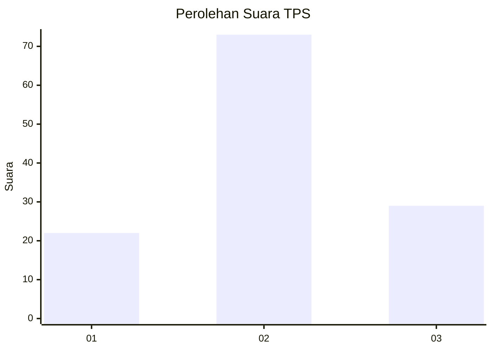
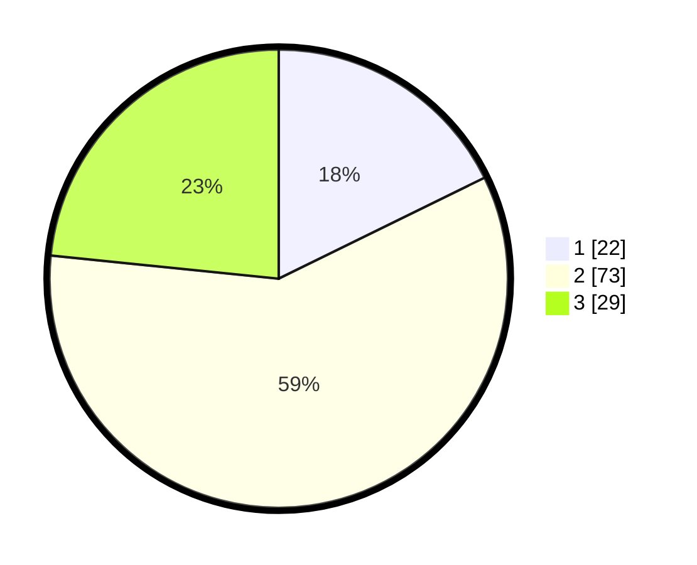

# Hasil

## Grafik

## Tabel

| No. | Nama Paslon    | Suara | Suara (raw) | Persentase |
|:--- |:-------------- | -----:| -----------:| ----------:|
| 1   | ANIES MUHAIMIN | 22    | [22][p-1]   | 17,74      |
| 2   | PRABOWO GIBRAN | 73    | [73][p-2]   | 58,87      |
| 3   | GANJAR MAHFUD  | 29    | [29][p-3]   | 23,39      |

[p-1]: https://github.com/gigit-pemilu/pemilu-2024/blob/main/pilpres/hitung-suara/sub/33-jawa-tengah/sub/05-kebumen/sub/03-puring/sub/2014-pesuruhan/sub/003-tps/sub/paslon-1.txt
[p-2]: https://github.com/gigit-pemilu/pemilu-2024/blob/main/pilpres/hitung-suara/sub/33-jawa-tengah/sub/05-kebumen/sub/03-puring/sub/2014-pesuruhan/sub/003-tps/sub/paslon-2.txt
[p-3]: https://github.com/gigit-pemilu/pemilu-2024/blob/main/pilpres/hitung-suara/sub/33-jawa-tengah/sub/05-kebumen/sub/03-puring/sub/2014-pesuruhan/sub/003-tps/sub/paslon-3.txt

## Foto C Plano

https://sirekap-obj-formc.kpu.go.id/8448/pemilu/ppwp/33/05/03/20/14/3305032014003-20240214-141211--c21bfd96-6185-48ca-901e-7baf28c31f4f.jpg

https://sirekap-obj-formc.kpu.go.id/8448/pemilu/ppwp/33/05/03/20/14/3305032014003-20240214-141304--68ff09fb-c4e6-49a5-be80-1d71d8b71672.jpg

https://sirekap-obj-formc.kpu.go.id/8448/pemilu/ppwp/33/05/03/20/14/3305032014003-20240214-141422--9745add8-3b42-4a43-87d1-ce171bbe18a9.jpg

## Metadata

| Key        | Value               |
| ---------- | ------------------- |
| Time Stamp | 2024-02-14 21:46:01 |

