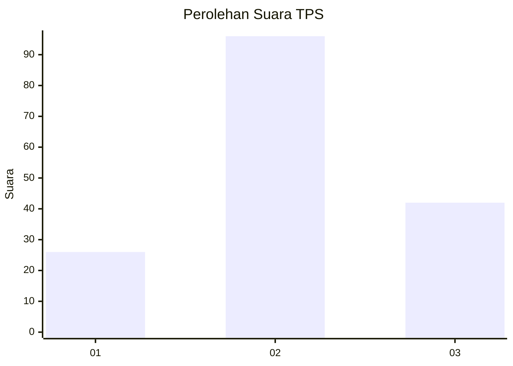
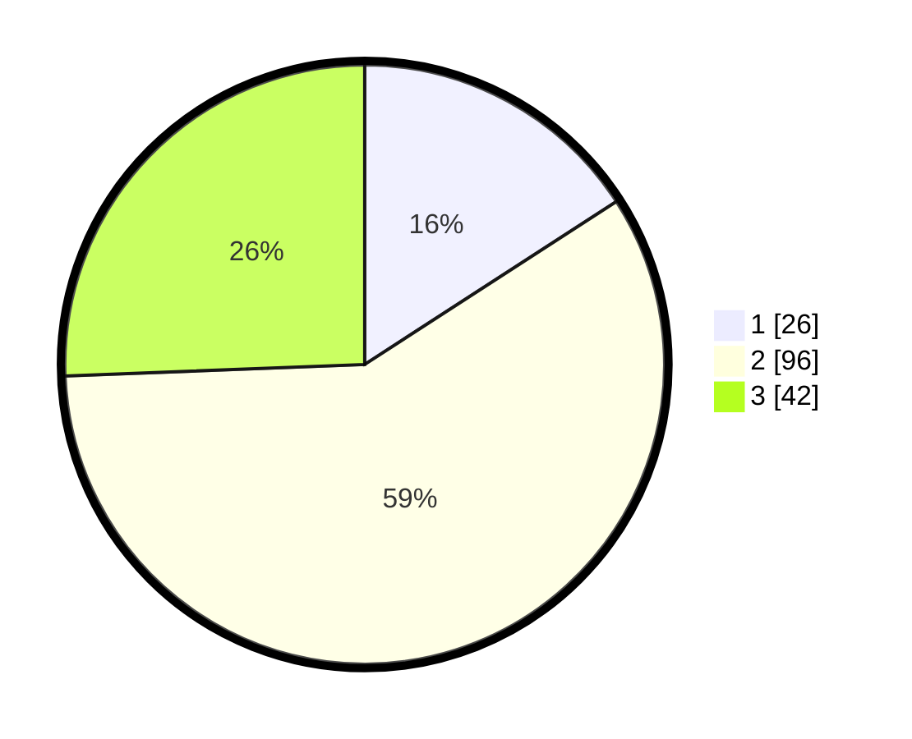

# Hasil

## Grafik

## Tabel

| No. | Nama Paslon    | Suara | Suara (raw) | Persentase |
|:--- |:-------------- | -----:| -----------:| ----------:|
| 1   | ANIES MUHAIMIN | 26    | [26][p-1]   | 15,85      |
| 2   | PRABOWO GIBRAN | 96    | [96][p-2]   | 58,54      |
| 3   | GANJAR MAHFUD  | 42    | [42][p-3]   | 25,61      |

[p-1]: https://github.com/gigit-pemilu/pemilu-2024/blob/main/pilpres/hitung-suara/sub/33-jawa-tengah/sub/05-kebumen/sub/03-puring/sub/2017-kedalemanwetan/sub/004-tps/sub/paslon-1.txt
[p-2]: https://github.com/gigit-pemilu/pemilu-2024/blob/main/pilpres/hitung-suara/sub/33-jawa-tengah/sub/05-kebumen/sub/03-puring/sub/2017-kedalemanwetan/sub/004-tps/sub/paslon-2.txt
[p-3]: https://github.com/gigit-pemilu/pemilu-2024/blob/main/pilpres/hitung-suara/sub/33-jawa-tengah/sub/05-kebumen/sub/03-puring/sub/2017-kedalemanwetan/sub/004-tps/sub/paslon-3.txt

## Foto C Plano

https://sirekap-obj-formc.kpu.go.id/39bd/pemilu/ppwp/33/05/03/20/17/3305032017004-20240214-155428--c4b7e4cc-ad05-4090-9b4f-edb6408e9bd3.jpg

https://sirekap-obj-formc.kpu.go.id/39bd/pemilu/ppwp/33/05/03/20/17/3305032017004-20240214-155830--b9e66bd0-01a0-475f-aa01-915c91bc2677.jpg

https://sirekap-obj-formc.kpu.go.id/39bd/pemilu/ppwp/33/05/03/20/17/3305032017004-20240214-214646--ddd05c3b-8409-46b4-b1cd-d2ab5c804559.jpg

## Metadata

| Key        | Value               |
| ---------- | ------------------- |
| Time Stamp | 2024-02-15 21:01:18 |

