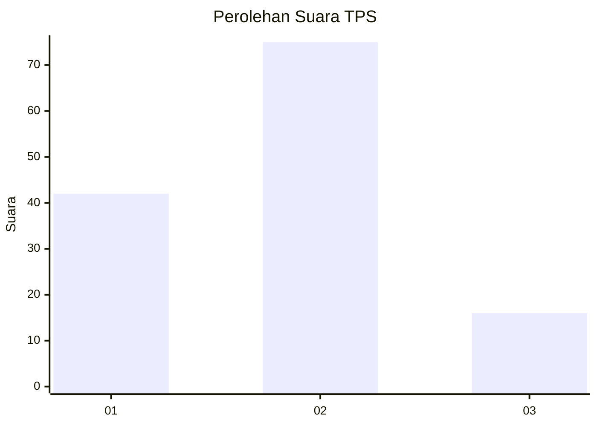
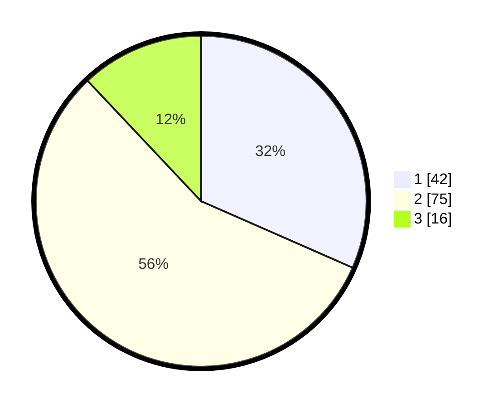

# Hasil

## Grafik

## Tabel

| No. | Nama Paslon    | Suara | Suara (raw) | Persentase |
|:--- |:-------------- | -----:| -----------:| ----------:|
| 1   | ANIES MUHAIMIN | 42    | [42][p-1]   | 31,58      |
| 2   | PRABOWO GIBRAN | 75    | [75][p-2]   | 56,39      |
| 3   | GANJAR MAHFUD  | 16    | [16][p-3]   | 12,03      |

[p-1]: https://github.com/gigit-pemilu/pemilu-2024-33-jawa-tengah/blob/main/pilpres/hitung-suara/sub/33-jawa-tengah/sub/05-kebumen/sub/03-puring/sub/2019-sitiadi/sub/002-tps/sub/paslon-1.txt
[p-2]: https://github.com/gigit-pemilu/pemilu-2024-33-jawa-tengah/blob/main/pilpres/hitung-suara/sub/33-jawa-tengah/sub/05-kebumen/sub/03-puring/sub/2019-sitiadi/sub/002-tps/sub/paslon-2.txt
[p-3]: https://github.com/gigit-pemilu/pemilu-2024-33-jawa-tengah/blob/main/pilpres/hitung-suara/sub/33-jawa-tengah/sub/05-kebumen/sub/03-puring/sub/2019-sitiadi/sub/002-tps/sub/paslon-3.txt

## Foto C Plano

https://sirekap-obj-formc.kpu.go.id/b8bc/pemilu/ppwp/33/05/03/20/19/3305032019002-20240217-093151--7e0d3e23-0c11-40dc-8903-4a351f222011.jpg

https://sirekap-obj-formc.kpu.go.id/b8bc/pemilu/ppwp/33/05/03/20/19/3305032019002-20240217-092050--1c304981-a0dc-4bdf-a87e-9ee03a952002.jpg

https://sirekap-obj-formc.kpu.go.id/b8bc/pemilu/ppwp/33/05/03/20/19/3305032019002-20240217-092245--30cc136f-1d43-4ba1-bfdd-205ae87747e0.jpg

## Metadata

| Key        | Value               |
| ---------- | ------------------- |
| Time Stamp | 2024-02-17 10:00:02 |

