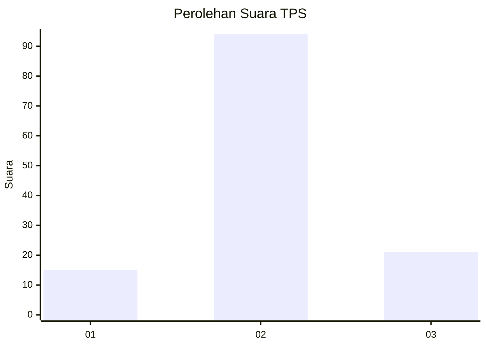
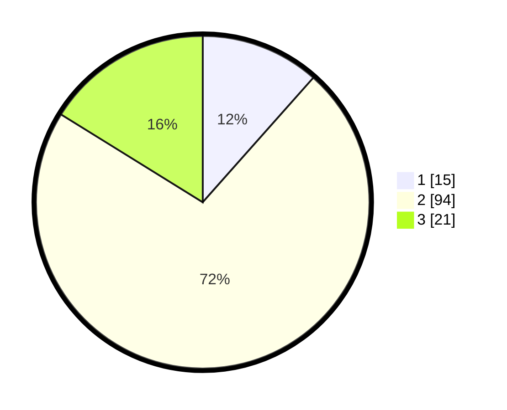

# Hasil

## Grafik

## Tabel

| No. | Nama Paslon    | Suara | Suara (raw) | Persentase |
|:--- |:-------------- | -----:| -----------:| ----------:|
| 1   | ANIES MUHAIMIN | 15    | [15][p-1]   | 11,54      |
| 2   | PRABOWO GIBRAN | 94    | [94][p-2]   | 72,31      |
| 3   | GANJAR MAHFUD  | 21    | [21][p-3]   | 16,15      |

[p-1]: https://github.com/gigit-pemilu/pemilu-2024/blob/main/pilpres/hitung-suara/sub/33-jawa-tengah/sub/05-kebumen/sub/03-puring/sub/2020-bumirejo/sub/007-tps/sub/paslon-1.txt
[p-2]: https://github.com/gigit-pemilu/pemilu-2024/blob/main/pilpres/hitung-suara/sub/33-jawa-tengah/sub/05-kebumen/sub/03-puring/sub/2020-bumirejo/sub/007-tps/sub/paslon-2.txt
[p-3]: https://github.com/gigit-pemilu/pemilu-2024/blob/main/pilpres/hitung-suara/sub/33-jawa-tengah/sub/05-kebumen/sub/03-puring/sub/2020-bumirejo/sub/007-tps/sub/paslon-3.txt

## Foto C Plano

https://sirekap-obj-formc.kpu.go.id/8ed8/pemilu/ppwp/33/05/03/20/20/3305032020007-20240218-151132--97ded1ba-423a-4941-b768-780b5c0ac8d6.jpg

https://sirekap-obj-formc.kpu.go.id/8ed8/pemilu/ppwp/33/05/03/20/20/3305032020007-20240218-151317--56c6eb4a-2205-4c6d-b128-4d1e9043046e.jpg

https://sirekap-obj-formc.kpu.go.id/8ed8/pemilu/ppwp/33/05/03/20/20/3305032020007-20240218-151802--8f04a2b2-eec9-45d7-9c63-84c80f713d80.jpg

## Metadata

| Key        | Value               |
| ---------- | ------------------- |
| Time Stamp | 2024-02-19 08:00:00 |

