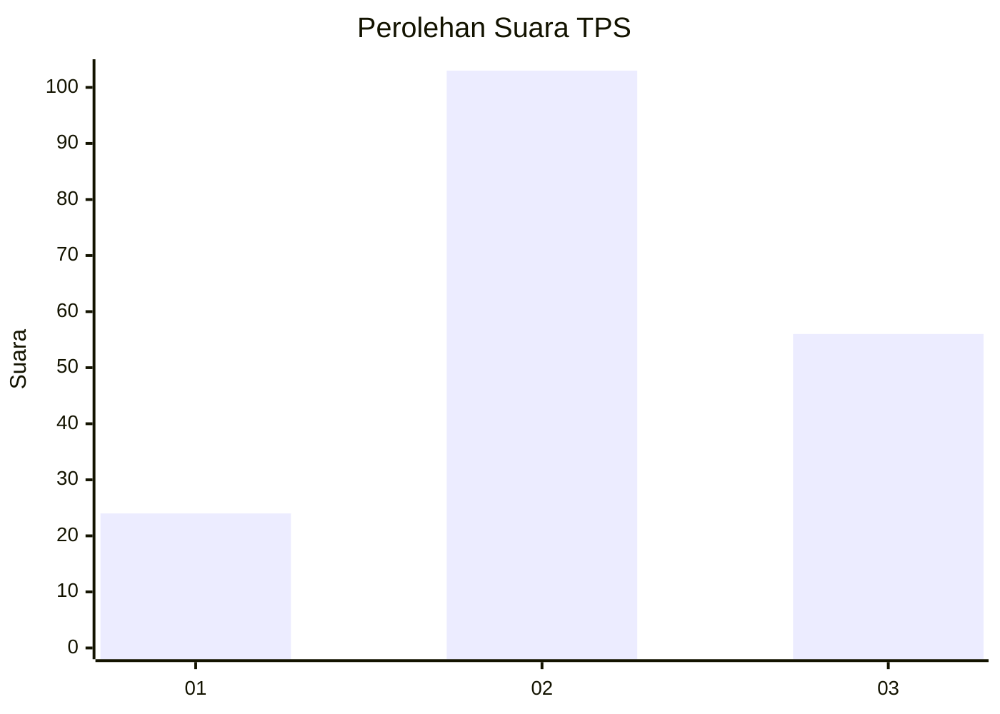
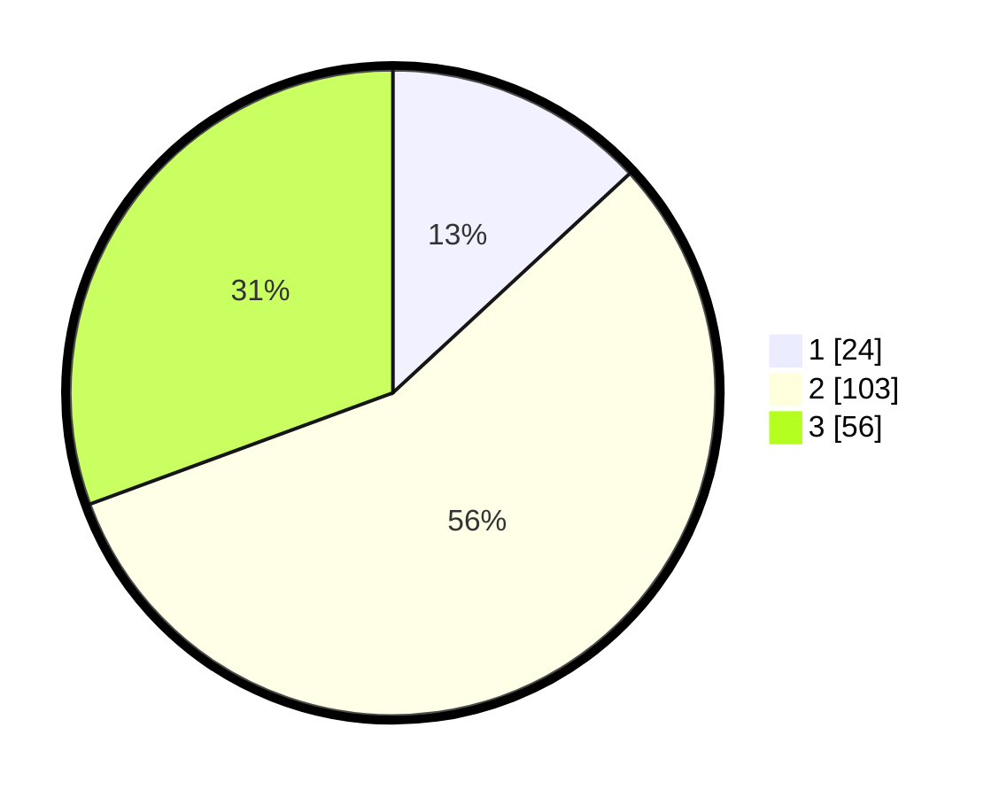

# Hasil

## Grafik

## Tabel

| No. | Nama Paslon    | Suara | Suara (raw) | Persentase |
|:--- |:-------------- | -----:| -----------:| ----------:|
| 1   | ANIES MUHAIMIN | 24    | [24][p-1]   | 13,11      |
| 2   | PRABOWO GIBRAN | 103   | [103][p-2]  | 56,28      |
| 3   | GANJAR MAHFUD  | 56    | [56][p-3]   | 30,60      |

[p-1]: https://github.com/gigit-pemilu/pemilu-2024/blob/main/pilpres/hitung-suara/sub/33-jawa-tengah/sub/05-kebumen/sub/04-petanahan/sub/2011-grogolbeningsari/sub/006-tps/sub/paslon-1.txt
[p-2]: https://github.com/gigit-pemilu/pemilu-2024/blob/main/pilpres/hitung-suara/sub/33-jawa-tengah/sub/05-kebumen/sub/04-petanahan/sub/2011-grogolbeningsari/sub/006-tps/sub/paslon-2.txt
[p-3]: https://github.com/gigit-pemilu/pemilu-2024/blob/main/pilpres/hitung-suara/sub/33-jawa-tengah/sub/05-kebumen/sub/04-petanahan/sub/2011-grogolbeningsari/sub/006-tps/sub/paslon-3.txt

## Foto C Plano

https://sirekap-obj-formc.kpu.go.id/2b59/pemilu/ppwp/33/05/04/20/11/3305042011006-20240215-005230--81d30952-e9b5-4b6f-830c-10b0be8843d0.jpg

https://sirekap-obj-formc.kpu.go.id/2b59/pemilu/ppwp/33/05/04/20/11/3305042011006-20240216-075723--d60ad1ab-c798-4161-bac3-235a92e11ea0.jpg

https://sirekap-obj-formc.kpu.go.id/2b59/pemilu/ppwp/33/05/04/20/11/3305042011006-20240216-074812--d425fd92-950e-44cb-849c-1bfd5dc92dd9.jpg

## Metadata

| Key        | Value               |
| ---------- | ------------------- |
| Time Stamp | 2024-02-16 21:01:00 |

