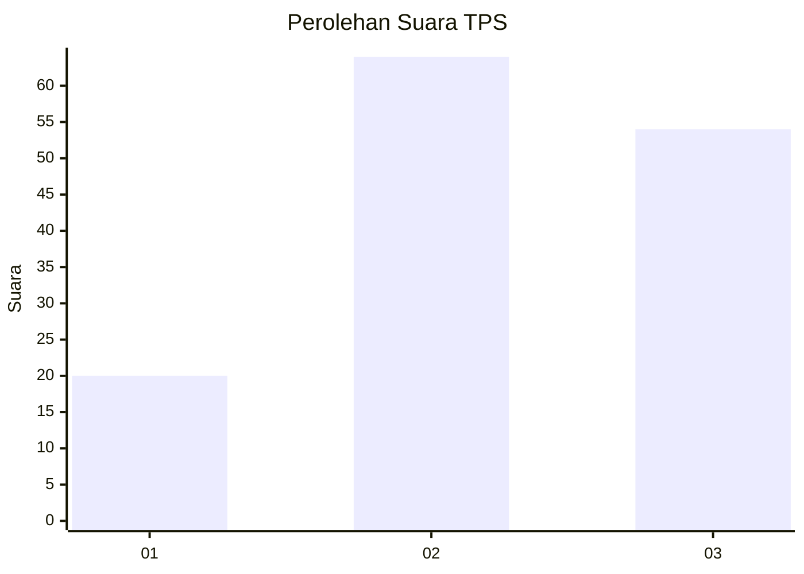
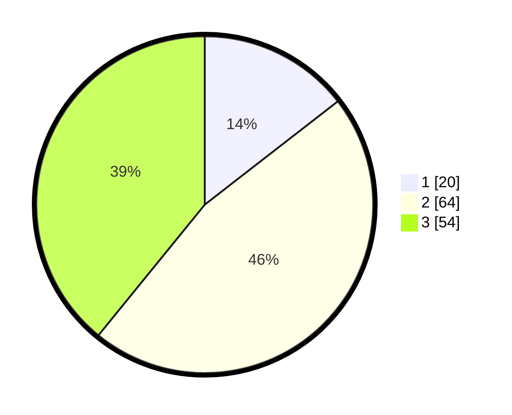

# Hasil

## Grafik

## Tabel

| No. | Nama Paslon    | Suara | Suara (raw) | Persentase |
|:--- |:-------------- | -----:| -----------:| ----------:|
| 1   | ANIES MUHAIMIN | 20    | [20][p-1]   | 14,49      |
| 2   | PRABOWO GIBRAN | 64    | [64][p-2]   | 46,38      |
| 3   | GANJAR MAHFUD  | 54    | [54][p-3]   | 39,13      |

[p-1]: https://github.com/gigit-pemilu/pemilu-2024/blob/main/pilpres/hitung-suara/sub/33-jawa-tengah/sub/05-kebumen/sub/05-klirong/sub/2010-klegenwonosari/sub/002-tps/sub/paslon-1.txt
[p-2]: https://github.com/gigit-pemilu/pemilu-2024/blob/main/pilpres/hitung-suara/sub/33-jawa-tengah/sub/05-kebumen/sub/05-klirong/sub/2010-klegenwonosari/sub/002-tps/sub/paslon-2.txt
[p-3]: https://github.com/gigit-pemilu/pemilu-2024/blob/main/pilpres/hitung-suara/sub/33-jawa-tengah/sub/05-kebumen/sub/05-klirong/sub/2010-klegenwonosari/sub/002-tps/sub/paslon-3.txt

## Foto C Plano

https://sirekap-obj-formc.kpu.go.id/4260/pemilu/ppwp/33/05/05/20/10/3305052010002-20240214-234143--0f6bb2ba-7bf5-4734-ba37-6c2d444a51dd.jpg

https://sirekap-obj-formc.kpu.go.id/4260/pemilu/ppwp/33/05/05/20/10/3305052010002-20240214-234352--654e6ddd-8450-43c2-aa5e-f9563368f338.jpg

https://sirekap-obj-formc.kpu.go.id/4260/pemilu/ppwp/33/05/05/20/10/3305052010002-20240215-212216--a1e11908-df5f-4997-a1b7-1864441efeea.jpg

## Metadata

| Key        | Value               |
| ---------- | ------------------- |
| Time Stamp | 2024-02-21 19:00:00 |

