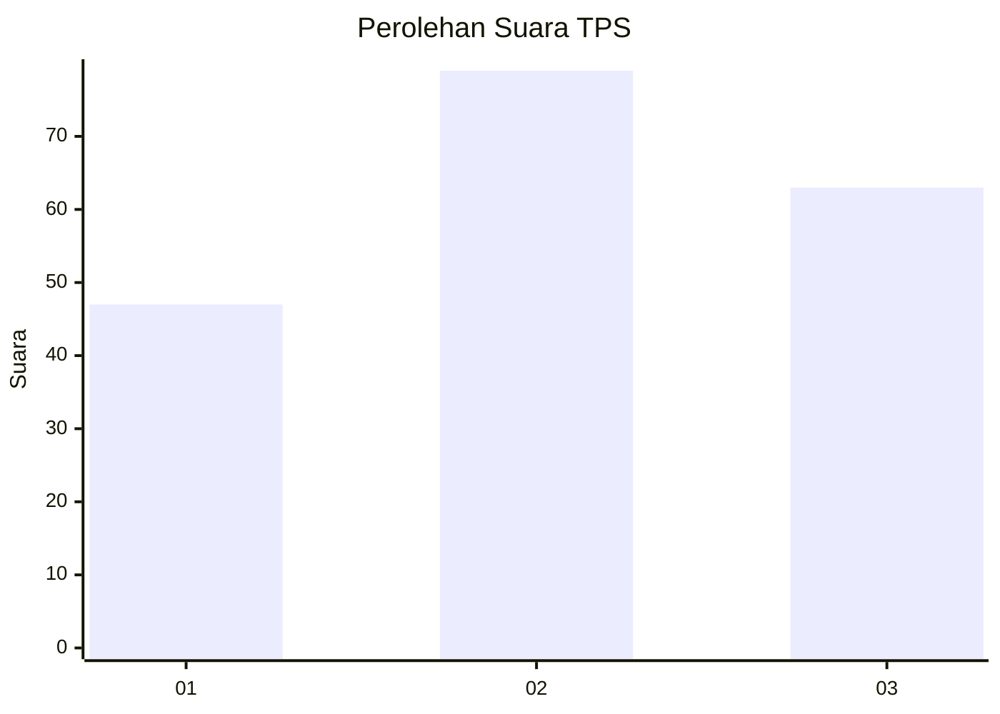
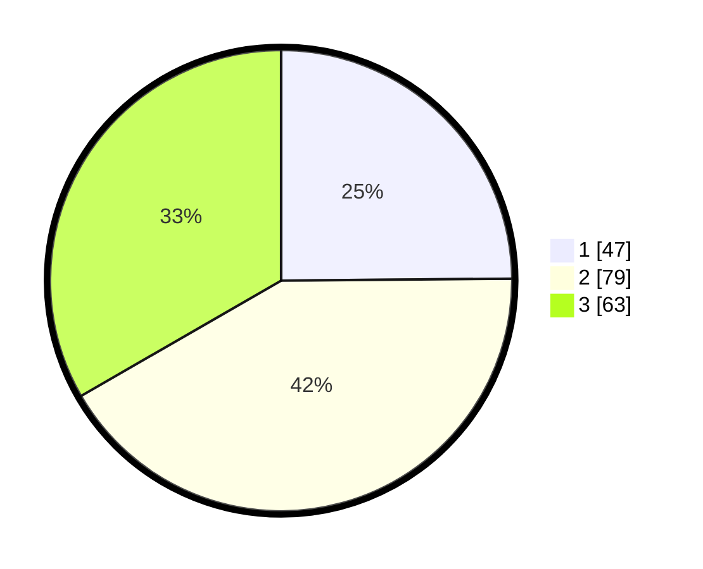

# Hasil

## Grafik

## Tabel

| No. | Nama Paslon    | Suara | Suara (raw) | Persentase |
|:--- |:-------------- | -----:| -----------:| ----------:|
| 1   | ANIES MUHAIMIN | 47    | [47][p-1]   | 24,87      |
| 2   | PRABOWO GIBRAN | 79    | [79][p-2]   | 41,80      |
| 3   | GANJAR MAHFUD  | 63    | [63][p-3]   | 33,33      |

[p-1]: https://github.com/gigit-pemilu/pemilu-2024/blob/main/pilpres/hitung-suara/sub/33-jawa-tengah/sub/05-kebumen/sub/05-klirong/sub/2010-klegenwonosari/sub/004-tps/sub/paslon-1.txt
[p-2]: https://github.com/gigit-pemilu/pemilu-2024/blob/main/pilpres/hitung-suara/sub/33-jawa-tengah/sub/05-kebumen/sub/05-klirong/sub/2010-klegenwonosari/sub/004-tps/sub/paslon-2.txt
[p-3]: https://github.com/gigit-pemilu/pemilu-2024/blob/main/pilpres/hitung-suara/sub/33-jawa-tengah/sub/05-kebumen/sub/05-klirong/sub/2010-klegenwonosari/sub/004-tps/sub/paslon-3.txt

## Foto C Plano

https://sirekap-obj-formc.kpu.go.id/55c2/pemilu/ppwp/33/05/05/20/10/3305052010004-20240215-132621--415e620b-2147-4c5f-ac04-e4b135793caa.jpg

https://sirekap-obj-formc.kpu.go.id/55c2/pemilu/ppwp/33/05/05/20/10/3305052010004-20240215-132755--f2ebd5d0-7803-4494-9ed5-31f9fbc50ede.jpg

https://sirekap-obj-formc.kpu.go.id/55c2/pemilu/ppwp/33/05/05/20/10/3305052010004-20240215-133055--432b194c-e161-4883-9149-da1483376a99.jpg

## Metadata

| Key        | Value               |
| ---------- | ------------------- |
| Time Stamp | 2024-02-15 19:30:26 |

