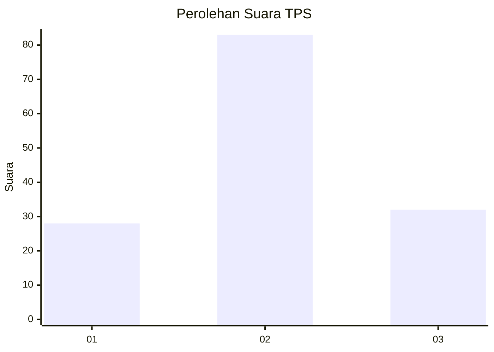
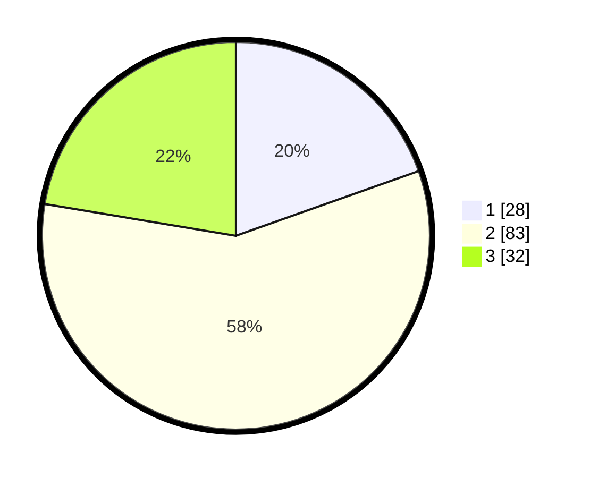

# Hasil

## Grafik

## Tabel

| No. | Nama Paslon    | Suara | Suara (raw) | Persentase |
|:--- |:-------------- | -----:| -----------:| ----------:|
| 1   | ANIES MUHAIMIN | 28    | [28][p-1]   | 19,58      |
| 2   | PRABOWO GIBRAN | 83    | [83][p-2]   | 58,04      |
| 3   | GANJAR MAHFUD  | 32    | [32][p-3]   | 22,38      |

[p-1]: https://github.com/gigit-pemilu/pemilu-2024-33-jawa-tengah/blob/main/pilpres/hitung-suara/sub/33-jawa-tengah/sub/05-kebumen/sub/05-klirong/sub/2020-dorowati/sub/001-tps/sub/paslon-1.txt
[p-2]: https://github.com/gigit-pemilu/pemilu-2024-33-jawa-tengah/blob/main/pilpres/hitung-suara/sub/33-jawa-tengah/sub/05-kebumen/sub/05-klirong/sub/2020-dorowati/sub/001-tps/sub/paslon-2.txt
[p-3]: https://github.com/gigit-pemilu/pemilu-2024-33-jawa-tengah/blob/main/pilpres/hitung-suara/sub/33-jawa-tengah/sub/05-kebumen/sub/05-klirong/sub/2020-dorowati/sub/001-tps/sub/paslon-3.txt

## Foto C Plano

https://sirekap-obj-formc.kpu.go.id/4d78/pemilu/ppwp/33/05/05/20/20/3305052020001-20240215-123950--9c023e61-711b-4a5e-9862-4fb7d2f42317.jpg

https://sirekap-obj-formc.kpu.go.id/4d78/pemilu/ppwp/33/05/05/20/20/3305052020001-20240215-124025--6ed7f2ab-740a-4243-805d-016ca73f3f71.jpg

https://sirekap-obj-formc.kpu.go.id/4d78/pemilu/ppwp/33/05/05/20/20/3305052020001-20240216-085754--1580ffde-19bd-46ec-b1d8-780ddf48393f.jpg

## Metadata

| Key        | Value               |
| ---------- | ------------------- |
| Time Stamp | 2024-02-16 09:00:28 |

