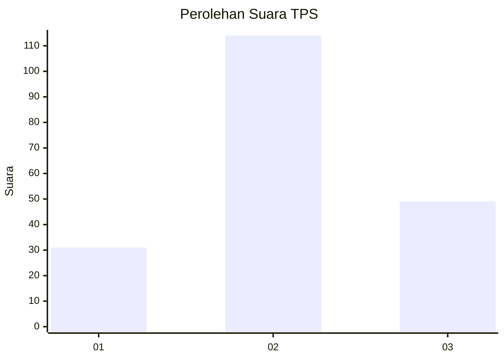
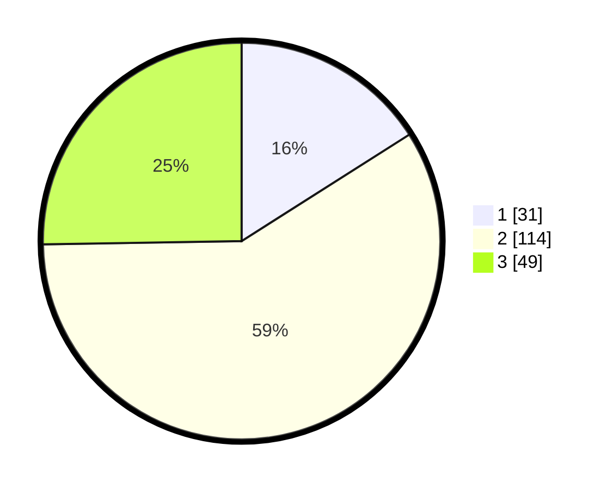

# Hasil

## Grafik

## Tabel

| No. | Nama Paslon    | Suara | Suara (raw) | Persentase |
|:--- |:-------------- | -----:| -----------:| ----------:|
| 1   | ANIES MUHAIMIN | 31    | [31][p-1]   | 15,98      |
| 2   | PRABOWO GIBRAN | 114   | [114][p-2]  | 58,76      |
| 3   | GANJAR MAHFUD  | 49    | [49][p-3]   | 25,26      |

[p-1]: https://github.com/gigit-pemilu/pemilu-2024/blob/main/pilpres/hitung-suara/sub/33-jawa-tengah/sub/05-kebumen/sub/05-klirong/sub/2020-dorowati/sub/002-tps/sub/paslon-1.txt
[p-2]: https://github.com/gigit-pemilu/pemilu-2024/blob/main/pilpres/hitung-suara/sub/33-jawa-tengah/sub/05-kebumen/sub/05-klirong/sub/2020-dorowati/sub/002-tps/sub/paslon-2.txt
[p-3]: https://github.com/gigit-pemilu/pemilu-2024/blob/main/pilpres/hitung-suara/sub/33-jawa-tengah/sub/05-kebumen/sub/05-klirong/sub/2020-dorowati/sub/002-tps/sub/paslon-3.txt

## Foto C Plano

https://sirekap-obj-formc.kpu.go.id/eff0/pemilu/ppwp/33/05/05/20/20/3305052020002-20240214-225541--73e0b8ba-965f-46b9-9da7-bd0d2e16b0f2.jpg

https://sirekap-obj-formc.kpu.go.id/eff0/pemilu/ppwp/33/05/05/20/20/3305052020002-20240215-012513--056281f2-1555-4457-b55f-526c8f5f1cd9.jpg

https://sirekap-obj-formc.kpu.go.id/eff0/pemilu/ppwp/33/05/05/20/20/3305052020002-20240215-012709--15fe1b53-94b1-4ee5-a3e1-2c24b1a9cb29.jpg

## Metadata

| Key        | Value               |
| ---------- | ------------------- |
| Time Stamp | 2024-02-15 19:30:26 |

