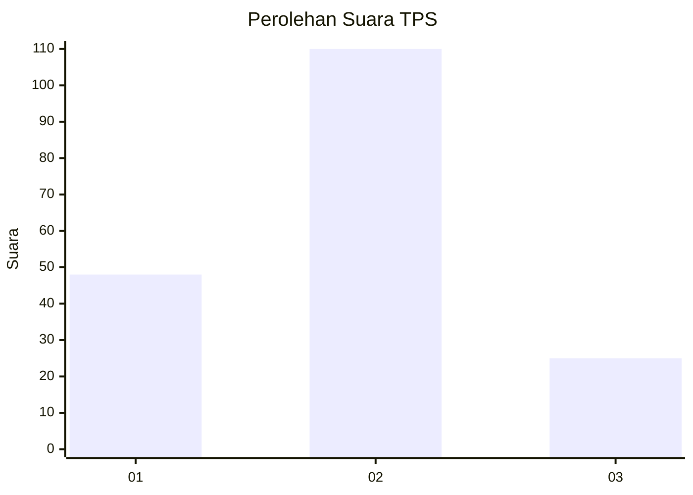
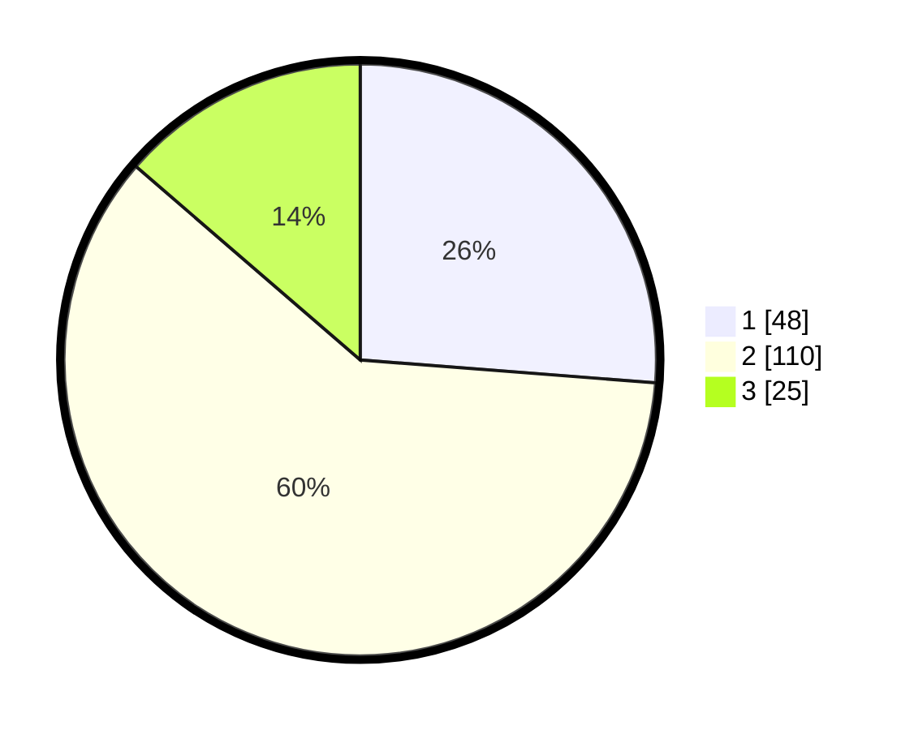

# Hasil

## Grafik

## Tabel

| No. | Nama Paslon    | Suara | Suara (raw) | Persentase |
|:--- |:-------------- | -----:| -----------:| ----------:|
| 1   | ANIES MUHAIMIN | 48    | [48][p-1]   | 26,23      |
| 2   | PRABOWO GIBRAN | 110   | [110][p-2]  | 60,11      |
| 3   | GANJAR MAHFUD  | 25    | [25][p-3]   | 13,66      |

[p-1]: https://github.com/gigit-pemilu/pemilu-2024-33-jawa-tengah/blob/main/pilpres/hitung-suara/sub/33-jawa-tengah/sub/05-kebumen/sub/06-buluspesantren/sub/2001-ayamputih/sub/005-tps/sub/paslon-1.txt
[p-2]: https://github.com/gigit-pemilu/pemilu-2024-33-jawa-tengah/blob/main/pilpres/hitung-suara/sub/33-jawa-tengah/sub/05-kebumen/sub/06-buluspesantren/sub/2001-ayamputih/sub/005-tps/sub/paslon-2.txt
[p-3]: https://github.com/gigit-pemilu/pemilu-2024-33-jawa-tengah/blob/main/pilpres/hitung-suara/sub/33-jawa-tengah/sub/05-kebumen/sub/06-buluspesantren/sub/2001-ayamputih/sub/005-tps/sub/paslon-3.txt

## Foto C Plano

https://sirekap-obj-formc.kpu.go.id/ec1f/pemilu/ppwp/33/05/06/20/01/3305062001005-20240214-225047--089f7c38-1633-4d57-8ed7-2c7db26a266e.jpg

https://sirekap-obj-formc.kpu.go.id/ec1f/pemilu/ppwp/33/05/06/20/01/3305062001005-20240215-000022--422fa2ba-a68f-4bcd-a894-12319a101877.jpg

https://sirekap-obj-formc.kpu.go.id/ec1f/pemilu/ppwp/33/05/06/20/01/3305062001005-20240216-130501--8f3b097e-b7b5-47c2-8130-4b17504c0a36.jpg

## Metadata

| Key        | Value               |
| ---------- | ------------------- |
| Time Stamp | 2024-02-16 13:30:32 |

