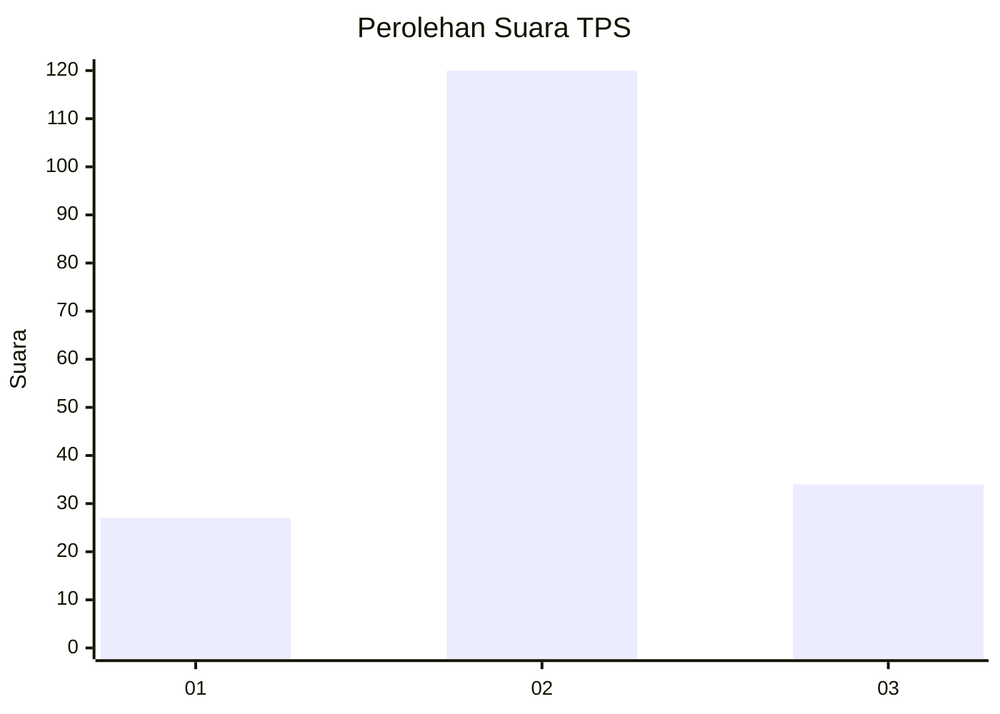
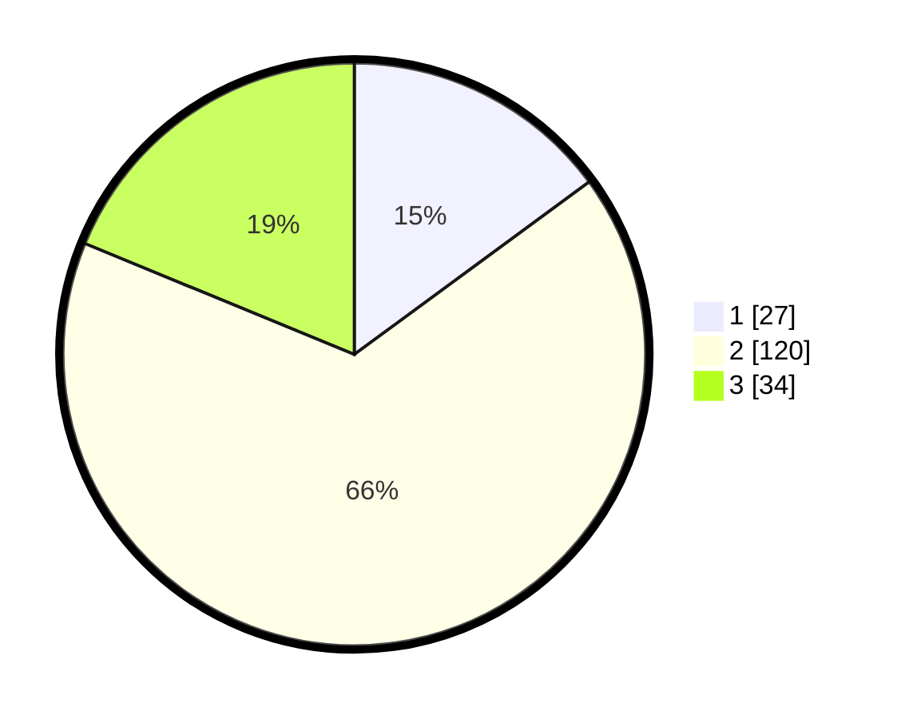

# Hasil

## Grafik

## Tabel

| No. | Nama Paslon    | Suara | Suara (raw) | Persentase |
|:--- |:-------------- | -----:| -----------:| ----------:|
| 1   | ANIES MUHAIMIN | 27    | [27][p-1]   | 14,92      |
| 2   | PRABOWO GIBRAN | 120   | [120][p-2]  | 66,30      |
| 3   | GANJAR MAHFUD  | 34    | [34][p-3]   | 18,78      |

[p-1]: https://github.com/gigit-pemilu/pemilu-2024-33-jawa-tengah/blob/main/pilpres/hitung-suara/sub/33-jawa-tengah/sub/05-kebumen/sub/06-buluspesantren/sub/2001-ayamputih/sub/006-tps/sub/paslon-1.txt
[p-2]: https://github.com/gigit-pemilu/pemilu-2024-33-jawa-tengah/blob/main/pilpres/hitung-suara/sub/33-jawa-tengah/sub/05-kebumen/sub/06-buluspesantren/sub/2001-ayamputih/sub/006-tps/sub/paslon-2.txt
[p-3]: https://github.com/gigit-pemilu/pemilu-2024-33-jawa-tengah/blob/main/pilpres/hitung-suara/sub/33-jawa-tengah/sub/05-kebumen/sub/06-buluspesantren/sub/2001-ayamputih/sub/006-tps/sub/paslon-3.txt

## Foto C Plano

https://sirekap-obj-formc.kpu.go.id/37c0/pemilu/ppwp/33/05/06/20/01/3305062001006-20240217-085549--757fd67b-e403-4a3c-b424-1960ae5740f0.jpg

https://sirekap-obj-formc.kpu.go.id/37c0/pemilu/ppwp/33/05/06/20/01/3305062001006-20240217-084814--62e12097-c262-4aa2-a9f9-8ab8853952dd.jpg

https://sirekap-obj-formc.kpu.go.id/37c0/pemilu/ppwp/33/05/06/20/01/3305062001006-20240217-084928--f6a607bf-da29-4554-83c4-53dc07c46239.jpg

## Metadata

| Key        | Value               |
| ---------- | ------------------- |
| Time Stamp | 2024-02-17 09:00:02 |

