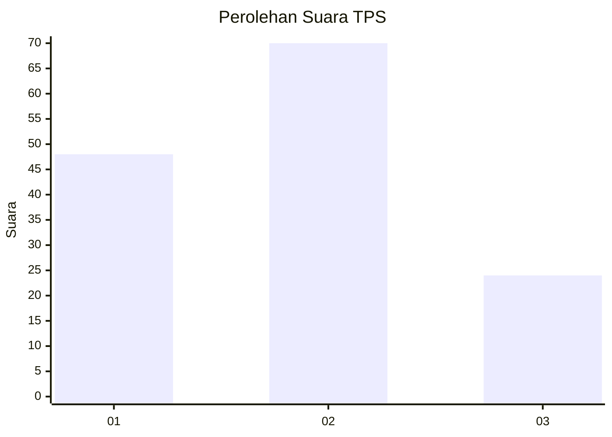
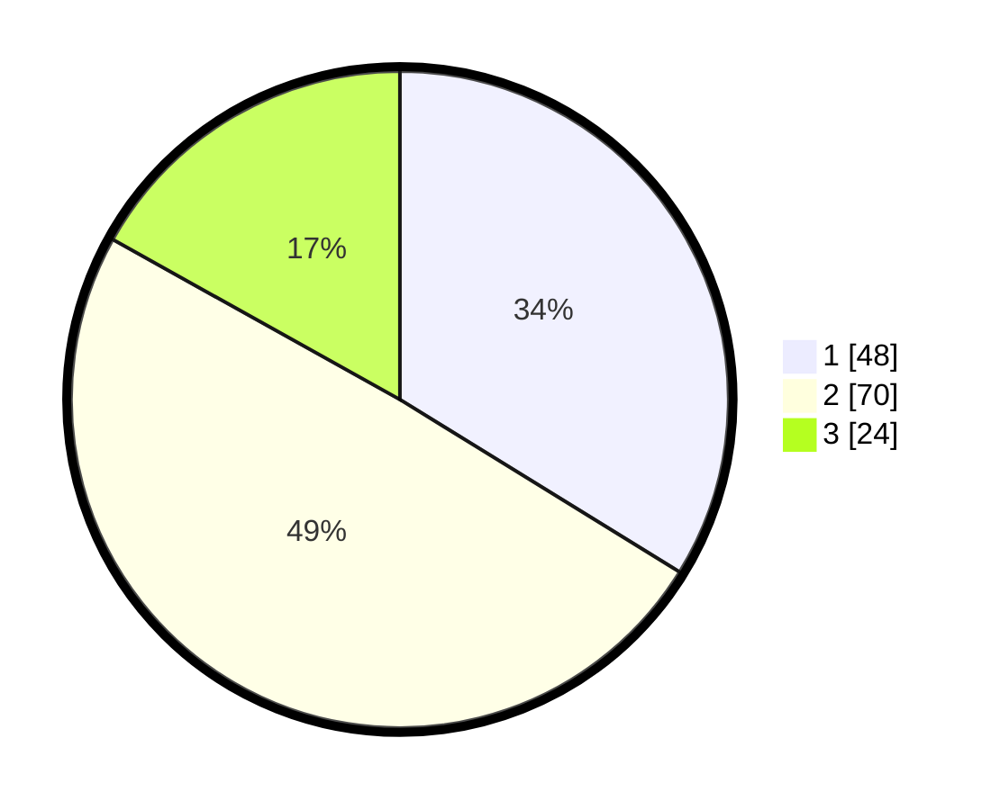

# Hasil

## Grafik

## Tabel

| No. | Nama Paslon    | Suara | Suara (raw) | Persentase |
|:--- |:-------------- | -----:| -----------:| ----------:|
| 1   | ANIES MUHAIMIN | 48    | [48][p-1]   | 33,80      |
| 2   | PRABOWO GIBRAN | 70    | [70][p-2]   | 49,30      |
| 3   | GANJAR MAHFUD  | 24    | [24][p-3]   | 16,90      |

[p-1]: https://github.com/gigit-pemilu/pemilu-2024-33-jawa-tengah/blob/main/pilpres/hitung-suara/sub/33-jawa-tengah/sub/05-kebumen/sub/06-buluspesantren/sub/2005-indrosari/sub/004-tps/sub/paslon-1.txt
[p-2]: https://github.com/gigit-pemilu/pemilu-2024-33-jawa-tengah/blob/main/pilpres/hitung-suara/sub/33-jawa-tengah/sub/05-kebumen/sub/06-buluspesantren/sub/2005-indrosari/sub/004-tps/sub/paslon-2.txt
[p-3]: https://github.com/gigit-pemilu/pemilu-2024-33-jawa-tengah/blob/main/pilpres/hitung-suara/sub/33-jawa-tengah/sub/05-kebumen/sub/06-buluspesantren/sub/2005-indrosari/sub/004-tps/sub/paslon-3.txt

## Foto C Plano

https://sirekap-obj-formc.kpu.go.id/6328/pemilu/ppwp/33/05/06/20/05/3305062005004-20240214-141542--51a78d9c-e9f6-4d17-8079-64b5e7d7e26e.jpg

https://sirekap-obj-formc.kpu.go.id/6328/pemilu/ppwp/33/05/06/20/05/3305062005004-20240214-141610--1b545c3f-4cda-4b36-8523-ec4c1ddde4b0.jpg

https://sirekap-obj-formc.kpu.go.id/6328/pemilu/ppwp/33/05/06/20/05/3305062005004-20240215-005853--e671651f-e908-4de0-bef5-5ae96c879200.jpg

## Metadata

| Key        | Value               |
| ---------- | ------------------- |
| Time Stamp | 2024-02-15 15:30:25 |

