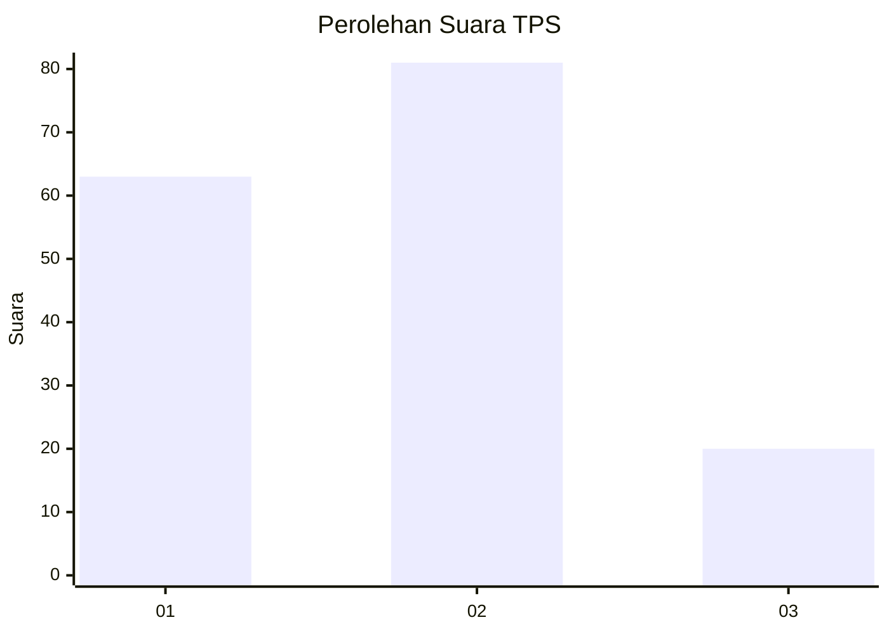
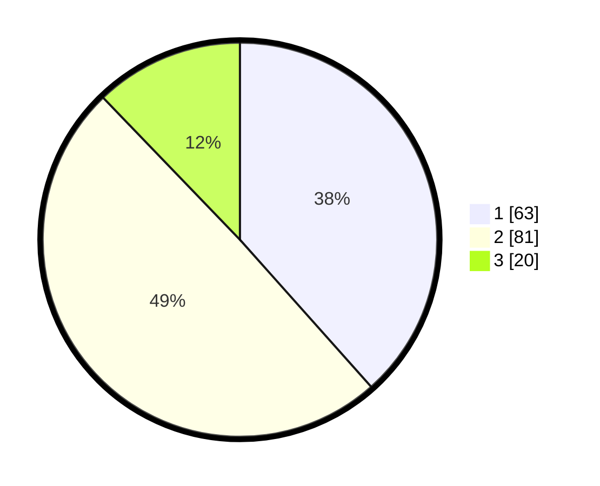

# Hasil

## Grafik

## Tabel

| No. | Nama Paslon    | Suara | Suara (raw) | Persentase |
|:--- |:-------------- | -----:| -----------:| ----------:|
| 1   | ANIES MUHAIMIN | 63    | [63][p-1]   | 38,41      |
| 2   | PRABOWO GIBRAN | 81    | [81][p-2]   | 49,39      |
| 3   | GANJAR MAHFUD  | 20    | [20][p-3]   | 12,20      |

[p-1]: https://github.com/gigit-pemilu/pemilu-2024-33-jawa-tengah/blob/main/pilpres/hitung-suara/sub/33-jawa-tengah/sub/05-kebumen/sub/06-buluspesantren/sub/2016-ampih/sub/008-tps/sub/paslon-1.txt
[p-2]: https://github.com/gigit-pemilu/pemilu-2024-33-jawa-tengah/blob/main/pilpres/hitung-suara/sub/33-jawa-tengah/sub/05-kebumen/sub/06-buluspesantren/sub/2016-ampih/sub/008-tps/sub/paslon-2.txt
[p-3]: https://github.com/gigit-pemilu/pemilu-2024-33-jawa-tengah/blob/main/pilpres/hitung-suara/sub/33-jawa-tengah/sub/05-kebumen/sub/06-buluspesantren/sub/2016-ampih/sub/008-tps/sub/paslon-3.txt

## Foto C Plano

https://sirekap-obj-formc.kpu.go.id/da45/pemilu/ppwp/33/05/06/20/16/3305062016008-20240215-162827--1c9ded87-d924-4aa8-a050-6c986f7a6c7b.jpg

https://sirekap-obj-formc.kpu.go.id/da45/pemilu/ppwp/33/05/06/20/16/3305062016008-20240215-163429--d488757d-d68e-4ff8-bd4c-5febd97d1a5a.jpg

https://sirekap-obj-formc.kpu.go.id/da45/pemilu/ppwp/33/05/06/20/16/3305062016008-20240215-172028--c241ae61-fe9e-4d8a-9c4f-9a19c1730a41.jpg

## Metadata

| Key        | Value               |
| ---------- | ------------------- |
| Time Stamp | 2024-02-15 23:29:50 |

