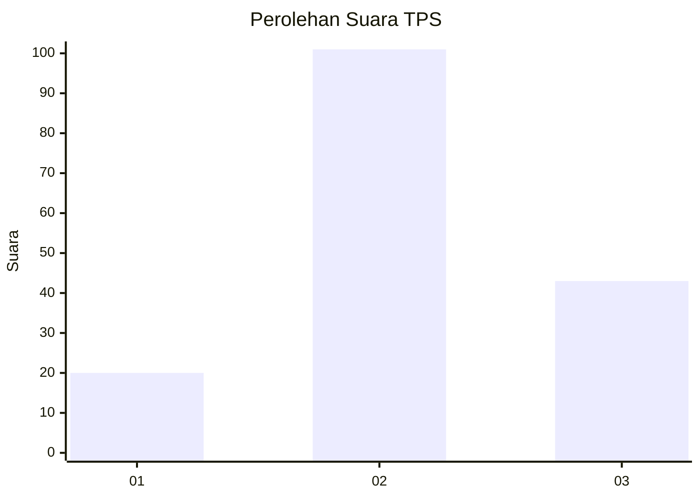
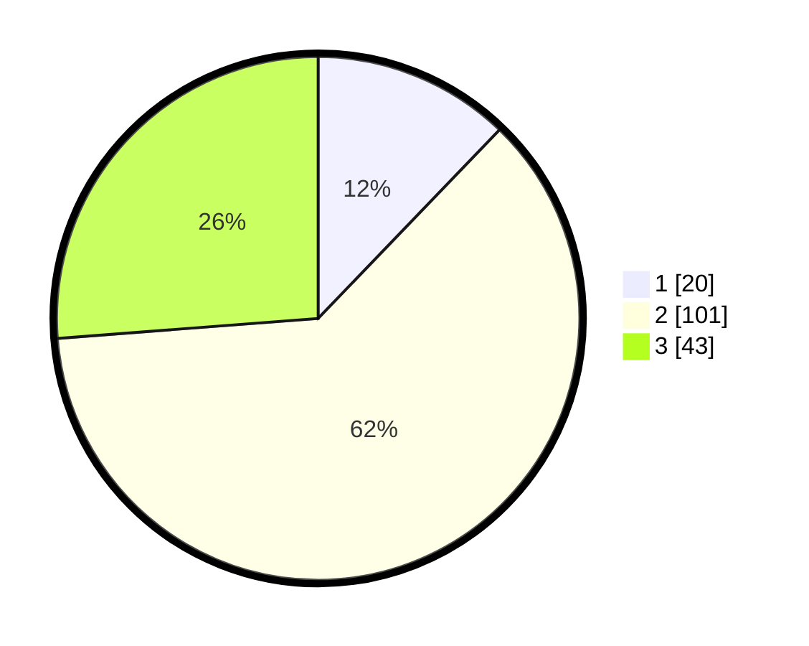

# Hasil

## Grafik

## Tabel

| No. | Nama Paslon    | Suara | Suara (raw) | Persentase |
|:--- |:-------------- | -----:| -----------:| ----------:|
| 1   | ANIES MUHAIMIN | 20    | [20][p-1]   | 12,20      |
| 2   | PRABOWO GIBRAN | 101   | [101][p-2]  | 61,59      |
| 3   | GANJAR MAHFUD  | 43    | [43][p-3]   | 26,22      |

[p-1]: https://github.com/gigit-pemilu/pemilu-2024-33-jawa-tengah/blob/main/pilpres/hitung-suara/sub/33-jawa-tengah/sub/05-kebumen/sub/06-buluspesantren/sub/2018-kloposawit/sub/009-tps/sub/paslon-1.txt
[p-2]: https://github.com/gigit-pemilu/pemilu-2024-33-jawa-tengah/blob/main/pilpres/hitung-suara/sub/33-jawa-tengah/sub/05-kebumen/sub/06-buluspesantren/sub/2018-kloposawit/sub/009-tps/sub/paslon-2.txt
[p-3]: https://github.com/gigit-pemilu/pemilu-2024-33-jawa-tengah/blob/main/pilpres/hitung-suara/sub/33-jawa-tengah/sub/05-kebumen/sub/06-buluspesantren/sub/2018-kloposawit/sub/009-tps/sub/paslon-3.txt

## Foto C Plano

https://sirekap-obj-formc.kpu.go.id/4dfd/pemilu/ppwp/33/05/06/20/18/3305062018009-20240217-112632--89f37b1e-6d7a-407b-a90f-481f24f3fb71.jpg

https://sirekap-obj-formc.kpu.go.id/4dfd/pemilu/ppwp/33/05/06/20/18/3305062018009-20240217-152831--b156fbc9-9672-4b51-a0fc-c2a8717af0cd.jpg

https://sirekap-obj-formc.kpu.go.id/4dfd/pemilu/ppwp/33/05/06/20/18/3305062018009-20240217-152944--b7c8cbd7-ef05-4bbe-af87-09c05358e0ae.jpg

## Metadata

| Key        | Value               |
| ---------- | ------------------- |
| Time Stamp | 2024-02-17 16:00:02 |

## DATA PEMILIH TETAP

Jumlah pemilih dalam DPT: **211**.
 * L: **102**.
 * P: **109**.

## DATA PENGGUNA HAK PILIH

Jumlah pengguna hak pilih dalam DPT: **870**.
 * L: **875**.
 * P: **895**.

Jumlah pengguna hak pilih dalam DPTb: **288**.
 * L: **883**.
 * P: **807**.

Jumlah pengguna hak pilih dalam DPK: **888**.
 * L: **488**.
 * P: **888**.

Jumlah pengguna hak pilih: **378**.
 * L: **878**.
 * P: **895**.

## JUMLAH SUARA SAH DAN TIDAK SAH

JUMLAH SELURUH SUARA SAH: **164**.

JUMLAH SUARA TIDAK SAH: **7**.

JUMLAH SELURUH SUARA SAH DAN SUARA TIDAK SAH: **171**.

