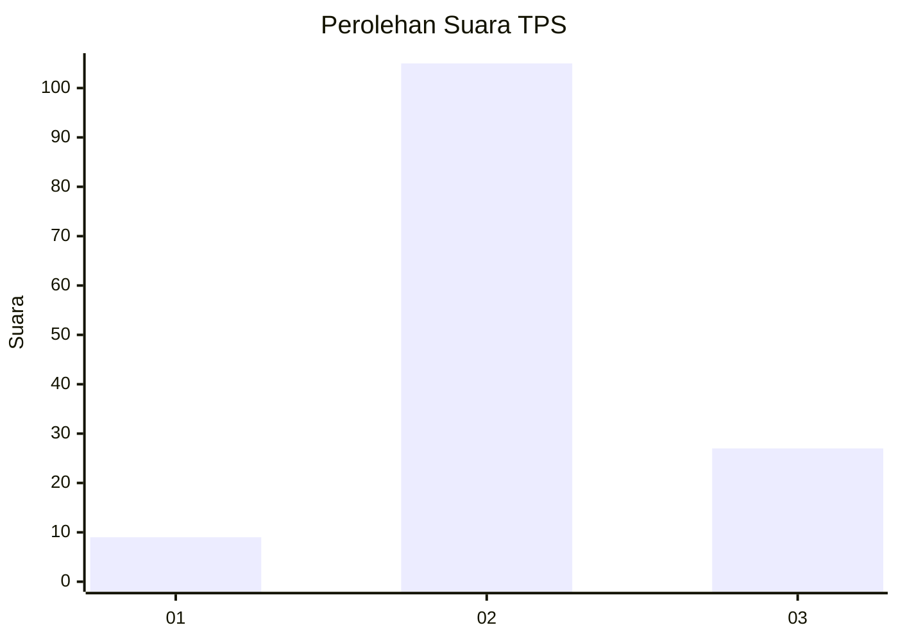
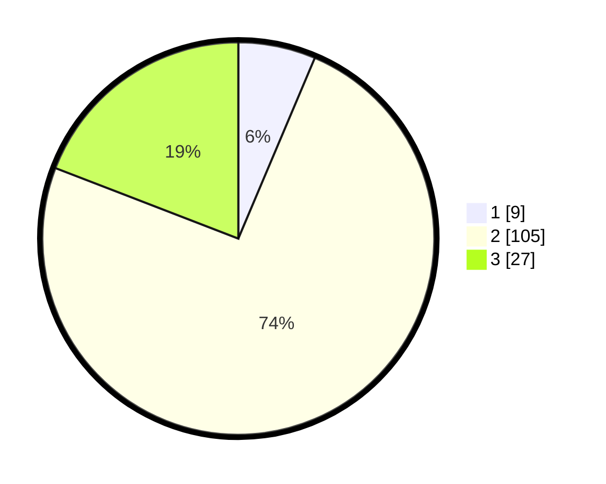

# Hasil

## Grafik

## Tabel

| No. | Nama Paslon    | Suara | Suara (raw) | Persentase |
|:--- |:-------------- | -----:| -----------:| ----------:|
| 1   | ANIES MUHAIMIN | 9     | [9][p-1]    | 6,38       |
| 2   | PRABOWO GIBRAN | 105   | [105][p-2]  | 74,47      |
| 3   | GANJAR MAHFUD  | 27    | [27][p-3]   | 19,15      |

[p-1]: https://github.com/gigit-pemilu/pemilu-2024/blob/main/pilpres/hitung-suara/sub/33-jawa-tengah/sub/05-kebumen/sub/07-ambal/sub/2006-kaibon/sub/001-tps/sub/paslon-1.txt
[p-2]: https://github.com/gigit-pemilu/pemilu-2024/blob/main/pilpres/hitung-suara/sub/33-jawa-tengah/sub/05-kebumen/sub/07-ambal/sub/2006-kaibon/sub/001-tps/sub/paslon-2.txt
[p-3]: https://github.com/gigit-pemilu/pemilu-2024/blob/main/pilpres/hitung-suara/sub/33-jawa-tengah/sub/05-kebumen/sub/07-ambal/sub/2006-kaibon/sub/001-tps/sub/paslon-3.txt

## Foto C Plano

https://sirekap-obj-formc.kpu.go.id/8939/pemilu/ppwp/33/05/07/20/06/3305072006001-20240218-100426--fbd3c4d7-ae06-4ea9-95c5-b64c664b0313.jpg

https://sirekap-obj-formc.kpu.go.id/8939/pemilu/ppwp/33/05/07/20/06/3305072006001-20240216-194003--4c2a6316-25dd-423d-9922-153c54e66bbd.jpg

https://sirekap-obj-formc.kpu.go.id/8939/pemilu/ppwp/33/05/07/20/06/3305072006001-20240216-100013--c0b3f19f-2186-448a-8438-94230d688a7c.jpg

## Metadata

| Key        | Value               |
| ---------- | ------------------- |
| Time Stamp | 2024-02-19 06:16:00 |

