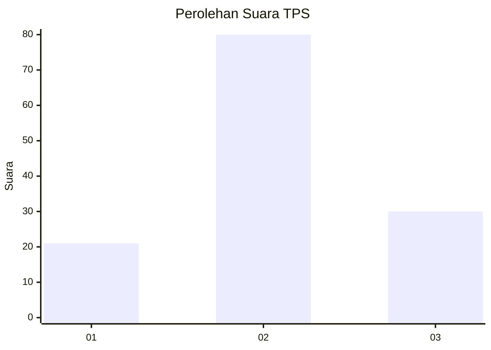
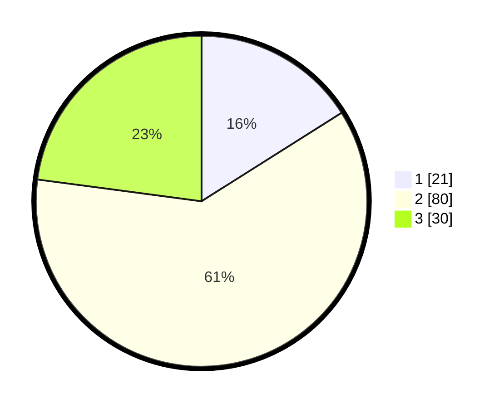

# Hasil

## Grafik

## Tabel

| No. | Nama Paslon    | Suara | Suara (raw) | Persentase |
|:--- |:-------------- | -----:| -----------:| ----------:|
| 1   | ANIES MUHAIMIN | 21    | [21][p-1]   | 16,03      |
| 2   | PRABOWO GIBRAN | 80    | [80][p-2]   | 61,07      |
| 3   | GANJAR MAHFUD  | 30    | [30][p-3]   | 22,90      |

[p-1]: https://github.com/gigit-pemilu/pemilu-2024-33-jawa-tengah/blob/main/pilpres/hitung-suara/sub/33-jawa-tengah/sub/05-kebumen/sub/07-ambal/sub/2008-blengorwetan/sub/005-tps/sub/paslon-1.txt
[p-2]: https://github.com/gigit-pemilu/pemilu-2024-33-jawa-tengah/blob/main/pilpres/hitung-suara/sub/33-jawa-tengah/sub/05-kebumen/sub/07-ambal/sub/2008-blengorwetan/sub/005-tps/sub/paslon-2.txt
[p-3]: https://github.com/gigit-pemilu/pemilu-2024-33-jawa-tengah/blob/main/pilpres/hitung-suara/sub/33-jawa-tengah/sub/05-kebumen/sub/07-ambal/sub/2008-blengorwetan/sub/005-tps/sub/paslon-3.txt

## Foto C Plano

https://sirekap-obj-formc.kpu.go.id/f686/pemilu/ppwp/33/05/07/20/08/3305072008005-20240217-225846--0c7d0ecd-3a14-4564-9b8b-b7837c4acdb1.jpg

https://sirekap-obj-formc.kpu.go.id/f686/pemilu/ppwp/33/05/07/20/08/3305072008005-20240217-231258--6f9d181a-e51d-4221-9bab-a809c9372262.jpg

https://sirekap-obj-formc.kpu.go.id/f686/pemilu/ppwp/33/05/07/20/08/3305072008005-20240217-231009--83bf398d-46e9-4f13-8409-93d700253be4.jpg

## Metadata

| Key        | Value               |
| ---------- | ------------------- |
| Time Stamp | 2024-02-19 06:16:00 |

