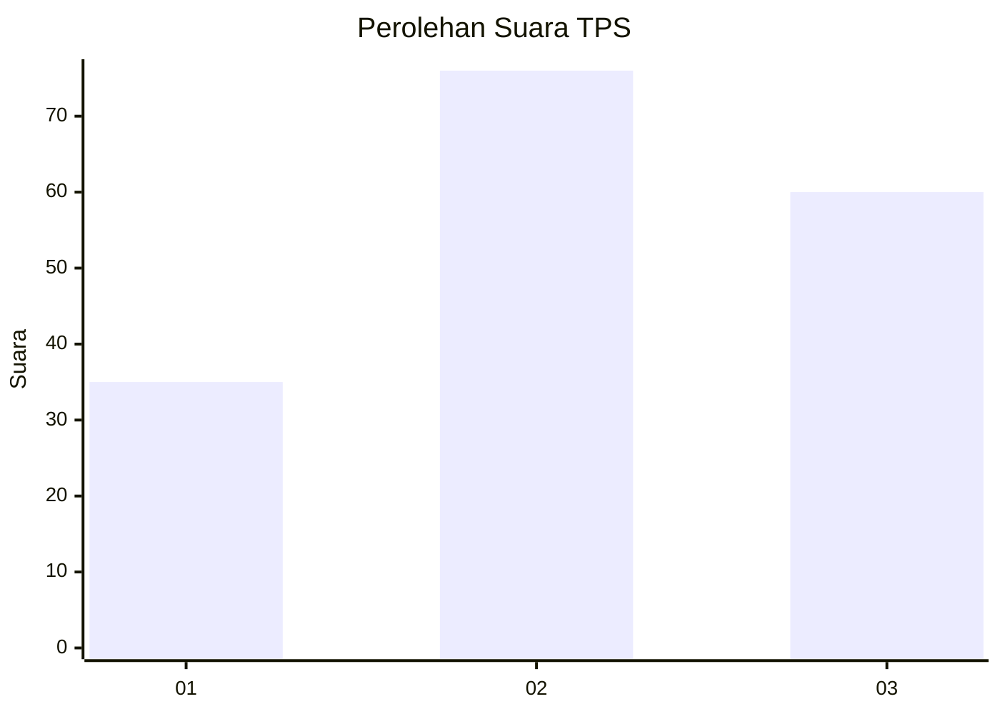
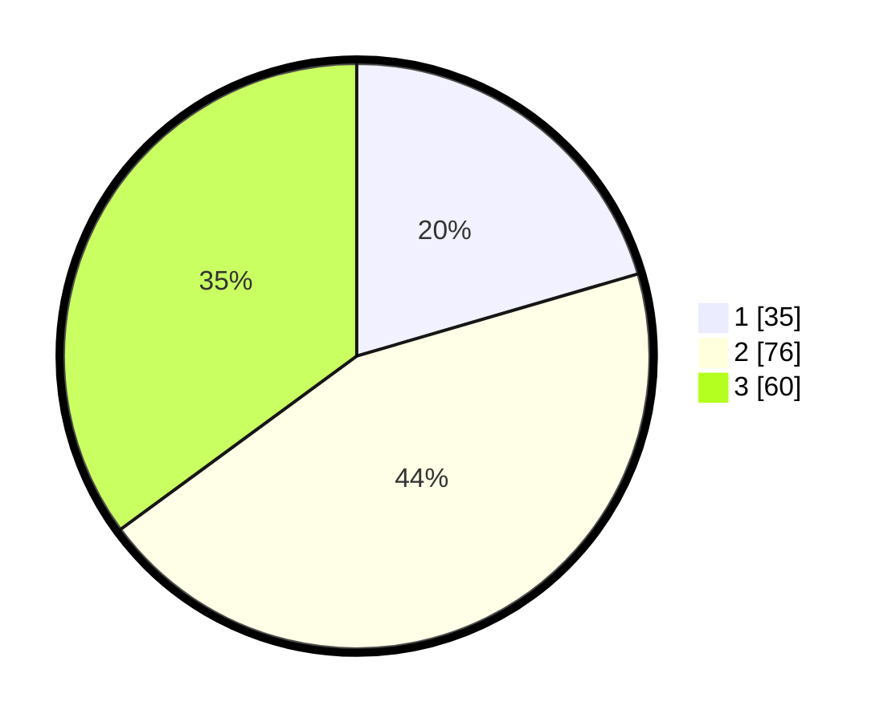

# Hasil

## Grafik

## Tabel

| No. | Nama Paslon    | Suara | Suara (raw) | Persentase |
|:--- |:-------------- | -----:| -----------:| ----------:|
| 1   | ANIES MUHAIMIN | 35    | [35][p-1]   | 20,47      |
| 2   | PRABOWO GIBRAN | 76    | [76][p-2]   | 44,44      |
| 3   | GANJAR MAHFUD  | 60    | [60][p-3]   | 35,09      |

[p-1]: https://github.com/gigit-pemilu/pemilu-2024-33-jawa-tengah/blob/main/pilpres/hitung-suara/sub/33-jawa-tengah/sub/05-kebumen/sub/08-mirit/sub/2005-lembupurwo/sub/004-tps/sub/paslon-1.txt
[p-2]: https://github.com/gigit-pemilu/pemilu-2024-33-jawa-tengah/blob/main/pilpres/hitung-suara/sub/33-jawa-tengah/sub/05-kebumen/sub/08-mirit/sub/2005-lembupurwo/sub/004-tps/sub/paslon-2.txt
[p-3]: https://github.com/gigit-pemilu/pemilu-2024-33-jawa-tengah/blob/main/pilpres/hitung-suara/sub/33-jawa-tengah/sub/05-kebumen/sub/08-mirit/sub/2005-lembupurwo/sub/004-tps/sub/paslon-3.txt

## Foto C Plano

https://sirekap-obj-formc.kpu.go.id/2c4c/pemilu/ppwp/33/05/08/20/05/3305082005004-20240214-141622--5fe6a476-fbde-449d-b000-95cbf82542c0.jpg

https://sirekap-obj-formc.kpu.go.id/2c4c/pemilu/ppwp/33/05/08/20/05/3305082005004-20240214-141010--4ec115ff-9ae8-460e-8c9c-6c953697788e.jpg

https://sirekap-obj-formc.kpu.go.id/2c4c/pemilu/ppwp/33/05/08/20/05/3305082005004-20240214-141111--4aa6724e-6cdd-4aee-87db-d7726cc9e951.jpg

## Metadata

| Key        | Value               |
| ---------- | ------------------- |
| Time Stamp | 2024-02-14 21:46:01 |

