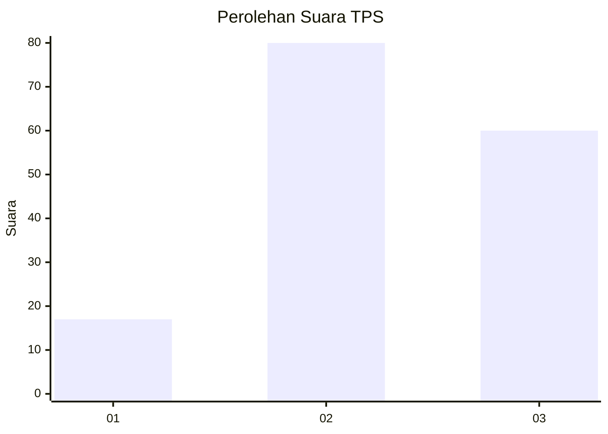
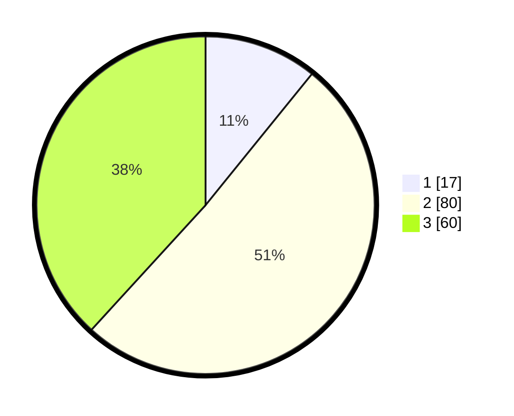

# Hasil

## Grafik

## Tabel

| No. | Nama Paslon    | Suara | Suara (raw) | Persentase |
|:--- |:-------------- | -----:| -----------:| ----------:|
| 1   | ANIES MUHAIMIN | 17    | [17][p-1]   | 10,83      |
| 2   | PRABOWO GIBRAN | 80    | [80][p-2]   | 50,96      |
| 3   | GANJAR MAHFUD  | 60    | [60][p-3]   | 38,22      |

[p-1]: https://github.com/gigit-pemilu/pemilu-2024/blob/main/pilpres/hitung-suara/sub/33-jawa-tengah/sub/05-kebumen/sub/08-mirit/sub/2005-lembupurwo/sub/006-tps/sub/paslon-1.txt
[p-2]: https://github.com/gigit-pemilu/pemilu-2024/blob/main/pilpres/hitung-suara/sub/33-jawa-tengah/sub/05-kebumen/sub/08-mirit/sub/2005-lembupurwo/sub/006-tps/sub/paslon-2.txt
[p-3]: https://github.com/gigit-pemilu/pemilu-2024/blob/main/pilpres/hitung-suara/sub/33-jawa-tengah/sub/05-kebumen/sub/08-mirit/sub/2005-lembupurwo/sub/006-tps/sub/paslon-3.txt

## Foto C Plano

https://sirekap-obj-formc.kpu.go.id/2380/pemilu/ppwp/33/05/08/20/05/3305082005006-20240217-090722--5217f801-1604-4b74-a3d3-8b1cf68202ab.jpg

https://sirekap-obj-formc.kpu.go.id/2380/pemilu/ppwp/33/05/08/20/05/3305082005006-20240217-090740--e713460e-b24f-47d8-b3df-e227ec71109d.jpg

https://sirekap-obj-formc.kpu.go.id/2380/pemilu/ppwp/33/05/08/20/05/3305082005006-20240217-090807--bf7c45a0-e39d-4352-afb6-973eec8e4f43.jpg

## Metadata

| Key        | Value               |
| ---------- | ------------------- |
| Time Stamp | 2024-02-19 15:00:00 |

